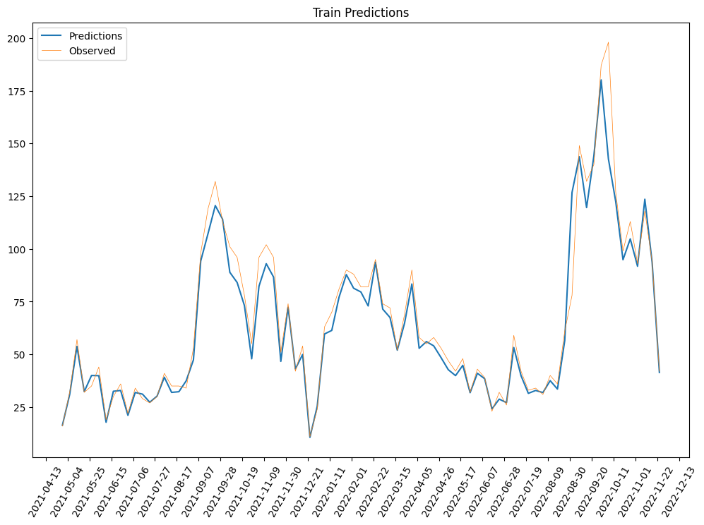
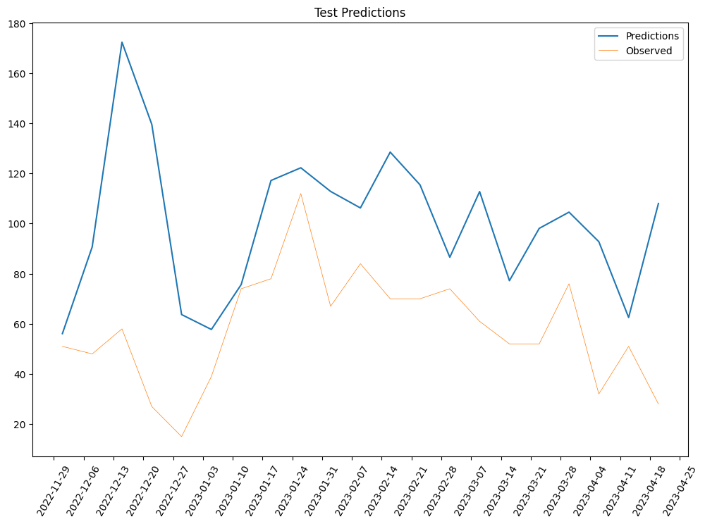
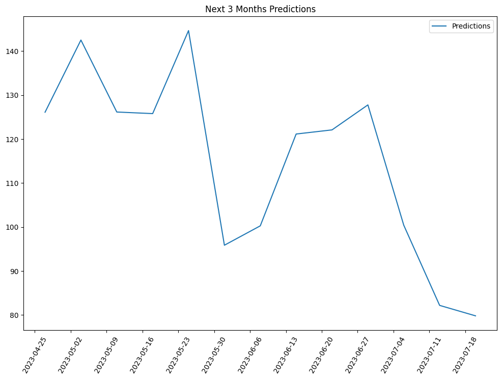

# **Appointments Prediction**
## **Introduction**
This application performs a prediction on the number of weekly appointments at CDL Columbia University.
To achieve the task, we need to perform some data cleaning and feature engineering in order to create relevant features that will help the LSTM model.

## **Documentation**
Execute this notebook everytime you need to predict the next three months of weekly number of appointments.

If you are using Google Colab: Click on Runtime > Run All

Before running this notebook it's recommended to run the Appointments Api application, in order to update the 3 files that this application will use: data appointments, students data, and data appointments with custom values.

Please, remember that in the default values all the files should be saved in your local drive in a directory called CDL Api Files. If you manually changed the path of the directory, please adjust the following paths accordingly.

Once you run this notebook, wait for the Google Drive authentication. After that, you may switch to another tab, but don't close the tab before the runtime is over.

When the runtime is over, you will find the new predictions files in csv format in a new subfolder titled as today's date inside CDL Api Files/appointments_prediction_results.

#### Link Google Drive


```python
from google.colab import drive
import pandas as pd
drive.mount('/content/drive')
```

    Mounted at /content/drive


#### Read Appointments Data


```python
data_appointments = pd.read_csv('/content/drive/MyDrive/CDL Api Files/data_appointments.csv').drop(['Unnamed: 0'], axis=1)
data_appointments.head()
```


  <div id="df-6098041a-9019-4510-83cd-c8856c059254">
    <div class="colab-df-container">
      <div>
<style scoped>
    .dataframe tbody tr th:only-of-type {
        vertical-align: middle;
    }

    .dataframe tbody tr th {
        vertical-align: top;
    }

    .dataframe thead th {
        text-align: right;
    }
</style>
<table border="1" class="dataframe">
  <thead>
    <tr style="text-align: right;">
      <th></th>
      <th>Id_x</th>
      <th>AppointmentBlockId</th>
      <th>StartTime</th>
      <th>EndTime</th>
      <th>StudentId_x</th>
      <th>StudentName</th>
      <th>Topic</th>
      <th>PreferredLocationId</th>
      <th>PreferredLocationName</th>
      <th>Location</th>
      <th>...</th>
      <th>Term</th>
      <th>Program Shortcut</th>
      <th>YOE</th>
      <th>Employment Status at Beginning of Program</th>
      <th>Desired Industry</th>
      <th>Graduation Term</th>
      <th>Attendance</th>
      <th>AppointmentId</th>
      <th>StudentId</th>
      <th>UNI</th>
    </tr>
  </thead>
  <tbody>
    <tr>
      <th>0</th>
      <td>220007404103835</td>
      <td>200006052546409</td>
      <td>2023-05-15T13:30:00.000</td>
      <td>2023-05-15T14:00:00.000</td>
      <td>540016052247406</td>
      <td>Liam Hiester</td>
      <td>NaN</td>
      <td>1.000760e+13</td>
      <td>Virtual</td>
      <td>NaN</td>
      <td>...</td>
      <td>Summer</td>
      <td>APAN</td>
      <td>0 - 3 Years</td>
      <td>Yes</td>
      <td>Finance, Consulting, Pharmaceuticals, Technology</td>
      <td>Spring 2023</td>
      <td>No</td>
      <td>220007404103835</td>
      <td>540016052247406</td>
      <td>llh2154</td>
    </tr>
    <tr>
      <th>1</th>
      <td>220007404103834</td>
      <td>200006052546407</td>
      <td>2023-05-08T13:30:00.000</td>
      <td>2023-05-08T14:00:00.000</td>
      <td>540016052247406</td>
      <td>Liam Hiester</td>
      <td>NaN</td>
      <td>1.000760e+13</td>
      <td>Virtual</td>
      <td>NaN</td>
      <td>...</td>
      <td>Spring</td>
      <td>APAN</td>
      <td>0 - 3 Years</td>
      <td>Yes</td>
      <td>Finance, Consulting, Pharmaceuticals, Technology</td>
      <td>Spring 2023</td>
      <td>No</td>
      <td>220007404103834</td>
      <td>540016052247406</td>
      <td>llh2154</td>
    </tr>
    <tr>
      <th>2</th>
      <td>220007404104491</td>
      <td>200006052487245</td>
      <td>2023-05-02T16:00:00.000</td>
      <td>2023-05-02T16:30:00.000</td>
      <td>540016051804044</td>
      <td>Zilu Zhang</td>
      <td>NaN</td>
      <td>1.000760e+13</td>
      <td>Virtual</td>
      <td>NaN</td>
      <td>...</td>
      <td>Spring</td>
      <td>STRAT COMM</td>
      <td>0 - 3 Years</td>
      <td>No</td>
      <td>Technology, Marketing</td>
      <td>Spring 2023</td>
      <td>No</td>
      <td>220007404104491</td>
      <td>540016051804044</td>
      <td>zz2635</td>
    </tr>
    <tr>
      <th>3</th>
      <td>220007404103087</td>
      <td>200006052548044</td>
      <td>2023-05-02T15:45:00.000</td>
      <td>2023-05-02T16:15:00.000</td>
      <td>540016052574956</td>
      <td>Sofia Ruiz de la Concha</td>
      <td>NaN</td>
      <td>1.000760e+13</td>
      <td>Virtual</td>
      <td>NaN</td>
      <td>...</td>
      <td>Spring</td>
      <td>ERM</td>
      <td>3 - 5 Years</td>
      <td>No</td>
      <td>Other</td>
      <td>Fall 2024</td>
      <td>No</td>
      <td>220007404103087</td>
      <td>540016052574956</td>
      <td>sr4013</td>
    </tr>
    <tr>
      <th>4</th>
      <td>220007404103800</td>
      <td>200006052546410</td>
      <td>2023-05-01T13:30:00.000</td>
      <td>2023-05-01T14:00:00.000</td>
      <td>540016052247406</td>
      <td>Liam Hiester</td>
      <td>NaN</td>
      <td>1.000760e+13</td>
      <td>Virtual</td>
      <td>NaN</td>
      <td>...</td>
      <td>Spring</td>
      <td>APAN</td>
      <td>0 - 3 Years</td>
      <td>Yes</td>
      <td>Finance, Consulting, Pharmaceuticals, Technology</td>
      <td>Spring 2023</td>
      <td>No</td>
      <td>220007404103800</td>
      <td>540016052247406</td>
      <td>llh2154</td>
    </tr>
  </tbody>
</table>
<p>5 rows × 42 columns</p>
</div>
      <button class="colab-df-convert" onclick="convertToInteractive('df-6098041a-9019-4510-83cd-c8856c059254')"
              title="Convert this dataframe to an interactive table."
              style="display:none;">

  <svg xmlns="http://www.w3.org/2000/svg" height="24px"viewBox="0 0 24 24"
       width="24px">
    <path d="M0 0h24v24H0V0z" fill="none"/>
    <path d="M18.56 5.44l.94 2.06.94-2.06 2.06-.94-2.06-.94-.94-2.06-.94 2.06-2.06.94zm-11 1L8.5 8.5l.94-2.06 2.06-.94-2.06-.94L8.5 2.5l-.94 2.06-2.06.94zm10 10l.94 2.06.94-2.06 2.06-.94-2.06-.94-.94-2.06-.94 2.06-2.06.94z"/><path d="M17.41 7.96l-1.37-1.37c-.4-.4-.92-.59-1.43-.59-.52 0-1.04.2-1.43.59L10.3 9.45l-7.72 7.72c-.78.78-.78 2.05 0 2.83L4 21.41c.39.39.9.59 1.41.59.51 0 1.02-.2 1.41-.59l7.78-7.78 2.81-2.81c.8-.78.8-2.07 0-2.86zM5.41 20L4 18.59l7.72-7.72 1.47 1.35L5.41 20z"/>
  </svg>
      </button>

  <style>
    .colab-df-container {
      display:flex;
      flex-wrap:wrap;
      gap: 12px;
    }

    .colab-df-convert {
      background-color: #E8F0FE;
      border: none;
      border-radius: 50%;
      cursor: pointer;
      display: none;
      fill: #1967D2;
      height: 32px;
      padding: 0 0 0 0;
      width: 32px;
    }

    .colab-df-convert:hover {
      background-color: #E2EBFA;
      box-shadow: 0px 1px 2px rgba(60, 64, 67, 0.3), 0px 1px 3px 1px rgba(60, 64, 67, 0.15);
      fill: #174EA6;
    }

    [theme=dark] .colab-df-convert {
      background-color: #3B4455;
      fill: #D2E3FC;
    }

    [theme=dark] .colab-df-convert:hover {
      background-color: #434B5C;
      box-shadow: 0px 1px 3px 1px rgba(0, 0, 0, 0.15);
      filter: drop-shadow(0px 1px 2px rgba(0, 0, 0, 0.3));
      fill: #FFFFFF;
    }
  </style>

      <script>
        const buttonEl =
          document.querySelector('#df-6098041a-9019-4510-83cd-c8856c059254 button.colab-df-convert');
        buttonEl.style.display =
          google.colab.kernel.accessAllowed ? 'block' : 'none';

        async function convertToInteractive(key) {
          const element = document.querySelector('#df-6098041a-9019-4510-83cd-c8856c059254');
          const dataTable =
            await google.colab.kernel.invokeFunction('convertToInteractive',
                                                     [key], {});
          if (!dataTable) return;

          const docLinkHtml = 'Like what you see? Visit the ' +
            '<a target="_blank" href=https://colab.research.google.com/notebooks/data_table.ipynb>data table notebook</a>'
            + ' to learn more about interactive tables.';
          element.innerHTML = '';
          dataTable['output_type'] = 'display_data';
          await google.colab.output.renderOutput(dataTable, element);
          const docLink = document.createElement('div');
          docLink.innerHTML = docLinkHtml;
          element.appendChild(docLink);
        }
      </script>
    </div>
  </div>


#### Read Students Data


```python
students = pd.read_csv('/content/drive/MyDrive/CDL Api Files/students.csv').drop(['Unnamed: 0'], axis=1)
display(len(students))
list(students.columns)
```


    13591


    ['RoleId',
     'StudentGroups',
     'FullName',
     'IsLgbtq',
     'SelfIdentifiedGenderDescription',
     'ParentEducationLevelId',
     'ParentEducationLevelName',
     'DoesParentHaveJD',
     'AbaGraduateId',
     'IsMultipleEnrollmentLinkedAccount',
     'OutcomeStatusInternship',
     'OutcomeStatusPostGraduation',
     'ReportingCategoryMbaCseaPostGraduation',
     'ReportingCategoryMbaCseaInternship',
     'Id',
     'FirstName',
     'MiddleName',
     'LastName',
     'EmailAddress',
     'GraduationYearId',
     'GraduationClass',
     'GraduationTerm',
     'StudentId',
     'IsAlumni',
     'IncludeInResumeBook',
     'PreferredEmailAddress',
     'JoinDate',
     'IsEnrolled',
     'LinkedInProfileUrl',
     'IsTransferStudent',
     'DeclineToStateIsTransferStudent',
     'HasPhoto',
     'AssignedAdvisor',
     'AssignedAdvisor2',
     'AssignedAdvisor3',
     'AssignedAdvisor4',
     'AssignedAdvisor5',
     'SubInfoDisplay',
     'CountryOfCitizenship1',
     'CountryOfCitizenship2',
     'CountryOfCitizenship',
     'DualCountryOfCitizenship',
     'PreferredConsolidatedIndustry',
     'PreferredConsolidatedIndustry2',
     'PreferredConsolidatedIndustry3',
     'PreferredConsolidatedIndustry4',
     'PreferredConsolidatedIndustry5',
     'PreferredConsolidatedJobFunction',
     'PreferredConsolidatedJobFunction2',
     'PreferredConsolidatedJobFunction3',
     'PreferredConsolidatedJobFunction4',
     'PreferredConsolidatedJobFunction5',
     'PreferredCountry',
     'PreferredCountry2',
     'PreferredCountry3',
     'PreferredCountry4',
     'PreferredCountry5',
     'PreferredCity',
     'PreferredCity2',
     'PreferredCity3',
     'PreferredCity4',
     'PreferredCity5',
     'College',
     'College2',
     'College3',
     'Program',
     'ConsolidatedMajor1',
     'ConsolidatedMajor2',
     'ConsolidatedMajor3',
     'ConsolidatedMajor4',
     'ConsolidatedMajor5',
     'DegreeLevel',
     'Degree1',
     'Degree2',
     'Degree3',
     'Ethnicity1',
     'Ethnicity2',
     'Placeability',
     'Engagement',
     'FirstLanguageSpoken',
     'SecondLanguageSpoken',
     'ThirdLanguageSpoken',
     'FirstLanguageWritten',
     'SecondLanguageWritten',
     'ThirdLanguageWritten',
     'LanguageSpoken1',
     'LanguageSpoken2',
     'LanguageSpoken3',
     'LanguageWritten1',
     'LanguageWritten2',
     'LanguageWritten3',
     'ConsolidatedWorkAuthorization',
     'CustomAttributeValues',
     'LastLoginDate',
     'Gender',
     'Gpa',
     'SchoolStartDate',
     'MilitaryBackground',
     'ShouldSyncToExternalCalendar',
     'ShouldSyncFromExternalCalendar',
     'HasDualCitizenship',
     'Phone1',
     'ProBonoPlacements']


#### Read Appointments Data with custom field


```python
appointments_report = pd.read_excel('/content/drive/MyDrive/CDL Api Files/appointment_report.xlsx')
display(len(appointments_report))
appointments_report.head()
```

    /usr/local/lib/python3.10/dist-packages/openpyxl/styles/stylesheet.py:226: UserWarning: Workbook contains no default style, apply openpyxl's default
      warn("Workbook contains no default style, apply openpyxl's default")


    6556


  <div id="df-76c68074-7dd1-4ca9-9fc0-e20aebaa9889">
    <div class="colab-df-container">
      <div>
<style scoped>
    .dataframe tbody tr th:only-of-type {
        vertical-align: middle;
    }

    .dataframe tbody tr th {
        vertical-align: top;
    }

    .dataframe thead th {
        text-align: right;
    }
</style>
<table border="1" class="dataframe">
  <thead>
    <tr style="text-align: right;">
      <th></th>
      <th>Student</th>
      <th>Email Address</th>
      <th>Career Adviser</th>
      <th>Date and Time</th>
      <th>Appointment Date</th>
      <th>First Name</th>
      <th>Last Name</th>
      <th>Email Address.1</th>
      <th>Preferred Location</th>
      <th>Career Adviser.1</th>
      <th>...</th>
      <th>Phone Number</th>
      <th>Graduation Term</th>
      <th>Desired Industry</th>
      <th>Desired City</th>
      <th>Attendance</th>
      <th>Country of Citizenship</th>
      <th>Graduate GPA</th>
      <th>Employment Status at Beginning of Program</th>
      <th>YOE</th>
      <th>No Show</th>
    </tr>
  </thead>
  <tbody>
    <tr>
      <th>0</th>
      <td>Jia Hu</td>
      <td>jh4390@columbia.edu</td>
      <td>Tiya McIver</td>
      <td>04/25/2023, 3:00PM - 3:30PM EDT</td>
      <td>04/25/2023, 3:00PM EDT</td>
      <td>Jia</td>
      <td>Hu</td>
      <td>jh4390@columbia.edu</td>
      <td>Tiya McIver Virtual Room: https://columbiasps....</td>
      <td>Tiya McIver</td>
      <td>...</td>
      <td>NaN</td>
      <td>Fall 2022</td>
      <td>Finance</td>
      <td>New York - NY</td>
      <td>NaN</td>
      <td>China Mainland</td>
      <td>NaN</td>
      <td>No</td>
      <td>0 - 3 Years</td>
      <td>NaN</td>
    </tr>
    <tr>
      <th>1</th>
      <td>Jia Hu</td>
      <td>jh4390@columbia.edu</td>
      <td>Tiya McIver</td>
      <td>04/20/2023, 3:30PM - 4:00PM EDT</td>
      <td>04/20/2023, 3:30PM EDT</td>
      <td>Jia</td>
      <td>Hu</td>
      <td>jh4390@columbia.edu</td>
      <td>Tiya McIver Virtual Room: https://columbiasps....</td>
      <td>Tiya McIver</td>
      <td>...</td>
      <td>NaN</td>
      <td>Fall 2022</td>
      <td>Finance</td>
      <td>New York - NY</td>
      <td>NaN</td>
      <td>China Mainland</td>
      <td>NaN</td>
      <td>No</td>
      <td>0 - 3 Years</td>
      <td>NaN</td>
    </tr>
    <tr>
      <th>2</th>
      <td>Philip Spiler</td>
      <td>pms2179@columbia.edu</td>
      <td>Dorlene Curwen</td>
      <td>04/18/2023, 2:15PM - 2:45PM EDT</td>
      <td>04/18/2023, 2:15PM EDT</td>
      <td>Philip</td>
      <td>Spiler</td>
      <td>pms2179@columbia.edu</td>
      <td>Dorlene Curwen Virtual Room: https://columbias...</td>
      <td>Dorlene Curwen</td>
      <td>...</td>
      <td>NaN</td>
      <td>Spring 2026</td>
      <td>Sports</td>
      <td>New York - NY</td>
      <td>NaN</td>
      <td>United States (USA)</td>
      <td>NaN</td>
      <td>Yes</td>
      <td>3 - 5 Years</td>
      <td>NaN</td>
    </tr>
    <tr>
      <th>3</th>
      <td>Nan Chen</td>
      <td>nc3019@columbia.edu</td>
      <td>Tiya McIver</td>
      <td>04/14/2023, 9:30AM - 10:00AM EDT</td>
      <td>04/14/2023, 9:30AM EDT</td>
      <td>Nan</td>
      <td>Chen</td>
      <td>nc3019@columbia.edu</td>
      <td>Tiya McIver Virtual Room: https://columbiasps....</td>
      <td>Tiya McIver</td>
      <td>...</td>
      <td>NaN</td>
      <td>Fall 2024</td>
      <td>Finance</td>
      <td>NaN</td>
      <td>NaN</td>
      <td>NaN</td>
      <td>NaN</td>
      <td>No</td>
      <td>0 - 3 Years</td>
      <td>NaN</td>
    </tr>
    <tr>
      <th>4</th>
      <td>Rongrong Chen</td>
      <td>rc3533@columbia.edu</td>
      <td>Tiya McIver</td>
      <td>04/14/2023, 9:00AM - 9:30AM EDT</td>
      <td>04/14/2023, 9:00AM EDT</td>
      <td>Rongrong</td>
      <td>Chen</td>
      <td>rc3533@columbia.edu</td>
      <td>Tiya McIver Virtual Room: https://columbiasps....</td>
      <td>Tiya McIver</td>
      <td>...</td>
      <td>NaN</td>
      <td>Spring 2027</td>
      <td>Technology</td>
      <td>New York - NY</td>
      <td>NaN</td>
      <td>China Mainland</td>
      <td>NaN</td>
      <td>No</td>
      <td>0 - 3 Years</td>
      <td>NaN</td>
    </tr>
  </tbody>
</table>
<p>5 rows × 24 columns</p>
</div>
      <button class="colab-df-convert" onclick="convertToInteractive('df-76c68074-7dd1-4ca9-9fc0-e20aebaa9889')"
              title="Convert this dataframe to an interactive table."
              style="display:none;">

  <svg xmlns="http://www.w3.org/2000/svg" height="24px"viewBox="0 0 24 24"
       width="24px">
    <path d="M0 0h24v24H0V0z" fill="none"/>
    <path d="M18.56 5.44l.94 2.06.94-2.06 2.06-.94-2.06-.94-.94-2.06-.94 2.06-2.06.94zm-11 1L8.5 8.5l.94-2.06 2.06-.94-2.06-.94L8.5 2.5l-.94 2.06-2.06.94zm10 10l.94 2.06.94-2.06 2.06-.94-2.06-.94-.94-2.06-.94 2.06-2.06.94z"/><path d="M17.41 7.96l-1.37-1.37c-.4-.4-.92-.59-1.43-.59-.52 0-1.04.2-1.43.59L10.3 9.45l-7.72 7.72c-.78.78-.78 2.05 0 2.83L4 21.41c.39.39.9.59 1.41.59.51 0 1.02-.2 1.41-.59l7.78-7.78 2.81-2.81c.8-.78.8-2.07 0-2.86zM5.41 20L4 18.59l7.72-7.72 1.47 1.35L5.41 20z"/>
  </svg>
      </button>

  <style>
    .colab-df-container {
      display:flex;
      flex-wrap:wrap;
      gap: 12px;
    }

    .colab-df-convert {
      background-color: #E8F0FE;
      border: none;
      border-radius: 50%;
      cursor: pointer;
      display: none;
      fill: #1967D2;
      height: 32px;
      padding: 0 0 0 0;
      width: 32px;
    }

    .colab-df-convert:hover {
      background-color: #E2EBFA;
      box-shadow: 0px 1px 2px rgba(60, 64, 67, 0.3), 0px 1px 3px 1px rgba(60, 64, 67, 0.15);
      fill: #174EA6;
    }

    [theme=dark] .colab-df-convert {
      background-color: #3B4455;
      fill: #D2E3FC;
    }

    [theme=dark] .colab-df-convert:hover {
      background-color: #434B5C;
      box-shadow: 0px 1px 3px 1px rgba(0, 0, 0, 0.15);
      filter: drop-shadow(0px 1px 2px rgba(0, 0, 0, 0.3));
      fill: #FFFFFF;
    }
  </style>

      <script>
        const buttonEl =
          document.querySelector('#df-76c68074-7dd1-4ca9-9fc0-e20aebaa9889 button.colab-df-convert');
        buttonEl.style.display =
          google.colab.kernel.accessAllowed ? 'block' : 'none';

        async function convertToInteractive(key) {
          const element = document.querySelector('#df-76c68074-7dd1-4ca9-9fc0-e20aebaa9889');
          const dataTable =
            await google.colab.kernel.invokeFunction('convertToInteractive',
                                                     [key], {});
          if (!dataTable) return;

          const docLinkHtml = 'Like what you see? Visit the ' +
            '<a target="_blank" href=https://colab.research.google.com/notebooks/data_table.ipynb>data table notebook</a>'
            + ' to learn more about interactive tables.';
          element.innerHTML = '';
          dataTable['output_type'] = 'display_data';
          await google.colab.output.renderOutput(dataTable, element);
          const docLink = document.createElement('div');
          docLink.innerHTML = docLinkHtml;
          element.appendChild(docLink);
        }
      </script>
    </div>
  </div>


This code manipulates data related to student appointments and merging it with other student data. Here's a line-by-line breakdown of what each line is doing:

The first line selects a subset of columns from the "appointments_report" dataframe and drops any duplicates based on the "Student Id" column.

The second line merges the "students" dataframe with the modified "appointments_report" dataframe based on the "StudentId" and "Student Id" columns. It uses a left join and drops the "GraduationTerm" column from the resulting dataframe.

The third line drops any columns from the merged dataframe that contain all null values.

The fourth line displays the length of the merged dataframe.

The final line displays a list of the column names in the merged dataframe.


```python
appointments_report = appointments_report[['Student Id', 'YOE', 'Employment Status at Beginning of Program', 'Desired Industry', 'Graduation Term']].drop_duplicates(subset='Student Id')
students_merged = students.merge(appointments_report, left_on='StudentId', right_on='Student Id', how='left').drop('GraduationTerm', axis=1)
students_merged.dropna(axis=1, how='all')
display(len(students_merged))
list(students_merged.columns)
```


    13591


    ['RoleId',
     'StudentGroups',
     'FullName',
     'IsLgbtq',
     'SelfIdentifiedGenderDescription',
     'ParentEducationLevelId',
     'ParentEducationLevelName',
     'DoesParentHaveJD',
     'AbaGraduateId',
     'IsMultipleEnrollmentLinkedAccount',
     'OutcomeStatusInternship',
     'OutcomeStatusPostGraduation',
     'ReportingCategoryMbaCseaPostGraduation',
     'ReportingCategoryMbaCseaInternship',
     'Id',
     'FirstName',
     'MiddleName',
     'LastName',
     'EmailAddress',
     'GraduationYearId',
     'GraduationClass',
     'StudentId',
     'IsAlumni',
     'IncludeInResumeBook',
     'PreferredEmailAddress',
     'JoinDate',
     'IsEnrolled',
     'LinkedInProfileUrl',
     'IsTransferStudent',
     'DeclineToStateIsTransferStudent',
     'HasPhoto',
     'AssignedAdvisor',
     'AssignedAdvisor2',
     'AssignedAdvisor3',
     'AssignedAdvisor4',
     'AssignedAdvisor5',
     'SubInfoDisplay',
     'CountryOfCitizenship1',
     'CountryOfCitizenship2',
     'CountryOfCitizenship',
     'DualCountryOfCitizenship',
     'PreferredConsolidatedIndustry',
     'PreferredConsolidatedIndustry2',
     'PreferredConsolidatedIndustry3',
     'PreferredConsolidatedIndustry4',
     'PreferredConsolidatedIndustry5',
     'PreferredConsolidatedJobFunction',
     'PreferredConsolidatedJobFunction2',
     'PreferredConsolidatedJobFunction3',
     'PreferredConsolidatedJobFunction4',
     'PreferredConsolidatedJobFunction5',
     'PreferredCountry',
     'PreferredCountry2',
     'PreferredCountry3',
     'PreferredCountry4',
     'PreferredCountry5',
     'PreferredCity',
     'PreferredCity2',
     'PreferredCity3',
     'PreferredCity4',
     'PreferredCity5',
     'College',
     'College2',
     'College3',
     'Program',
     'ConsolidatedMajor1',
     'ConsolidatedMajor2',
     'ConsolidatedMajor3',
     'ConsolidatedMajor4',
     'ConsolidatedMajor5',
     'DegreeLevel',
     'Degree1',
     'Degree2',
     'Degree3',
     'Ethnicity1',
     'Ethnicity2',
     'Placeability',
     'Engagement',
     'FirstLanguageSpoken',
     'SecondLanguageSpoken',
     'ThirdLanguageSpoken',
     'FirstLanguageWritten',
     'SecondLanguageWritten',
     'ThirdLanguageWritten',
     'LanguageSpoken1',
     'LanguageSpoken2',
     'LanguageSpoken3',
     'LanguageWritten1',
     'LanguageWritten2',
     'LanguageWritten3',
     'ConsolidatedWorkAuthorization',
     'CustomAttributeValues',
     'LastLoginDate',
     'Gender',
     'Gpa',
     'SchoolStartDate',
     'MilitaryBackground',
     'ShouldSyncToExternalCalendar',
     'ShouldSyncFromExternalCalendar',
     'HasDualCitizenship',
     'Phone1',
     'ProBonoPlacements',
     'Student Id',
     'YOE',
     'Employment Status at Beginning of Program',
     'Desired Industry',
     'Graduation Term']


#### Map graduation date to numeric values
The first line groups the "students_merged" dataframe by "Graduation Term" and counts the number of unique "Student Ids" in each group. It then creates a new dataframe called "students_term" with the "Graduation Term" and "grad_term_count" columns.

The second line creates a Python dictionary called "term_map" that maps each string value of "Graduation Term" to a corresponding integer value.

The third line replaces the string values in the "Graduation Term" column of the "students_term" dataframe with their corresponding integer values using the "term_map" dictionary.

The fourth line replaces the string values in the "Graduation Term" column of the "data_appointments" dataframe with their corresponding integer values using the "term_map" dictionary.

The fifth line fills any missing values in the "Graduation Term" column of the "data_appointments" dataframe using the "ffill" method, which propagates the last non-null value forward to the missing values.

The sixth line prints the unique values in the "Graduation Term" column of the "data_appointments" dataframe.


```python
students_term = students_merged.groupby('Graduation Term')['Student Id'].count().reset_index(name='grad_term_count')

term_map = {
    'Spring 2009': 1, 'Spring 2011': 2, 'Spring 2012': 3, 
    'Fall 2013': 4, 'Spring 2014': 5, 'Spring 2016': 6,
    'Fall 2016': 7, 'Spring 2017': 8, 'Spring 2018': 9, 'Summer 2018': 10,
    'Spring 2019': 11, 'Summer 2019': 12, 'Fall 2019': 13,
    'Spring 2020': 14, 'Summer 2020': 15, 'Fall 2020': 16,
    'Spring 2021': 17, 'Summer 2021': 18, 'Fall 2021': 19,
    'Spring 2022': 20, 'Summer 2022': 21, 'Fall 2022': 22,
    'Spring 2023': 23, 'Summer 2023': 24, 'Fall 2023': 25,
    'Spring 2024': 26, 'Summer 2024': 27, 'Fall 2024': 28,
    'Spring 2025': 29, 'Summer 2025': 30, 'Fall 2025': 31,
    'Spring 2026': 32, 'Summer 2026': 33, 'Fall 2026': 34,
    'Spring 2027': 35, 'Summer 2027': 36, 'Fall 2027': 37
}

students_term['Graduation Term'] = students_term['Graduation Term'].replace(term_map)
data_appointments['Graduation Term'] = data_appointments['Graduation Term'].replace(term_map)
data_appointments['Graduation Term'] = data_appointments['Graduation Term'].fillna(method='ffill')
data_appointments['Graduation Term'].unique()

students_term.head()
```


  <div id="df-c000f4ae-ed62-45bc-819f-963c5745dea5">
    <div class="colab-df-container">
      <div>
<style scoped>
    .dataframe tbody tr th:only-of-type {
        vertical-align: middle;
    }

    .dataframe tbody tr th {
        vertical-align: top;
    }

    .dataframe thead th {
        text-align: right;
    }
</style>
<table border="1" class="dataframe">
  <thead>
    <tr style="text-align: right;">
      <th></th>
      <th>Graduation Term</th>
      <th>grad_term_count</th>
    </tr>
  </thead>
  <tbody>
    <tr>
      <th>0</th>
      <td>4</td>
      <td>1</td>
    </tr>
    <tr>
      <th>1</th>
      <td>7</td>
      <td>1</td>
    </tr>
    <tr>
      <th>2</th>
      <td>13</td>
      <td>5</td>
    </tr>
    <tr>
      <th>3</th>
      <td>16</td>
      <td>32</td>
    </tr>
    <tr>
      <th>4</th>
      <td>19</td>
      <td>135</td>
    </tr>
  </tbody>
</table>
</div>
      <button class="colab-df-convert" onclick="convertToInteractive('df-c000f4ae-ed62-45bc-819f-963c5745dea5')"
              title="Convert this dataframe to an interactive table."
              style="display:none;">

  <svg xmlns="http://www.w3.org/2000/svg" height="24px"viewBox="0 0 24 24"
       width="24px">
    <path d="M0 0h24v24H0V0z" fill="none"/>
    <path d="M18.56 5.44l.94 2.06.94-2.06 2.06-.94-2.06-.94-.94-2.06-.94 2.06-2.06.94zm-11 1L8.5 8.5l.94-2.06 2.06-.94-2.06-.94L8.5 2.5l-.94 2.06-2.06.94zm10 10l.94 2.06.94-2.06 2.06-.94-2.06-.94-.94-2.06-.94 2.06-2.06.94z"/><path d="M17.41 7.96l-1.37-1.37c-.4-.4-.92-.59-1.43-.59-.52 0-1.04.2-1.43.59L10.3 9.45l-7.72 7.72c-.78.78-.78 2.05 0 2.83L4 21.41c.39.39.9.59 1.41.59.51 0 1.02-.2 1.41-.59l7.78-7.78 2.81-2.81c.8-.78.8-2.07 0-2.86zM5.41 20L4 18.59l7.72-7.72 1.47 1.35L5.41 20z"/>
  </svg>
      </button>

  <style>
    .colab-df-container {
      display:flex;
      flex-wrap:wrap;
      gap: 12px;
    }

    .colab-df-convert {
      background-color: #E8F0FE;
      border: none;
      border-radius: 50%;
      cursor: pointer;
      display: none;
      fill: #1967D2;
      height: 32px;
      padding: 0 0 0 0;
      width: 32px;
    }

    .colab-df-convert:hover {
      background-color: #E2EBFA;
      box-shadow: 0px 1px 2px rgba(60, 64, 67, 0.3), 0px 1px 3px 1px rgba(60, 64, 67, 0.15);
      fill: #174EA6;
    }

    [theme=dark] .colab-df-convert {
      background-color: #3B4455;
      fill: #D2E3FC;
    }

    [theme=dark] .colab-df-convert:hover {
      background-color: #434B5C;
      box-shadow: 0px 1px 3px 1px rgba(0, 0, 0, 0.15);
      filter: drop-shadow(0px 1px 2px rgba(0, 0, 0, 0.3));
      fill: #FFFFFF;
    }
  </style>

      <script>
        const buttonEl =
          document.querySelector('#df-c000f4ae-ed62-45bc-819f-963c5745dea5 button.colab-df-convert');
        buttonEl.style.display =
          google.colab.kernel.accessAllowed ? 'block' : 'none';

        async function convertToInteractive(key) {
          const element = document.querySelector('#df-c000f4ae-ed62-45bc-819f-963c5745dea5');
          const dataTable =
            await google.colab.kernel.invokeFunction('convertToInteractive',
                                                     [key], {});
          if (!dataTable) return;

          const docLinkHtml = 'Like what you see? Visit the ' +
            '<a target="_blank" href=https://colab.research.google.com/notebooks/data_table.ipynb>data table notebook</a>'
            + ' to learn more about interactive tables.';
          element.innerHTML = '';
          dataTable['output_type'] = 'display_data';
          await google.colab.output.renderOutput(dataTable, element);
          const docLink = document.createElement('div');
          docLink.innerHTML = docLinkHtml;
          element.appendChild(docLink);
        }
      </script>
    </div>
  </div>


The first line merges the "students_merged" dataframe with a subset of columns from the "data_appointments" dataframe (specifically, the "UNI" and "Program Shortcut" columns). It performs a left join based on the "StudentId" and "UNI" columns.

The second line groups the resulting "students_merged" dataframe by both "Graduation Term" and "Program Shortcut", counts the number of unique "Student Ids" in each group, and creates a new dataframe called "students_programs" with "Graduation Term", "Program Shortcut", and "Student Id" columns.

The third line pivots the "students_programs" dataframe, with "Graduation Term" as the index, "Program Shortcut" as the columns, and "Student Id" as the values. It uses the "sum" aggregation function to combine any duplicate values.

The fourth line converts the resulting pivoted dataframe back to a regular dataframe, with "Graduation Term", program names as columns, and student count as values.

The fifth line replaces the string values in the "Graduation Term" column of the "students_programs" dataframe with their corresponding integer values using the "term_map" dictionary.

The sixth line fills any missing values in the "students_programs" dataframe with zero.


```python
students_merged = students_merged.merge(data_appointments[['UNI', 'Program Shortcut']], left_on='StudentId', right_on='UNI', how='left')
students_programs = students_merged.groupby(['Graduation Term', 'Program Shortcut'])['Student Id'].count().reset_index()
students_programs = pd.pivot_table(students_programs, values='Student Id', index='Graduation Term', columns='Program Shortcut', aggfunc='sum')
students_programs = pd.DataFrame(students_programs).reset_index()
students_programs['Graduation Term'] = students_programs['Graduation Term'].replace(term_map)
students_programs.fillna(0, inplace=True)
students_programs
```


  <div id="df-2c3dacd8-1acb-4784-8edd-efe30f43a14f">
    <div class="colab-df-container">
      <div>
<style scoped>
    .dataframe tbody tr th:only-of-type {
        vertical-align: middle;
    }

    .dataframe tbody tr th {
        vertical-align: top;
    }

    .dataframe thead th {
        text-align: right;
    }
</style>
<table border="1" class="dataframe">
  <thead>
    <tr style="text-align: right;">
      <th>Program Shortcut</th>
      <th>Graduation Term</th>
      <th>ACTU</th>
      <th>APAN</th>
      <th>BIET</th>
      <th>CNAD</th>
      <th>ERM</th>
      <th>HCM</th>
      <th>IKNS</th>
      <th>INSURANCE</th>
      <th>NECR</th>
      <th>NMED</th>
      <th>NON-DEGREE</th>
      <th>NOPM</th>
      <th>SPORT</th>
      <th>STRAT COMM</th>
      <th>SUMA</th>
      <th>SUSC</th>
      <th>TEMT</th>
      <th>WEALTH</th>
    </tr>
  </thead>
  <tbody>
    <tr>
      <th>0</th>
      <td>4</td>
      <td>0.0</td>
      <td>0.0</td>
      <td>0.0</td>
      <td>0.0</td>
      <td>0.0</td>
      <td>0.0</td>
      <td>0.0</td>
      <td>0.0</td>
      <td>0.0</td>
      <td>0.0</td>
      <td>0.0</td>
      <td>0.0</td>
      <td>0.0</td>
      <td>0.0</td>
      <td>0.0</td>
      <td>0.0</td>
      <td>1.0</td>
      <td>0.0</td>
    </tr>
    <tr>
      <th>1</th>
      <td>7</td>
      <td>0.0</td>
      <td>0.0</td>
      <td>0.0</td>
      <td>0.0</td>
      <td>0.0</td>
      <td>0.0</td>
      <td>0.0</td>
      <td>0.0</td>
      <td>1.0</td>
      <td>0.0</td>
      <td>0.0</td>
      <td>0.0</td>
      <td>0.0</td>
      <td>0.0</td>
      <td>0.0</td>
      <td>0.0</td>
      <td>0.0</td>
      <td>0.0</td>
    </tr>
    <tr>
      <th>2</th>
      <td>13</td>
      <td>0.0</td>
      <td>3.0</td>
      <td>0.0</td>
      <td>0.0</td>
      <td>1.0</td>
      <td>0.0</td>
      <td>0.0</td>
      <td>0.0</td>
      <td>0.0</td>
      <td>0.0</td>
      <td>0.0</td>
      <td>6.0</td>
      <td>0.0</td>
      <td>0.0</td>
      <td>0.0</td>
      <td>0.0</td>
      <td>1.0</td>
      <td>0.0</td>
    </tr>
    <tr>
      <th>3</th>
      <td>16</td>
      <td>0.0</td>
      <td>11.0</td>
      <td>2.0</td>
      <td>1.0</td>
      <td>31.0</td>
      <td>0.0</td>
      <td>0.0</td>
      <td>0.0</td>
      <td>3.0</td>
      <td>0.0</td>
      <td>0.0</td>
      <td>7.0</td>
      <td>0.0</td>
      <td>15.0</td>
      <td>1.0</td>
      <td>0.0</td>
      <td>25.0</td>
      <td>0.0</td>
    </tr>
    <tr>
      <th>4</th>
      <td>19</td>
      <td>7.0</td>
      <td>196.0</td>
      <td>0.0</td>
      <td>3.0</td>
      <td>43.0</td>
      <td>7.0</td>
      <td>6.0</td>
      <td>0.0</td>
      <td>13.0</td>
      <td>10.0</td>
      <td>0.0</td>
      <td>8.0</td>
      <td>10.0</td>
      <td>54.0</td>
      <td>20.0</td>
      <td>0.0</td>
      <td>79.0</td>
      <td>3.0</td>
    </tr>
    <tr>
      <th>5</th>
      <td>22</td>
      <td>41.0</td>
      <td>1034.0</td>
      <td>7.0</td>
      <td>39.0</td>
      <td>423.0</td>
      <td>3.0</td>
      <td>6.0</td>
      <td>6.0</td>
      <td>22.0</td>
      <td>0.0</td>
      <td>2.0</td>
      <td>23.0</td>
      <td>97.0</td>
      <td>169.0</td>
      <td>104.0</td>
      <td>16.0</td>
      <td>89.0</td>
      <td>5.0</td>
    </tr>
    <tr>
      <th>6</th>
      <td>25</td>
      <td>0.0</td>
      <td>7.0</td>
      <td>1.0</td>
      <td>3.0</td>
      <td>20.0</td>
      <td>0.0</td>
      <td>0.0</td>
      <td>0.0</td>
      <td>0.0</td>
      <td>0.0</td>
      <td>0.0</td>
      <td>2.0</td>
      <td>0.0</td>
      <td>9.0</td>
      <td>4.0</td>
      <td>0.0</td>
      <td>0.0</td>
      <td>0.0</td>
    </tr>
    <tr>
      <th>7</th>
      <td>28</td>
      <td>9.0</td>
      <td>605.0</td>
      <td>8.0</td>
      <td>14.0</td>
      <td>319.0</td>
      <td>23.0</td>
      <td>8.0</td>
      <td>0.0</td>
      <td>21.0</td>
      <td>3.0</td>
      <td>0.0</td>
      <td>25.0</td>
      <td>50.0</td>
      <td>74.0</td>
      <td>160.0</td>
      <td>2.0</td>
      <td>99.0</td>
      <td>1.0</td>
    </tr>
    <tr>
      <th>8</th>
      <td>1</td>
      <td>0.0</td>
      <td>0.0</td>
      <td>0.0</td>
      <td>0.0</td>
      <td>0.0</td>
      <td>0.0</td>
      <td>0.0</td>
      <td>0.0</td>
      <td>0.0</td>
      <td>0.0</td>
      <td>0.0</td>
      <td>0.0</td>
      <td>3.0</td>
      <td>0.0</td>
      <td>0.0</td>
      <td>0.0</td>
      <td>0.0</td>
      <td>0.0</td>
    </tr>
    <tr>
      <th>9</th>
      <td>2</td>
      <td>0.0</td>
      <td>0.0</td>
      <td>0.0</td>
      <td>0.0</td>
      <td>0.0</td>
      <td>0.0</td>
      <td>0.0</td>
      <td>0.0</td>
      <td>1.0</td>
      <td>0.0</td>
      <td>0.0</td>
      <td>0.0</td>
      <td>0.0</td>
      <td>0.0</td>
      <td>0.0</td>
      <td>0.0</td>
      <td>0.0</td>
      <td>0.0</td>
    </tr>
    <tr>
      <th>10</th>
      <td>3</td>
      <td>0.0</td>
      <td>0.0</td>
      <td>0.0</td>
      <td>0.0</td>
      <td>0.0</td>
      <td>0.0</td>
      <td>0.0</td>
      <td>0.0</td>
      <td>0.0</td>
      <td>0.0</td>
      <td>0.0</td>
      <td>1.0</td>
      <td>0.0</td>
      <td>0.0</td>
      <td>0.0</td>
      <td>0.0</td>
      <td>0.0</td>
      <td>0.0</td>
    </tr>
    <tr>
      <th>11</th>
      <td>5</td>
      <td>0.0</td>
      <td>0.0</td>
      <td>0.0</td>
      <td>0.0</td>
      <td>0.0</td>
      <td>0.0</td>
      <td>0.0</td>
      <td>0.0</td>
      <td>1.0</td>
      <td>0.0</td>
      <td>0.0</td>
      <td>0.0</td>
      <td>0.0</td>
      <td>0.0</td>
      <td>2.0</td>
      <td>0.0</td>
      <td>0.0</td>
      <td>0.0</td>
    </tr>
    <tr>
      <th>12</th>
      <td>6</td>
      <td>0.0</td>
      <td>0.0</td>
      <td>0.0</td>
      <td>0.0</td>
      <td>0.0</td>
      <td>0.0</td>
      <td>1.0</td>
      <td>0.0</td>
      <td>0.0</td>
      <td>2.0</td>
      <td>2.0</td>
      <td>0.0</td>
      <td>0.0</td>
      <td>3.0</td>
      <td>0.0</td>
      <td>0.0</td>
      <td>4.0</td>
      <td>0.0</td>
    </tr>
    <tr>
      <th>13</th>
      <td>8</td>
      <td>0.0</td>
      <td>0.0</td>
      <td>0.0</td>
      <td>0.0</td>
      <td>0.0</td>
      <td>0.0</td>
      <td>3.0</td>
      <td>0.0</td>
      <td>1.0</td>
      <td>0.0</td>
      <td>0.0</td>
      <td>1.0</td>
      <td>4.0</td>
      <td>1.0</td>
      <td>2.0</td>
      <td>0.0</td>
      <td>0.0</td>
      <td>0.0</td>
    </tr>
    <tr>
      <th>14</th>
      <td>9</td>
      <td>0.0</td>
      <td>0.0</td>
      <td>0.0</td>
      <td>0.0</td>
      <td>0.0</td>
      <td>0.0</td>
      <td>0.0</td>
      <td>0.0</td>
      <td>2.0</td>
      <td>0.0</td>
      <td>0.0</td>
      <td>6.0</td>
      <td>0.0</td>
      <td>12.0</td>
      <td>1.0</td>
      <td>0.0</td>
      <td>1.0</td>
      <td>0.0</td>
    </tr>
    <tr>
      <th>15</th>
      <td>11</td>
      <td>0.0</td>
      <td>3.0</td>
      <td>0.0</td>
      <td>0.0</td>
      <td>0.0</td>
      <td>0.0</td>
      <td>0.0</td>
      <td>0.0</td>
      <td>6.0</td>
      <td>1.0</td>
      <td>0.0</td>
      <td>7.0</td>
      <td>2.0</td>
      <td>2.0</td>
      <td>1.0</td>
      <td>0.0</td>
      <td>4.0</td>
      <td>0.0</td>
    </tr>
    <tr>
      <th>16</th>
      <td>14</td>
      <td>3.0</td>
      <td>6.0</td>
      <td>0.0</td>
      <td>1.0</td>
      <td>2.0</td>
      <td>0.0</td>
      <td>2.0</td>
      <td>0.0</td>
      <td>2.0</td>
      <td>0.0</td>
      <td>0.0</td>
      <td>2.0</td>
      <td>4.0</td>
      <td>1.0</td>
      <td>5.0</td>
      <td>0.0</td>
      <td>7.0</td>
      <td>0.0</td>
    </tr>
    <tr>
      <th>17</th>
      <td>17</td>
      <td>0.0</td>
      <td>10.0</td>
      <td>2.0</td>
      <td>0.0</td>
      <td>3.0</td>
      <td>0.0</td>
      <td>0.0</td>
      <td>0.0</td>
      <td>0.0</td>
      <td>0.0</td>
      <td>0.0</td>
      <td>2.0</td>
      <td>0.0</td>
      <td>0.0</td>
      <td>30.0</td>
      <td>0.0</td>
      <td>2.0</td>
      <td>0.0</td>
    </tr>
    <tr>
      <th>18</th>
      <td>20</td>
      <td>14.0</td>
      <td>148.0</td>
      <td>7.0</td>
      <td>31.0</td>
      <td>141.0</td>
      <td>2.0</td>
      <td>9.0</td>
      <td>0.0</td>
      <td>18.0</td>
      <td>8.0</td>
      <td>2.0</td>
      <td>4.0</td>
      <td>12.0</td>
      <td>3.0</td>
      <td>67.0</td>
      <td>3.0</td>
      <td>2.0</td>
      <td>0.0</td>
    </tr>
    <tr>
      <th>19</th>
      <td>23</td>
      <td>17.0</td>
      <td>222.0</td>
      <td>12.0</td>
      <td>5.0</td>
      <td>42.0</td>
      <td>14.0</td>
      <td>26.0</td>
      <td>0.0</td>
      <td>30.0</td>
      <td>4.0</td>
      <td>24.0</td>
      <td>12.0</td>
      <td>53.0</td>
      <td>28.0</td>
      <td>113.0</td>
      <td>6.0</td>
      <td>26.0</td>
      <td>6.0</td>
    </tr>
    <tr>
      <th>20</th>
      <td>26</td>
      <td>0.0</td>
      <td>35.0</td>
      <td>0.0</td>
      <td>5.0</td>
      <td>4.0</td>
      <td>1.0</td>
      <td>5.0</td>
      <td>0.0</td>
      <td>0.0</td>
      <td>0.0</td>
      <td>0.0</td>
      <td>0.0</td>
      <td>5.0</td>
      <td>9.0</td>
      <td>30.0</td>
      <td>0.0</td>
      <td>5.0</td>
      <td>0.0</td>
    </tr>
    <tr>
      <th>21</th>
      <td>29</td>
      <td>0.0</td>
      <td>0.0</td>
      <td>0.0</td>
      <td>0.0</td>
      <td>0.0</td>
      <td>0.0</td>
      <td>0.0</td>
      <td>0.0</td>
      <td>0.0</td>
      <td>0.0</td>
      <td>0.0</td>
      <td>0.0</td>
      <td>0.0</td>
      <td>0.0</td>
      <td>26.0</td>
      <td>0.0</td>
      <td>0.0</td>
      <td>0.0</td>
    </tr>
    <tr>
      <th>22</th>
      <td>32</td>
      <td>0.0</td>
      <td>0.0</td>
      <td>0.0</td>
      <td>0.0</td>
      <td>0.0</td>
      <td>0.0</td>
      <td>0.0</td>
      <td>0.0</td>
      <td>0.0</td>
      <td>0.0</td>
      <td>0.0</td>
      <td>0.0</td>
      <td>13.0</td>
      <td>0.0</td>
      <td>6.0</td>
      <td>0.0</td>
      <td>0.0</td>
      <td>0.0</td>
    </tr>
    <tr>
      <th>23</th>
      <td>35</td>
      <td>0.0</td>
      <td>30.0</td>
      <td>0.0</td>
      <td>3.0</td>
      <td>11.0</td>
      <td>1.0</td>
      <td>0.0</td>
      <td>0.0</td>
      <td>4.0</td>
      <td>0.0</td>
      <td>0.0</td>
      <td>0.0</td>
      <td>0.0</td>
      <td>0.0</td>
      <td>0.0</td>
      <td>1.0</td>
      <td>2.0</td>
      <td>0.0</td>
    </tr>
    <tr>
      <th>24</th>
      <td>10</td>
      <td>0.0</td>
      <td>0.0</td>
      <td>1.0</td>
      <td>0.0</td>
      <td>0.0</td>
      <td>0.0</td>
      <td>0.0</td>
      <td>0.0</td>
      <td>0.0</td>
      <td>0.0</td>
      <td>0.0</td>
      <td>0.0</td>
      <td>0.0</td>
      <td>0.0</td>
      <td>0.0</td>
      <td>0.0</td>
      <td>0.0</td>
      <td>0.0</td>
    </tr>
    <tr>
      <th>25</th>
      <td>12</td>
      <td>0.0</td>
      <td>0.0</td>
      <td>0.0</td>
      <td>0.0</td>
      <td>0.0</td>
      <td>0.0</td>
      <td>0.0</td>
      <td>0.0</td>
      <td>0.0</td>
      <td>0.0</td>
      <td>0.0</td>
      <td>0.0</td>
      <td>0.0</td>
      <td>0.0</td>
      <td>0.0</td>
      <td>0.0</td>
      <td>2.0</td>
      <td>0.0</td>
    </tr>
    <tr>
      <th>26</th>
      <td>15</td>
      <td>0.0</td>
      <td>2.0</td>
      <td>0.0</td>
      <td>2.0</td>
      <td>0.0</td>
      <td>8.0</td>
      <td>0.0</td>
      <td>0.0</td>
      <td>1.0</td>
      <td>1.0</td>
      <td>0.0</td>
      <td>3.0</td>
      <td>4.0</td>
      <td>12.0</td>
      <td>0.0</td>
      <td>0.0</td>
      <td>1.0</td>
      <td>0.0</td>
    </tr>
    <tr>
      <th>27</th>
      <td>18</td>
      <td>0.0</td>
      <td>28.0</td>
      <td>1.0</td>
      <td>1.0</td>
      <td>15.0</td>
      <td>6.0</td>
      <td>0.0</td>
      <td>0.0</td>
      <td>2.0</td>
      <td>0.0</td>
      <td>0.0</td>
      <td>20.0</td>
      <td>0.0</td>
      <td>18.0</td>
      <td>0.0</td>
      <td>3.0</td>
      <td>17.0</td>
      <td>0.0</td>
    </tr>
    <tr>
      <th>28</th>
      <td>21</td>
      <td>0.0</td>
      <td>129.0</td>
      <td>37.0</td>
      <td>3.0</td>
      <td>81.0</td>
      <td>55.0</td>
      <td>0.0</td>
      <td>0.0</td>
      <td>5.0</td>
      <td>12.0</td>
      <td>0.0</td>
      <td>94.0</td>
      <td>23.0</td>
      <td>27.0</td>
      <td>48.0</td>
      <td>1.0</td>
      <td>162.0</td>
      <td>0.0</td>
    </tr>
    <tr>
      <th>29</th>
      <td>24</td>
      <td>0.0</td>
      <td>29.0</td>
      <td>5.0</td>
      <td>2.0</td>
      <td>2.0</td>
      <td>9.0</td>
      <td>1.0</td>
      <td>0.0</td>
      <td>0.0</td>
      <td>0.0</td>
      <td>4.0</td>
      <td>71.0</td>
      <td>0.0</td>
      <td>8.0</td>
      <td>23.0</td>
      <td>0.0</td>
      <td>3.0</td>
      <td>0.0</td>
    </tr>
    <tr>
      <th>30</th>
      <td>27</td>
      <td>0.0</td>
      <td>3.0</td>
      <td>0.0</td>
      <td>0.0</td>
      <td>0.0</td>
      <td>0.0</td>
      <td>0.0</td>
      <td>0.0</td>
      <td>0.0</td>
      <td>0.0</td>
      <td>3.0</td>
      <td>0.0</td>
      <td>0.0</td>
      <td>0.0</td>
      <td>5.0</td>
      <td>0.0</td>
      <td>0.0</td>
      <td>0.0</td>
    </tr>
    <tr>
      <th>31</th>
      <td>33</td>
      <td>0.0</td>
      <td>0.0</td>
      <td>0.0</td>
      <td>0.0</td>
      <td>0.0</td>
      <td>0.0</td>
      <td>0.0</td>
      <td>0.0</td>
      <td>0.0</td>
      <td>0.0</td>
      <td>0.0</td>
      <td>0.0</td>
      <td>0.0</td>
      <td>0.0</td>
      <td>5.0</td>
      <td>0.0</td>
      <td>0.0</td>
      <td>0.0</td>
    </tr>
  </tbody>
</table>
</div>
      <button class="colab-df-convert" onclick="convertToInteractive('df-2c3dacd8-1acb-4784-8edd-efe30f43a14f')"
              title="Convert this dataframe to an interactive table."
              style="display:none;">

  <svg xmlns="http://www.w3.org/2000/svg" height="24px"viewBox="0 0 24 24"
       width="24px">
    <path d="M0 0h24v24H0V0z" fill="none"/>
    <path d="M18.56 5.44l.94 2.06.94-2.06 2.06-.94-2.06-.94-.94-2.06-.94 2.06-2.06.94zm-11 1L8.5 8.5l.94-2.06 2.06-.94-2.06-.94L8.5 2.5l-.94 2.06-2.06.94zm10 10l.94 2.06.94-2.06 2.06-.94-2.06-.94-.94-2.06-.94 2.06-2.06.94z"/><path d="M17.41 7.96l-1.37-1.37c-.4-.4-.92-.59-1.43-.59-.52 0-1.04.2-1.43.59L10.3 9.45l-7.72 7.72c-.78.78-.78 2.05 0 2.83L4 21.41c.39.39.9.59 1.41.59.51 0 1.02-.2 1.41-.59l7.78-7.78 2.81-2.81c.8-.78.8-2.07 0-2.86zM5.41 20L4 18.59l7.72-7.72 1.47 1.35L5.41 20z"/>
  </svg>
      </button>

  <style>
    .colab-df-container {
      display:flex;
      flex-wrap:wrap;
      gap: 12px;
    }

    .colab-df-convert {
      background-color: #E8F0FE;
      border: none;
      border-radius: 50%;
      cursor: pointer;
      display: none;
      fill: #1967D2;
      height: 32px;
      padding: 0 0 0 0;
      width: 32px;
    }

    .colab-df-convert:hover {
      background-color: #E2EBFA;
      box-shadow: 0px 1px 2px rgba(60, 64, 67, 0.3), 0px 1px 3px 1px rgba(60, 64, 67, 0.15);
      fill: #174EA6;
    }

    [theme=dark] .colab-df-convert {
      background-color: #3B4455;
      fill: #D2E3FC;
    }

    [theme=dark] .colab-df-convert:hover {
      background-color: #434B5C;
      box-shadow: 0px 1px 3px 1px rgba(0, 0, 0, 0.15);
      filter: drop-shadow(0px 1px 2px rgba(0, 0, 0, 0.3));
      fill: #FFFFFF;
    }
  </style>

      <script>
        const buttonEl =
          document.querySelector('#df-2c3dacd8-1acb-4784-8edd-efe30f43a14f button.colab-df-convert');
        buttonEl.style.display =
          google.colab.kernel.accessAllowed ? 'block' : 'none';

        async function convertToInteractive(key) {
          const element = document.querySelector('#df-2c3dacd8-1acb-4784-8edd-efe30f43a14f');
          const dataTable =
            await google.colab.kernel.invokeFunction('convertToInteractive',
                                                     [key], {});
          if (!dataTable) return;

          const docLinkHtml = 'Like what you see? Visit the ' +
            '<a target="_blank" href=https://colab.research.google.com/notebooks/data_table.ipynb>data table notebook</a>'
            + ' to learn more about interactive tables.';
          element.innerHTML = '';
          dataTable['output_type'] = 'display_data';
          await google.colab.output.renderOutput(dataTable, element);
          const docLink = document.createElement('div');
          docLink.innerHTML = docLinkHtml;
          element.appendChild(docLink);
        }
      </script>
    </div>
  </div>


The first line groups the "students_merged" dataframe by both "Graduation Term" and "YOE", counts the number of unique "Student Ids" in each group, and creates a new dataframe called "students_yoe" with "Graduation Term", "YOE", and "Student Id" columns.

The second line pivots the "students_yoe" dataframe, with "Graduation Term" as the index, "YOE" as the columns, and "Student Id" as the values. It uses the "sum" aggregation function to combine any duplicate values.

The third line converts the resulting pivoted dataframe back to a regular dataframe, with "Graduation Term", "YOE" values as columns, and student count as values.

The fourth line fills any missing values in the "students_yoe" dataframe with zero.

The fifth line replaces the string values in the "Graduation Term" column of the "students_yoe" dataframe with their corresponding integer values using the "term_map" dictionary.


```python
students_yoe = students_merged.groupby(['Graduation Term', 'YOE'])['Student Id'].count().reset_index()
students_yoe = pd.pivot_table(students_yoe, values='Student Id', index='Graduation Term', columns='YOE', aggfunc='sum')
students_yoe = pd.DataFrame(students_yoe).reset_index()
students_yoe.fillna(0, inplace=True)
students_yoe['Graduation Term'] = students_yoe['Graduation Term'].replace(term_map)
students_yoe
```


  <div id="df-a3f1891b-bad5-41ff-99f2-0568e038cc13">
    <div class="colab-df-container">
      <div>
<style scoped>
    .dataframe tbody tr th:only-of-type {
        vertical-align: middle;
    }

    .dataframe tbody tr th {
        vertical-align: top;
    }

    .dataframe thead th {
        text-align: right;
    }
</style>
<table border="1" class="dataframe">
  <thead>
    <tr style="text-align: right;">
      <th>YOE</th>
      <th>Graduation Term</th>
      <th>0 - 3 Years</th>
      <th>3 - 5 Years</th>
      <th>5+ Years</th>
    </tr>
  </thead>
  <tbody>
    <tr>
      <th>0</th>
      <td>4</td>
      <td>0.0</td>
      <td>0.0</td>
      <td>1.0</td>
    </tr>
    <tr>
      <th>1</th>
      <td>7</td>
      <td>0.0</td>
      <td>1.0</td>
      <td>0.0</td>
    </tr>
    <tr>
      <th>2</th>
      <td>13</td>
      <td>7.0</td>
      <td>0.0</td>
      <td>0.0</td>
    </tr>
    <tr>
      <th>3</th>
      <td>16</td>
      <td>50.0</td>
      <td>14.0</td>
      <td>24.0</td>
    </tr>
    <tr>
      <th>4</th>
      <td>19</td>
      <td>218.0</td>
      <td>114.0</td>
      <td>113.0</td>
    </tr>
    <tr>
      <th>5</th>
      <td>22</td>
      <td>1604.0</td>
      <td>235.0</td>
      <td>236.0</td>
    </tr>
    <tr>
      <th>6</th>
      <td>25</td>
      <td>41.0</td>
      <td>3.0</td>
      <td>2.0</td>
    </tr>
    <tr>
      <th>7</th>
      <td>28</td>
      <td>1123.0</td>
      <td>164.0</td>
      <td>134.0</td>
    </tr>
    <tr>
      <th>8</th>
      <td>1</td>
      <td>0.0</td>
      <td>0.0</td>
      <td>3.0</td>
    </tr>
    <tr>
      <th>9</th>
      <td>2</td>
      <td>0.0</td>
      <td>0.0</td>
      <td>1.0</td>
    </tr>
    <tr>
      <th>10</th>
      <td>3</td>
      <td>0.0</td>
      <td>0.0</td>
      <td>1.0</td>
    </tr>
    <tr>
      <th>11</th>
      <td>5</td>
      <td>0.0</td>
      <td>0.0</td>
      <td>3.0</td>
    </tr>
    <tr>
      <th>12</th>
      <td>6</td>
      <td>0.0</td>
      <td>1.0</td>
      <td>8.0</td>
    </tr>
    <tr>
      <th>13</th>
      <td>8</td>
      <td>2.0</td>
      <td>0.0</td>
      <td>10.0</td>
    </tr>
    <tr>
      <th>14</th>
      <td>9</td>
      <td>0.0</td>
      <td>3.0</td>
      <td>19.0</td>
    </tr>
    <tr>
      <th>15</th>
      <td>11</td>
      <td>1.0</td>
      <td>7.0</td>
      <td>17.0</td>
    </tr>
    <tr>
      <th>16</th>
      <td>14</td>
      <td>6.0</td>
      <td>14.0</td>
      <td>10.0</td>
    </tr>
    <tr>
      <th>17</th>
      <td>17</td>
      <td>8.0</td>
      <td>17.0</td>
      <td>10.0</td>
    </tr>
    <tr>
      <th>18</th>
      <td>20</td>
      <td>274.0</td>
      <td>109.0</td>
      <td>79.0</td>
    </tr>
    <tr>
      <th>19</th>
      <td>23</td>
      <td>340.0</td>
      <td>114.0</td>
      <td>184.0</td>
    </tr>
    <tr>
      <th>20</th>
      <td>26</td>
      <td>30.0</td>
      <td>13.0</td>
      <td>56.0</td>
    </tr>
    <tr>
      <th>21</th>
      <td>29</td>
      <td>11.0</td>
      <td>2.0</td>
      <td>13.0</td>
    </tr>
    <tr>
      <th>22</th>
      <td>32</td>
      <td>13.0</td>
      <td>4.0</td>
      <td>2.0</td>
    </tr>
    <tr>
      <th>23</th>
      <td>35</td>
      <td>47.0</td>
      <td>4.0</td>
      <td>1.0</td>
    </tr>
    <tr>
      <th>24</th>
      <td>12</td>
      <td>0.0</td>
      <td>1.0</td>
      <td>1.0</td>
    </tr>
    <tr>
      <th>25</th>
      <td>15</td>
      <td>3.0</td>
      <td>7.0</td>
      <td>20.0</td>
    </tr>
    <tr>
      <th>26</th>
      <td>18</td>
      <td>38.0</td>
      <td>26.0</td>
      <td>30.0</td>
    </tr>
    <tr>
      <th>27</th>
      <td>21</td>
      <td>375.0</td>
      <td>124.0</td>
      <td>168.0</td>
    </tr>
    <tr>
      <th>28</th>
      <td>24</td>
      <td>76.0</td>
      <td>32.0</td>
      <td>40.0</td>
    </tr>
    <tr>
      <th>29</th>
      <td>27</td>
      <td>3.0</td>
      <td>5.0</td>
      <td>3.0</td>
    </tr>
    <tr>
      <th>30</th>
      <td>33</td>
      <td>5.0</td>
      <td>0.0</td>
      <td>0.0</td>
    </tr>
  </tbody>
</table>
</div>
      <button class="colab-df-convert" onclick="convertToInteractive('df-a3f1891b-bad5-41ff-99f2-0568e038cc13')"
              title="Convert this dataframe to an interactive table."
              style="display:none;">

  <svg xmlns="http://www.w3.org/2000/svg" height="24px"viewBox="0 0 24 24"
       width="24px">
    <path d="M0 0h24v24H0V0z" fill="none"/>
    <path d="M18.56 5.44l.94 2.06.94-2.06 2.06-.94-2.06-.94-.94-2.06-.94 2.06-2.06.94zm-11 1L8.5 8.5l.94-2.06 2.06-.94-2.06-.94L8.5 2.5l-.94 2.06-2.06.94zm10 10l.94 2.06.94-2.06 2.06-.94-2.06-.94-.94-2.06-.94 2.06-2.06.94z"/><path d="M17.41 7.96l-1.37-1.37c-.4-.4-.92-.59-1.43-.59-.52 0-1.04.2-1.43.59L10.3 9.45l-7.72 7.72c-.78.78-.78 2.05 0 2.83L4 21.41c.39.39.9.59 1.41.59.51 0 1.02-.2 1.41-.59l7.78-7.78 2.81-2.81c.8-.78.8-2.07 0-2.86zM5.41 20L4 18.59l7.72-7.72 1.47 1.35L5.41 20z"/>
  </svg>
      </button>

  <style>
    .colab-df-container {
      display:flex;
      flex-wrap:wrap;
      gap: 12px;
    }

    .colab-df-convert {
      background-color: #E8F0FE;
      border: none;
      border-radius: 50%;
      cursor: pointer;
      display: none;
      fill: #1967D2;
      height: 32px;
      padding: 0 0 0 0;
      width: 32px;
    }

    .colab-df-convert:hover {
      background-color: #E2EBFA;
      box-shadow: 0px 1px 2px rgba(60, 64, 67, 0.3), 0px 1px 3px 1px rgba(60, 64, 67, 0.15);
      fill: #174EA6;
    }

    [theme=dark] .colab-df-convert {
      background-color: #3B4455;
      fill: #D2E3FC;
    }

    [theme=dark] .colab-df-convert:hover {
      background-color: #434B5C;
      box-shadow: 0px 1px 3px 1px rgba(0, 0, 0, 0.15);
      filter: drop-shadow(0px 1px 2px rgba(0, 0, 0, 0.3));
      fill: #FFFFFF;
    }
  </style>

      <script>
        const buttonEl =
          document.querySelector('#df-a3f1891b-bad5-41ff-99f2-0568e038cc13 button.colab-df-convert');
        buttonEl.style.display =
          google.colab.kernel.accessAllowed ? 'block' : 'none';

        async function convertToInteractive(key) {
          const element = document.querySelector('#df-a3f1891b-bad5-41ff-99f2-0568e038cc13');
          const dataTable =
            await google.colab.kernel.invokeFunction('convertToInteractive',
                                                     [key], {});
          if (!dataTable) return;

          const docLinkHtml = 'Like what you see? Visit the ' +
            '<a target="_blank" href=https://colab.research.google.com/notebooks/data_table.ipynb>data table notebook</a>'
            + ' to learn more about interactive tables.';
          element.innerHTML = '';
          dataTable['output_type'] = 'display_data';
          await google.colab.output.renderOutput(dataTable, element);
          const docLink = document.createElement('div');
          docLink.innerHTML = docLinkHtml;
          element.appendChild(docLink);
        }
      </script>
    </div>
  </div>


This code groups the "data_appointments" dataframe by the "Date" column, counts the number of unique "StudentName" values in each group, and creates a new Series called "appointments_time" with the "Date" values as the index and the count of "StudentName" values as the values.

The second line converts this Series to a pandas DataFrame object, with "Date" and "StudentName" columns. The "reset_index()" method is called to reset the index and create a new integer index, so that the "Date" values become a regular column.


```python
appointments_time = data_appointments.groupby('Date')['StudentName'].count()
appointments_time = pd.DataFrame(appointments_time).reset_index()
appointments_time
```


  <div id="df-cc4eb734-9d81-4480-9d1c-be1bacf0fbad">
    <div class="colab-df-container">
      <div>
<style scoped>
    .dataframe tbody tr th:only-of-type {
        vertical-align: middle;
    }

    .dataframe tbody tr th {
        vertical-align: top;
    }

    .dataframe thead th {
        text-align: right;
    }
</style>
<table border="1" class="dataframe">
  <thead>
    <tr style="text-align: right;">
      <th></th>
      <th>Date</th>
      <th>StudentName</th>
    </tr>
  </thead>
  <tbody>
    <tr>
      <th>0</th>
      <td>2021-04-29</td>
      <td>1</td>
    </tr>
    <tr>
      <th>1</th>
      <td>2021-05-03</td>
      <td>6</td>
    </tr>
    <tr>
      <th>2</th>
      <td>2021-05-04</td>
      <td>3</td>
    </tr>
    <tr>
      <th>3</th>
      <td>2021-05-05</td>
      <td>6</td>
    </tr>
    <tr>
      <th>4</th>
      <td>2021-05-06</td>
      <td>6</td>
    </tr>
    <tr>
      <th>...</th>
      <td>...</td>
      <td>...</td>
    </tr>
    <tr>
      <th>505</th>
      <td>2023-04-26</td>
      <td>1</td>
    </tr>
    <tr>
      <th>506</th>
      <td>2023-05-01</td>
      <td>1</td>
    </tr>
    <tr>
      <th>507</th>
      <td>2023-05-02</td>
      <td>2</td>
    </tr>
    <tr>
      <th>508</th>
      <td>2023-05-08</td>
      <td>1</td>
    </tr>
    <tr>
      <th>509</th>
      <td>2023-05-15</td>
      <td>1</td>
    </tr>
  </tbody>
</table>
<p>510 rows × 2 columns</p>
</div>
      <button class="colab-df-convert" onclick="convertToInteractive('df-cc4eb734-9d81-4480-9d1c-be1bacf0fbad')"
              title="Convert this dataframe to an interactive table."
              style="display:none;">

  <svg xmlns="http://www.w3.org/2000/svg" height="24px"viewBox="0 0 24 24"
       width="24px">
    <path d="M0 0h24v24H0V0z" fill="none"/>
    <path d="M18.56 5.44l.94 2.06.94-2.06 2.06-.94-2.06-.94-.94-2.06-.94 2.06-2.06.94zm-11 1L8.5 8.5l.94-2.06 2.06-.94-2.06-.94L8.5 2.5l-.94 2.06-2.06.94zm10 10l.94 2.06.94-2.06 2.06-.94-2.06-.94-.94-2.06-.94 2.06-2.06.94z"/><path d="M17.41 7.96l-1.37-1.37c-.4-.4-.92-.59-1.43-.59-.52 0-1.04.2-1.43.59L10.3 9.45l-7.72 7.72c-.78.78-.78 2.05 0 2.83L4 21.41c.39.39.9.59 1.41.59.51 0 1.02-.2 1.41-.59l7.78-7.78 2.81-2.81c.8-.78.8-2.07 0-2.86zM5.41 20L4 18.59l7.72-7.72 1.47 1.35L5.41 20z"/>
  </svg>
      </button>

  <style>
    .colab-df-container {
      display:flex;
      flex-wrap:wrap;
      gap: 12px;
    }

    .colab-df-convert {
      background-color: #E8F0FE;
      border: none;
      border-radius: 50%;
      cursor: pointer;
      display: none;
      fill: #1967D2;
      height: 32px;
      padding: 0 0 0 0;
      width: 32px;
    }

    .colab-df-convert:hover {
      background-color: #E2EBFA;
      box-shadow: 0px 1px 2px rgba(60, 64, 67, 0.3), 0px 1px 3px 1px rgba(60, 64, 67, 0.15);
      fill: #174EA6;
    }

    [theme=dark] .colab-df-convert {
      background-color: #3B4455;
      fill: #D2E3FC;
    }

    [theme=dark] .colab-df-convert:hover {
      background-color: #434B5C;
      box-shadow: 0px 1px 3px 1px rgba(0, 0, 0, 0.15);
      filter: drop-shadow(0px 1px 2px rgba(0, 0, 0, 0.3));
      fill: #FFFFFF;
    }
  </style>

      <script>
        const buttonEl =
          document.querySelector('#df-cc4eb734-9d81-4480-9d1c-be1bacf0fbad button.colab-df-convert');
        buttonEl.style.display =
          google.colab.kernel.accessAllowed ? 'block' : 'none';

        async function convertToInteractive(key) {
          const element = document.querySelector('#df-cc4eb734-9d81-4480-9d1c-be1bacf0fbad');
          const dataTable =
            await google.colab.kernel.invokeFunction('convertToInteractive',
                                                     [key], {});
          if (!dataTable) return;

          const docLinkHtml = 'Like what you see? Visit the ' +
            '<a target="_blank" href=https://colab.research.google.com/notebooks/data_table.ipynb>data table notebook</a>'
            + ' to learn more about interactive tables.';
          element.innerHTML = '';
          dataTable['output_type'] = 'display_data';
          await google.colab.output.renderOutput(dataTable, element);
          const docLink = document.createElement('div');
          docLink.innerHTML = docLinkHtml;
          element.appendChild(docLink);
        }
      </script>
    </div>
  </div>


This code creates a list of dates between "2021-04-29" and the current date, excluding the last 7 days. It then creates a pandas DataFrame object called "dates" with a single column named "Date" that contains the dates in the list.

The "data_appointments" DataFrame is modified by converting the "Date" column to a datetime format using the "pd.to_datetime()" method. Similarly, the "appointments_time" DataFrame's "Date" column is converted to a datetime format.

The "dates" DataFrame is then merged with the "appointments_time" DataFrame on the "Date" column, and with the "data_appointments" DataFrame on the "Date" column and "Term" column. The "how='left'" parameter is specified in both cases to keep all dates in the "dates" DataFrame, even if there is no corresponding data in the other DataFrames.

The "fillna()" method is called to replace missing values in the "Term" column with the previous value (using the "ffill" method), and missing values in the "StudentName" column with 0.

Finally, the "drop_duplicates()" method is called to remove any duplicate rows in the "dates" DataFrame. The resulting "dates" DataFrame can be used for further analysis or visualization.


```python
from datetime import date
dates = pd.date_range(start='2021-04-29', end=date.today(), freq='D')[:-7]
dates = pd.DataFrame({'Date': pd.to_datetime(dates)})
data_appointments['Date'] = pd.to_datetime(data_appointments['Date'])
appointments_time['Date'] = pd.to_datetime(appointments_time['Date'])
dates = dates.merge(appointments_time, on='Date', how='left')
dates = dates.merge(data_appointments[['Date', 'Term']], on='Date', how='left')
dates['Term'] = dates['Term'].fillna(method='ffill')
dates['StudentName'] = dates['StudentName'].fillna(0)
dates.drop_duplicates(inplace=True)
dates.tail()
```


  <div id="df-21dc3a45-6b46-4c2d-9ada-288fbddbb64c">
    <div class="colab-df-container">
      <div>
<style scoped>
    .dataframe tbody tr th:only-of-type {
        vertical-align: middle;
    }

    .dataframe tbody tr th {
        vertical-align: top;
    }

    .dataframe thead th {
        text-align: right;
    }
</style>
<table border="1" class="dataframe">
  <thead>
    <tr style="text-align: right;">
      <th></th>
      <th>Date</th>
      <th>StudentName</th>
      <th>Term</th>
    </tr>
  </thead>
  <tbody>
    <tr>
      <th>6881</th>
      <td>2023-04-22</td>
      <td>0.0</td>
      <td>Spring</td>
    </tr>
    <tr>
      <th>6882</th>
      <td>2023-04-23</td>
      <td>0.0</td>
      <td>Spring</td>
    </tr>
    <tr>
      <th>6883</th>
      <td>2023-04-24</td>
      <td>6.0</td>
      <td>Spring</td>
    </tr>
    <tr>
      <th>6889</th>
      <td>2023-04-25</td>
      <td>4.0</td>
      <td>Spring</td>
    </tr>
    <tr>
      <th>6893</th>
      <td>2023-04-26</td>
      <td>1.0</td>
      <td>Spring</td>
    </tr>
  </tbody>
</table>
</div>
      <button class="colab-df-convert" onclick="convertToInteractive('df-21dc3a45-6b46-4c2d-9ada-288fbddbb64c')"
              title="Convert this dataframe to an interactive table."
              style="display:none;">

  <svg xmlns="http://www.w3.org/2000/svg" height="24px"viewBox="0 0 24 24"
       width="24px">
    <path d="M0 0h24v24H0V0z" fill="none"/>
    <path d="M18.56 5.44l.94 2.06.94-2.06 2.06-.94-2.06-.94-.94-2.06-.94 2.06-2.06.94zm-11 1L8.5 8.5l.94-2.06 2.06-.94-2.06-.94L8.5 2.5l-.94 2.06-2.06.94zm10 10l.94 2.06.94-2.06 2.06-.94-2.06-.94-.94-2.06-.94 2.06-2.06.94z"/><path d="M17.41 7.96l-1.37-1.37c-.4-.4-.92-.59-1.43-.59-.52 0-1.04.2-1.43.59L10.3 9.45l-7.72 7.72c-.78.78-.78 2.05 0 2.83L4 21.41c.39.39.9.59 1.41.59.51 0 1.02-.2 1.41-.59l7.78-7.78 2.81-2.81c.8-.78.8-2.07 0-2.86zM5.41 20L4 18.59l7.72-7.72 1.47 1.35L5.41 20z"/>
  </svg>
      </button>

  <style>
    .colab-df-container {
      display:flex;
      flex-wrap:wrap;
      gap: 12px;
    }

    .colab-df-convert {
      background-color: #E8F0FE;
      border: none;
      border-radius: 50%;
      cursor: pointer;
      display: none;
      fill: #1967D2;
      height: 32px;
      padding: 0 0 0 0;
      width: 32px;
    }

    .colab-df-convert:hover {
      background-color: #E2EBFA;
      box-shadow: 0px 1px 2px rgba(60, 64, 67, 0.3), 0px 1px 3px 1px rgba(60, 64, 67, 0.15);
      fill: #174EA6;
    }

    [theme=dark] .colab-df-convert {
      background-color: #3B4455;
      fill: #D2E3FC;
    }

    [theme=dark] .colab-df-convert:hover {
      background-color: #434B5C;
      box-shadow: 0px 1px 3px 1px rgba(0, 0, 0, 0.15);
      filter: drop-shadow(0px 1px 2px rgba(0, 0, 0, 0.3));
      fill: #FFFFFF;
    }
  </style>

      <script>
        const buttonEl =
          document.querySelector('#df-21dc3a45-6b46-4c2d-9ada-288fbddbb64c button.colab-df-convert');
        buttonEl.style.display =
          google.colab.kernel.accessAllowed ? 'block' : 'none';

        async function convertToInteractive(key) {
          const element = document.querySelector('#df-21dc3a45-6b46-4c2d-9ada-288fbddbb64c');
          const dataTable =
            await google.colab.kernel.invokeFunction('convertToInteractive',
                                                     [key], {});
          if (!dataTable) return;

          const docLinkHtml = 'Like what you see? Visit the ' +
            '<a target="_blank" href=https://colab.research.google.com/notebooks/data_table.ipynb>data table notebook</a>'
            + ' to learn more about interactive tables.';
          element.innerHTML = '';
          dataTable['output_type'] = 'display_data';
          await google.colab.output.renderOutput(dataTable, element);
          const docLink = document.createElement('div');
          docLink.innerHTML = docLinkHtml;
          element.appendChild(docLink);
        }
      </script>
    </div>
  </div>


The above code merges the data_appointments dataframe with students_term, students_programs, and students_yoe dataframes based on the Graduation Term column.

The first line of code merges data_appointments and students_term dataframes. The resulting dataframe contains all columns from both dataframes and is merged on the Graduation Term column using a left join.

The second line of code merges the resulting dataframe from the first merge with students_programs dataframe. The resulting dataframe contains all columns from both dataframes and is merged on the Graduation Term column using a left join.

The third line of code merges the resulting dataframe from the second merge with students_yoe dataframe. The resulting dataframe contains all columns from both dataframes and is merged on the Graduation Term column using a left join.


```python
appts_df = data_appointments.merge(students_term, on='Graduation Term', how='left')
appts_df = appts_df.merge(students_programs, on='Graduation Term', how='left')
appts_df = appts_df.merge(students_yoe, on='Graduation Term', how='left')
display(len(appts_df))
```


    6677


This code merges two dataframes dates and appts_df on the common column Date using a left join, and assigns the resulting merged dataframe to appts. The display(len(appts)) statement is then used to display the number of rows in the merged dataframe.


```python
appts = dates.merge(appts_df, on='Date', how='left')
display(len(appts))
appts.tail()
```


    6894


  <div id="df-74f69adf-891f-44a8-ae18-dcac5f215b12">
    <div class="colab-df-container">
      <div>
<style scoped>
    .dataframe tbody tr th:only-of-type {
        vertical-align: middle;
    }

    .dataframe tbody tr th {
        vertical-align: top;
    }

    .dataframe thead th {
        text-align: right;
    }
</style>
<table border="1" class="dataframe">
  <thead>
    <tr style="text-align: right;">
      <th></th>
      <th>Date</th>
      <th>StudentName_x</th>
      <th>Term_x</th>
      <th>Id_x</th>
      <th>AppointmentBlockId</th>
      <th>StartTime</th>
      <th>EndTime</th>
      <th>StudentId_x</th>
      <th>StudentName_y</th>
      <th>Topic</th>
      <th>...</th>
      <th>NOPM</th>
      <th>SPORT</th>
      <th>STRAT COMM</th>
      <th>SUMA</th>
      <th>SUSC</th>
      <th>TEMT</th>
      <th>WEALTH</th>
      <th>0 - 3 Years</th>
      <th>3 - 5 Years</th>
      <th>5+ Years</th>
    </tr>
  </thead>
  <tbody>
    <tr>
      <th>6889</th>
      <td>2023-04-25</td>
      <td>4.0</td>
      <td>Spring</td>
      <td>2.200074e+14</td>
      <td>2.000061e+14</td>
      <td>2023-04-25T19:00:00.000</td>
      <td>2023-04-25T19:30:00.000</td>
      <td>5.400161e+14</td>
      <td>Jia Hu</td>
      <td>NaN</td>
      <td>...</td>
      <td>23.0</td>
      <td>97.0</td>
      <td>169.0</td>
      <td>104.0</td>
      <td>16.0</td>
      <td>89.0</td>
      <td>5.0</td>
      <td>1604.0</td>
      <td>235.0</td>
      <td>236.0</td>
    </tr>
    <tr>
      <th>6890</th>
      <td>2023-04-25</td>
      <td>4.0</td>
      <td>Spring</td>
      <td>2.200074e+14</td>
      <td>2.000061e+14</td>
      <td>2023-04-25T16:00:00.000</td>
      <td>2023-04-25T16:30:00.000</td>
      <td>5.400161e+14</td>
      <td>Zilu Zhang</td>
      <td>NaN</td>
      <td>...</td>
      <td>12.0</td>
      <td>53.0</td>
      <td>28.0</td>
      <td>113.0</td>
      <td>6.0</td>
      <td>26.0</td>
      <td>6.0</td>
      <td>340.0</td>
      <td>114.0</td>
      <td>184.0</td>
    </tr>
    <tr>
      <th>6891</th>
      <td>2023-04-25</td>
      <td>4.0</td>
      <td>Spring</td>
      <td>2.200074e+14</td>
      <td>2.000061e+14</td>
      <td>2023-04-25T14:00:00.000</td>
      <td>2023-04-25T14:30:00.000</td>
      <td>5.400161e+14</td>
      <td>Catalina Ramos</td>
      <td>NaN</td>
      <td>...</td>
      <td>23.0</td>
      <td>97.0</td>
      <td>169.0</td>
      <td>104.0</td>
      <td>16.0</td>
      <td>89.0</td>
      <td>5.0</td>
      <td>1604.0</td>
      <td>235.0</td>
      <td>236.0</td>
    </tr>
    <tr>
      <th>6892</th>
      <td>2023-04-25</td>
      <td>4.0</td>
      <td>Spring</td>
      <td>2.200074e+14</td>
      <td>2.000061e+14</td>
      <td>2023-04-25T14:00:00.000</td>
      <td>2023-04-25T14:30:00.000</td>
      <td>5.400161e+14</td>
      <td>Cheng Ye</td>
      <td>NaN</td>
      <td>...</td>
      <td>23.0</td>
      <td>97.0</td>
      <td>169.0</td>
      <td>104.0</td>
      <td>16.0</td>
      <td>89.0</td>
      <td>5.0</td>
      <td>1604.0</td>
      <td>235.0</td>
      <td>236.0</td>
    </tr>
    <tr>
      <th>6893</th>
      <td>2023-04-26</td>
      <td>1.0</td>
      <td>Spring</td>
      <td>2.200074e+14</td>
      <td>2.000061e+14</td>
      <td>2023-04-26T18:15:00.000</td>
      <td>2023-04-26T18:45:00.000</td>
      <td>5.400161e+14</td>
      <td>Ran Wang</td>
      <td>NaN</td>
      <td>...</td>
      <td>12.0</td>
      <td>53.0</td>
      <td>28.0</td>
      <td>113.0</td>
      <td>6.0</td>
      <td>26.0</td>
      <td>6.0</td>
      <td>340.0</td>
      <td>114.0</td>
      <td>184.0</td>
    </tr>
  </tbody>
</table>
<p>5 rows × 66 columns</p>
</div>
      <button class="colab-df-convert" onclick="convertToInteractive('df-74f69adf-891f-44a8-ae18-dcac5f215b12')"
              title="Convert this dataframe to an interactive table."
              style="display:none;">

  <svg xmlns="http://www.w3.org/2000/svg" height="24px"viewBox="0 0 24 24"
       width="24px">
    <path d="M0 0h24v24H0V0z" fill="none"/>
    <path d="M18.56 5.44l.94 2.06.94-2.06 2.06-.94-2.06-.94-.94-2.06-.94 2.06-2.06.94zm-11 1L8.5 8.5l.94-2.06 2.06-.94-2.06-.94L8.5 2.5l-.94 2.06-2.06.94zm10 10l.94 2.06.94-2.06 2.06-.94-2.06-.94-.94-2.06-.94 2.06-2.06.94z"/><path d="M17.41 7.96l-1.37-1.37c-.4-.4-.92-.59-1.43-.59-.52 0-1.04.2-1.43.59L10.3 9.45l-7.72 7.72c-.78.78-.78 2.05 0 2.83L4 21.41c.39.39.9.59 1.41.59.51 0 1.02-.2 1.41-.59l7.78-7.78 2.81-2.81c.8-.78.8-2.07 0-2.86zM5.41 20L4 18.59l7.72-7.72 1.47 1.35L5.41 20z"/>
  </svg>
      </button>

  <style>
    .colab-df-container {
      display:flex;
      flex-wrap:wrap;
      gap: 12px;
    }

    .colab-df-convert {
      background-color: #E8F0FE;
      border: none;
      border-radius: 50%;
      cursor: pointer;
      display: none;
      fill: #1967D2;
      height: 32px;
      padding: 0 0 0 0;
      width: 32px;
    }

    .colab-df-convert:hover {
      background-color: #E2EBFA;
      box-shadow: 0px 1px 2px rgba(60, 64, 67, 0.3), 0px 1px 3px 1px rgba(60, 64, 67, 0.15);
      fill: #174EA6;
    }

    [theme=dark] .colab-df-convert {
      background-color: #3B4455;
      fill: #D2E3FC;
    }

    [theme=dark] .colab-df-convert:hover {
      background-color: #434B5C;
      box-shadow: 0px 1px 3px 1px rgba(0, 0, 0, 0.15);
      filter: drop-shadow(0px 1px 2px rgba(0, 0, 0, 0.3));
      fill: #FFFFFF;
    }
  </style>

      <script>
        const buttonEl =
          document.querySelector('#df-74f69adf-891f-44a8-ae18-dcac5f215b12 button.colab-df-convert');
        buttonEl.style.display =
          google.colab.kernel.accessAllowed ? 'block' : 'none';

        async function convertToInteractive(key) {
          const element = document.querySelector('#df-74f69adf-891f-44a8-ae18-dcac5f215b12');
          const dataTable =
            await google.colab.kernel.invokeFunction('convertToInteractive',
                                                     [key], {});
          if (!dataTable) return;

          const docLinkHtml = 'Like what you see? Visit the ' +
            '<a target="_blank" href=https://colab.research.google.com/notebooks/data_table.ipynb>data table notebook</a>'
            + ' to learn more about interactive tables.';
          element.innerHTML = '';
          dataTable['output_type'] = 'display_data';
          await google.colab.output.renderOutput(dataTable, element);
          const docLink = document.createElement('div');
          docLink.innerHTML = docLinkHtml;
          element.appendChild(docLink);
        }
      </script>
    </div>
  </div>


```python
dates.tail()
```


  <div id="df-4e8ac2e1-fd2a-494e-88b7-52e5579264e4">
    <div class="colab-df-container">
      <div>
<style scoped>
    .dataframe tbody tr th:only-of-type {
        vertical-align: middle;
    }

    .dataframe tbody tr th {
        vertical-align: top;
    }

    .dataframe thead th {
        text-align: right;
    }
</style>
<table border="1" class="dataframe">
  <thead>
    <tr style="text-align: right;">
      <th></th>
      <th>Date</th>
      <th>StudentName</th>
      <th>Term</th>
    </tr>
  </thead>
  <tbody>
    <tr>
      <th>6881</th>
      <td>2023-04-22</td>
      <td>0.0</td>
      <td>Spring</td>
    </tr>
    <tr>
      <th>6882</th>
      <td>2023-04-23</td>
      <td>0.0</td>
      <td>Spring</td>
    </tr>
    <tr>
      <th>6883</th>
      <td>2023-04-24</td>
      <td>6.0</td>
      <td>Spring</td>
    </tr>
    <tr>
      <th>6889</th>
      <td>2023-04-25</td>
      <td>4.0</td>
      <td>Spring</td>
    </tr>
    <tr>
      <th>6893</th>
      <td>2023-04-26</td>
      <td>1.0</td>
      <td>Spring</td>
    </tr>
  </tbody>
</table>
</div>
      <button class="colab-df-convert" onclick="convertToInteractive('df-4e8ac2e1-fd2a-494e-88b7-52e5579264e4')"
              title="Convert this dataframe to an interactive table."
              style="display:none;">

  <svg xmlns="http://www.w3.org/2000/svg" height="24px"viewBox="0 0 24 24"
       width="24px">
    <path d="M0 0h24v24H0V0z" fill="none"/>
    <path d="M18.56 5.44l.94 2.06.94-2.06 2.06-.94-2.06-.94-.94-2.06-.94 2.06-2.06.94zm-11 1L8.5 8.5l.94-2.06 2.06-.94-2.06-.94L8.5 2.5l-.94 2.06-2.06.94zm10 10l.94 2.06.94-2.06 2.06-.94-2.06-.94-.94-2.06-.94 2.06-2.06.94z"/><path d="M17.41 7.96l-1.37-1.37c-.4-.4-.92-.59-1.43-.59-.52 0-1.04.2-1.43.59L10.3 9.45l-7.72 7.72c-.78.78-.78 2.05 0 2.83L4 21.41c.39.39.9.59 1.41.59.51 0 1.02-.2 1.41-.59l7.78-7.78 2.81-2.81c.8-.78.8-2.07 0-2.86zM5.41 20L4 18.59l7.72-7.72 1.47 1.35L5.41 20z"/>
  </svg>
      </button>

  <style>
    .colab-df-container {
      display:flex;
      flex-wrap:wrap;
      gap: 12px;
    }

    .colab-df-convert {
      background-color: #E8F0FE;
      border: none;
      border-radius: 50%;
      cursor: pointer;
      display: none;
      fill: #1967D2;
      height: 32px;
      padding: 0 0 0 0;
      width: 32px;
    }

    .colab-df-convert:hover {
      background-color: #E2EBFA;
      box-shadow: 0px 1px 2px rgba(60, 64, 67, 0.3), 0px 1px 3px 1px rgba(60, 64, 67, 0.15);
      fill: #174EA6;
    }

    [theme=dark] .colab-df-convert {
      background-color: #3B4455;
      fill: #D2E3FC;
    }

    [theme=dark] .colab-df-convert:hover {
      background-color: #434B5C;
      box-shadow: 0px 1px 3px 1px rgba(0, 0, 0, 0.15);
      filter: drop-shadow(0px 1px 2px rgba(0, 0, 0, 0.3));
      fill: #FFFFFF;
    }
  </style>

      <script>
        const buttonEl =
          document.querySelector('#df-4e8ac2e1-fd2a-494e-88b7-52e5579264e4 button.colab-df-convert');
        buttonEl.style.display =
          google.colab.kernel.accessAllowed ? 'block' : 'none';

        async function convertToInteractive(key) {
          const element = document.querySelector('#df-4e8ac2e1-fd2a-494e-88b7-52e5579264e4');
          const dataTable =
            await google.colab.kernel.invokeFunction('convertToInteractive',
                                                     [key], {});
          if (!dataTable) return;

          const docLinkHtml = 'Like what you see? Visit the ' +
            '<a target="_blank" href=https://colab.research.google.com/notebooks/data_table.ipynb>data table notebook</a>'
            + ' to learn more about interactive tables.';
          element.innerHTML = '';
          dataTable['output_type'] = 'display_data';
          await google.colab.output.renderOutput(dataTable, element);
          const docLink = document.createElement('div');
          docLink.innerHTML = docLinkHtml;
          element.appendChild(docLink);
        }
      </script>
    </div>
  </div>


```python
appts.tail()
```


  <div id="df-92bbaa2d-5580-4eb6-9826-5b485d814464">
    <div class="colab-df-container">
      <div>
<style scoped>
    .dataframe tbody tr th:only-of-type {
        vertical-align: middle;
    }

    .dataframe tbody tr th {
        vertical-align: top;
    }

    .dataframe thead th {
        text-align: right;
    }
</style>
<table border="1" class="dataframe">
  <thead>
    <tr style="text-align: right;">
      <th></th>
      <th>Date</th>
      <th>StudentName_x</th>
      <th>Term_x</th>
      <th>Id_x</th>
      <th>AppointmentBlockId</th>
      <th>StartTime</th>
      <th>EndTime</th>
      <th>StudentId_x</th>
      <th>StudentName_y</th>
      <th>Topic</th>
      <th>...</th>
      <th>NOPM</th>
      <th>SPORT</th>
      <th>STRAT COMM</th>
      <th>SUMA</th>
      <th>SUSC</th>
      <th>TEMT</th>
      <th>WEALTH</th>
      <th>0 - 3 Years</th>
      <th>3 - 5 Years</th>
      <th>5+ Years</th>
    </tr>
  </thead>
  <tbody>
    <tr>
      <th>6889</th>
      <td>2023-04-25</td>
      <td>4.0</td>
      <td>Spring</td>
      <td>2.200074e+14</td>
      <td>2.000061e+14</td>
      <td>2023-04-25T19:00:00.000</td>
      <td>2023-04-25T19:30:00.000</td>
      <td>5.400161e+14</td>
      <td>Jia Hu</td>
      <td>NaN</td>
      <td>...</td>
      <td>23.0</td>
      <td>97.0</td>
      <td>169.0</td>
      <td>104.0</td>
      <td>16.0</td>
      <td>89.0</td>
      <td>5.0</td>
      <td>1604.0</td>
      <td>235.0</td>
      <td>236.0</td>
    </tr>
    <tr>
      <th>6890</th>
      <td>2023-04-25</td>
      <td>4.0</td>
      <td>Spring</td>
      <td>2.200074e+14</td>
      <td>2.000061e+14</td>
      <td>2023-04-25T16:00:00.000</td>
      <td>2023-04-25T16:30:00.000</td>
      <td>5.400161e+14</td>
      <td>Zilu Zhang</td>
      <td>NaN</td>
      <td>...</td>
      <td>12.0</td>
      <td>53.0</td>
      <td>28.0</td>
      <td>113.0</td>
      <td>6.0</td>
      <td>26.0</td>
      <td>6.0</td>
      <td>340.0</td>
      <td>114.0</td>
      <td>184.0</td>
    </tr>
    <tr>
      <th>6891</th>
      <td>2023-04-25</td>
      <td>4.0</td>
      <td>Spring</td>
      <td>2.200074e+14</td>
      <td>2.000061e+14</td>
      <td>2023-04-25T14:00:00.000</td>
      <td>2023-04-25T14:30:00.000</td>
      <td>5.400161e+14</td>
      <td>Catalina Ramos</td>
      <td>NaN</td>
      <td>...</td>
      <td>23.0</td>
      <td>97.0</td>
      <td>169.0</td>
      <td>104.0</td>
      <td>16.0</td>
      <td>89.0</td>
      <td>5.0</td>
      <td>1604.0</td>
      <td>235.0</td>
      <td>236.0</td>
    </tr>
    <tr>
      <th>6892</th>
      <td>2023-04-25</td>
      <td>4.0</td>
      <td>Spring</td>
      <td>2.200074e+14</td>
      <td>2.000061e+14</td>
      <td>2023-04-25T14:00:00.000</td>
      <td>2023-04-25T14:30:00.000</td>
      <td>5.400161e+14</td>
      <td>Cheng Ye</td>
      <td>NaN</td>
      <td>...</td>
      <td>23.0</td>
      <td>97.0</td>
      <td>169.0</td>
      <td>104.0</td>
      <td>16.0</td>
      <td>89.0</td>
      <td>5.0</td>
      <td>1604.0</td>
      <td>235.0</td>
      <td>236.0</td>
    </tr>
    <tr>
      <th>6893</th>
      <td>2023-04-26</td>
      <td>1.0</td>
      <td>Spring</td>
      <td>2.200074e+14</td>
      <td>2.000061e+14</td>
      <td>2023-04-26T18:15:00.000</td>
      <td>2023-04-26T18:45:00.000</td>
      <td>5.400161e+14</td>
      <td>Ran Wang</td>
      <td>NaN</td>
      <td>...</td>
      <td>12.0</td>
      <td>53.0</td>
      <td>28.0</td>
      <td>113.0</td>
      <td>6.0</td>
      <td>26.0</td>
      <td>6.0</td>
      <td>340.0</td>
      <td>114.0</td>
      <td>184.0</td>
    </tr>
  </tbody>
</table>
<p>5 rows × 66 columns</p>
</div>
      <button class="colab-df-convert" onclick="convertToInteractive('df-92bbaa2d-5580-4eb6-9826-5b485d814464')"
              title="Convert this dataframe to an interactive table."
              style="display:none;">

  <svg xmlns="http://www.w3.org/2000/svg" height="24px"viewBox="0 0 24 24"
       width="24px">
    <path d="M0 0h24v24H0V0z" fill="none"/>
    <path d="M18.56 5.44l.94 2.06.94-2.06 2.06-.94-2.06-.94-.94-2.06-.94 2.06-2.06.94zm-11 1L8.5 8.5l.94-2.06 2.06-.94-2.06-.94L8.5 2.5l-.94 2.06-2.06.94zm10 10l.94 2.06.94-2.06 2.06-.94-2.06-.94-.94-2.06-.94 2.06-2.06.94z"/><path d="M17.41 7.96l-1.37-1.37c-.4-.4-.92-.59-1.43-.59-.52 0-1.04.2-1.43.59L10.3 9.45l-7.72 7.72c-.78.78-.78 2.05 0 2.83L4 21.41c.39.39.9.59 1.41.59.51 0 1.02-.2 1.41-.59l7.78-7.78 2.81-2.81c.8-.78.8-2.07 0-2.86zM5.41 20L4 18.59l7.72-7.72 1.47 1.35L5.41 20z"/>
  </svg>
      </button>

  <style>
    .colab-df-container {
      display:flex;
      flex-wrap:wrap;
      gap: 12px;
    }

    .colab-df-convert {
      background-color: #E8F0FE;
      border: none;
      border-radius: 50%;
      cursor: pointer;
      display: none;
      fill: #1967D2;
      height: 32px;
      padding: 0 0 0 0;
      width: 32px;
    }

    .colab-df-convert:hover {
      background-color: #E2EBFA;
      box-shadow: 0px 1px 2px rgba(60, 64, 67, 0.3), 0px 1px 3px 1px rgba(60, 64, 67, 0.15);
      fill: #174EA6;
    }

    [theme=dark] .colab-df-convert {
      background-color: #3B4455;
      fill: #D2E3FC;
    }

    [theme=dark] .colab-df-convert:hover {
      background-color: #434B5C;
      box-shadow: 0px 1px 3px 1px rgba(0, 0, 0, 0.15);
      filter: drop-shadow(0px 1px 2px rgba(0, 0, 0, 0.3));
      fill: #FFFFFF;
    }
  </style>

      <script>
        const buttonEl =
          document.querySelector('#df-92bbaa2d-5580-4eb6-9826-5b485d814464 button.colab-df-convert');
        buttonEl.style.display =
          google.colab.kernel.accessAllowed ? 'block' : 'none';

        async function convertToInteractive(key) {
          const element = document.querySelector('#df-92bbaa2d-5580-4eb6-9826-5b485d814464');
          const dataTable =
            await google.colab.kernel.invokeFunction('convertToInteractive',
                                                     [key], {});
          if (!dataTable) return;

          const docLinkHtml = 'Like what you see? Visit the ' +
            '<a target="_blank" href=https://colab.research.google.com/notebooks/data_table.ipynb>data table notebook</a>'
            + ' to learn more about interactive tables.';
          element.innerHTML = '';
          dataTable['output_type'] = 'display_data';
          await google.colab.output.renderOutput(dataTable, element);
          const docLink = document.createElement('div');
          docLink.innerHTML = docLinkHtml;
          element.appendChild(docLink);
        }
      </script>
    </div>
  </div>


#### Drop duplicates


```python
appts.drop_duplicates(subset=['Date'], inplace=True)
appts.tail()
```


  <div id="df-3d980822-db48-4829-9771-74f17cf92594">
    <div class="colab-df-container">
      <div>
<style scoped>
    .dataframe tbody tr th:only-of-type {
        vertical-align: middle;
    }

    .dataframe tbody tr th {
        vertical-align: top;
    }

    .dataframe thead th {
        text-align: right;
    }
</style>
<table border="1" class="dataframe">
  <thead>
    <tr style="text-align: right;">
      <th></th>
      <th>Date</th>
      <th>StudentName_x</th>
      <th>Term_x</th>
      <th>Id_x</th>
      <th>AppointmentBlockId</th>
      <th>StartTime</th>
      <th>EndTime</th>
      <th>StudentId_x</th>
      <th>StudentName_y</th>
      <th>Topic</th>
      <th>...</th>
      <th>NOPM</th>
      <th>SPORT</th>
      <th>STRAT COMM</th>
      <th>SUMA</th>
      <th>SUSC</th>
      <th>TEMT</th>
      <th>WEALTH</th>
      <th>0 - 3 Years</th>
      <th>3 - 5 Years</th>
      <th>5+ Years</th>
    </tr>
  </thead>
  <tbody>
    <tr>
      <th>6881</th>
      <td>2023-04-22</td>
      <td>0.0</td>
      <td>Spring</td>
      <td>NaN</td>
      <td>NaN</td>
      <td>NaN</td>
      <td>NaN</td>
      <td>NaN</td>
      <td>NaN</td>
      <td>NaN</td>
      <td>...</td>
      <td>NaN</td>
      <td>NaN</td>
      <td>NaN</td>
      <td>NaN</td>
      <td>NaN</td>
      <td>NaN</td>
      <td>NaN</td>
      <td>NaN</td>
      <td>NaN</td>
      <td>NaN</td>
    </tr>
    <tr>
      <th>6882</th>
      <td>2023-04-23</td>
      <td>0.0</td>
      <td>Spring</td>
      <td>NaN</td>
      <td>NaN</td>
      <td>NaN</td>
      <td>NaN</td>
      <td>NaN</td>
      <td>NaN</td>
      <td>NaN</td>
      <td>...</td>
      <td>NaN</td>
      <td>NaN</td>
      <td>NaN</td>
      <td>NaN</td>
      <td>NaN</td>
      <td>NaN</td>
      <td>NaN</td>
      <td>NaN</td>
      <td>NaN</td>
      <td>NaN</td>
    </tr>
    <tr>
      <th>6883</th>
      <td>2023-04-24</td>
      <td>6.0</td>
      <td>Spring</td>
      <td>2.200074e+14</td>
      <td>2.000061e+14</td>
      <td>2023-04-24T20:00:00.000</td>
      <td>2023-04-24T20:30:00.000</td>
      <td>5.400161e+14</td>
      <td>Yuchong Liu</td>
      <td>NaN</td>
      <td>...</td>
      <td>23.0</td>
      <td>97.0</td>
      <td>169.0</td>
      <td>104.0</td>
      <td>16.0</td>
      <td>89.0</td>
      <td>5.0</td>
      <td>1604.0</td>
      <td>235.0</td>
      <td>236.0</td>
    </tr>
    <tr>
      <th>6889</th>
      <td>2023-04-25</td>
      <td>4.0</td>
      <td>Spring</td>
      <td>2.200074e+14</td>
      <td>2.000061e+14</td>
      <td>2023-04-25T19:00:00.000</td>
      <td>2023-04-25T19:30:00.000</td>
      <td>5.400161e+14</td>
      <td>Jia Hu</td>
      <td>NaN</td>
      <td>...</td>
      <td>23.0</td>
      <td>97.0</td>
      <td>169.0</td>
      <td>104.0</td>
      <td>16.0</td>
      <td>89.0</td>
      <td>5.0</td>
      <td>1604.0</td>
      <td>235.0</td>
      <td>236.0</td>
    </tr>
    <tr>
      <th>6893</th>
      <td>2023-04-26</td>
      <td>1.0</td>
      <td>Spring</td>
      <td>2.200074e+14</td>
      <td>2.000061e+14</td>
      <td>2023-04-26T18:15:00.000</td>
      <td>2023-04-26T18:45:00.000</td>
      <td>5.400161e+14</td>
      <td>Ran Wang</td>
      <td>NaN</td>
      <td>...</td>
      <td>12.0</td>
      <td>53.0</td>
      <td>28.0</td>
      <td>113.0</td>
      <td>6.0</td>
      <td>26.0</td>
      <td>6.0</td>
      <td>340.0</td>
      <td>114.0</td>
      <td>184.0</td>
    </tr>
  </tbody>
</table>
<p>5 rows × 66 columns</p>
</div>
      <button class="colab-df-convert" onclick="convertToInteractive('df-3d980822-db48-4829-9771-74f17cf92594')"
              title="Convert this dataframe to an interactive table."
              style="display:none;">

  <svg xmlns="http://www.w3.org/2000/svg" height="24px"viewBox="0 0 24 24"
       width="24px">
    <path d="M0 0h24v24H0V0z" fill="none"/>
    <path d="M18.56 5.44l.94 2.06.94-2.06 2.06-.94-2.06-.94-.94-2.06-.94 2.06-2.06.94zm-11 1L8.5 8.5l.94-2.06 2.06-.94-2.06-.94L8.5 2.5l-.94 2.06-2.06.94zm10 10l.94 2.06.94-2.06 2.06-.94-2.06-.94-.94-2.06-.94 2.06-2.06.94z"/><path d="M17.41 7.96l-1.37-1.37c-.4-.4-.92-.59-1.43-.59-.52 0-1.04.2-1.43.59L10.3 9.45l-7.72 7.72c-.78.78-.78 2.05 0 2.83L4 21.41c.39.39.9.59 1.41.59.51 0 1.02-.2 1.41-.59l7.78-7.78 2.81-2.81c.8-.78.8-2.07 0-2.86zM5.41 20L4 18.59l7.72-7.72 1.47 1.35L5.41 20z"/>
  </svg>
      </button>

  <style>
    .colab-df-container {
      display:flex;
      flex-wrap:wrap;
      gap: 12px;
    }

    .colab-df-convert {
      background-color: #E8F0FE;
      border: none;
      border-radius: 50%;
      cursor: pointer;
      display: none;
      fill: #1967D2;
      height: 32px;
      padding: 0 0 0 0;
      width: 32px;
    }

    .colab-df-convert:hover {
      background-color: #E2EBFA;
      box-shadow: 0px 1px 2px rgba(60, 64, 67, 0.3), 0px 1px 3px 1px rgba(60, 64, 67, 0.15);
      fill: #174EA6;
    }

    [theme=dark] .colab-df-convert {
      background-color: #3B4455;
      fill: #D2E3FC;
    }

    [theme=dark] .colab-df-convert:hover {
      background-color: #434B5C;
      box-shadow: 0px 1px 3px 1px rgba(0, 0, 0, 0.15);
      filter: drop-shadow(0px 1px 2px rgba(0, 0, 0, 0.3));
      fill: #FFFFFF;
    }
  </style>

      <script>
        const buttonEl =
          document.querySelector('#df-3d980822-db48-4829-9771-74f17cf92594 button.colab-df-convert');
        buttonEl.style.display =
          google.colab.kernel.accessAllowed ? 'block' : 'none';

        async function convertToInteractive(key) {
          const element = document.querySelector('#df-3d980822-db48-4829-9771-74f17cf92594');
          const dataTable =
            await google.colab.kernel.invokeFunction('convertToInteractive',
                                                     [key], {});
          if (!dataTable) return;

          const docLinkHtml = 'Like what you see? Visit the ' +
            '<a target="_blank" href=https://colab.research.google.com/notebooks/data_table.ipynb>data table notebook</a>'
            + ' to learn more about interactive tables.';
          element.innerHTML = '';
          dataTable['output_type'] = 'display_data';
          await google.colab.output.renderOutput(dataTable, element);
          const docLink = document.createElement('div');
          docLink.innerHTML = docLinkHtml;
          element.appendChild(docLink);
        }
      </script>
    </div>
  </div>


The first line selects specific columns from the appts DataFrame and reorders them. These columns are Date, StudentName_x, Graduation Term, Term_y, and several program and year-of-experience columns.

The second line fills in missing values in the DataFrame using the previous value in the same column.

The third line creates dummy variables for the Term_y column and drops the first dummy variable.

The fourth line merges the updated appts DataFrame with the dates DataFrame on the Date column, with missing values filled in using the previous value in the same column.


```python
appts = appts[['Date', 'StudentName_x', 'Graduation Term', 'Term_y',
                      'grad_term_count', 'ACTU', 'APAN', 'BIET', 'CNAD', 'ERM', 'HCM', 'IKNS',
                      'INSURANCE', 'NECR', 'NMED', 'NON-DEGREE', 'NOPM', 'SPORT',
                      'STRAT COMM', 'SUMA', 'SUSC', 'TEMT', 'WEALTH', '0 - 3 Years',
                      '3 - 5 Years', '5+ Years']]

appts = appts.fillna(method='ffill')
appts = pd.get_dummies(appts, columns=['Term_y'], drop_first=True)
appts = dates.merge(appts, on='Date', how='left')

appts.tail()
```


  <div id="df-37dde497-9956-4962-bfea-02ba787bbd56">
    <div class="colab-df-container">
      <div>
<style scoped>
    .dataframe tbody tr th:only-of-type {
        vertical-align: middle;
    }

    .dataframe tbody tr th {
        vertical-align: top;
    }

    .dataframe thead th {
        text-align: right;
    }
</style>
<table border="1" class="dataframe">
  <thead>
    <tr style="text-align: right;">
      <th></th>
      <th>Date</th>
      <th>StudentName</th>
      <th>Term</th>
      <th>StudentName_x</th>
      <th>Graduation Term</th>
      <th>grad_term_count</th>
      <th>ACTU</th>
      <th>APAN</th>
      <th>BIET</th>
      <th>CNAD</th>
      <th>...</th>
      <th>STRAT COMM</th>
      <th>SUMA</th>
      <th>SUSC</th>
      <th>TEMT</th>
      <th>WEALTH</th>
      <th>0 - 3 Years</th>
      <th>3 - 5 Years</th>
      <th>5+ Years</th>
      <th>Term_y_Spring</th>
      <th>Term_y_Summer</th>
    </tr>
  </thead>
  <tbody>
    <tr>
      <th>723</th>
      <td>2023-04-22</td>
      <td>0.0</td>
      <td>Spring</td>
      <td>0.0</td>
      <td>23.0</td>
      <td>221.0</td>
      <td>17.0</td>
      <td>222.0</td>
      <td>12.0</td>
      <td>5.0</td>
      <td>...</td>
      <td>28.0</td>
      <td>113.0</td>
      <td>6.0</td>
      <td>26.0</td>
      <td>6.0</td>
      <td>340.0</td>
      <td>114.0</td>
      <td>184.0</td>
      <td>1</td>
      <td>0</td>
    </tr>
    <tr>
      <th>724</th>
      <td>2023-04-23</td>
      <td>0.0</td>
      <td>Spring</td>
      <td>0.0</td>
      <td>23.0</td>
      <td>221.0</td>
      <td>17.0</td>
      <td>222.0</td>
      <td>12.0</td>
      <td>5.0</td>
      <td>...</td>
      <td>28.0</td>
      <td>113.0</td>
      <td>6.0</td>
      <td>26.0</td>
      <td>6.0</td>
      <td>340.0</td>
      <td>114.0</td>
      <td>184.0</td>
      <td>1</td>
      <td>0</td>
    </tr>
    <tr>
      <th>725</th>
      <td>2023-04-24</td>
      <td>6.0</td>
      <td>Spring</td>
      <td>6.0</td>
      <td>22.0</td>
      <td>567.0</td>
      <td>41.0</td>
      <td>1034.0</td>
      <td>7.0</td>
      <td>39.0</td>
      <td>...</td>
      <td>169.0</td>
      <td>104.0</td>
      <td>16.0</td>
      <td>89.0</td>
      <td>5.0</td>
      <td>1604.0</td>
      <td>235.0</td>
      <td>236.0</td>
      <td>1</td>
      <td>0</td>
    </tr>
    <tr>
      <th>726</th>
      <td>2023-04-25</td>
      <td>4.0</td>
      <td>Spring</td>
      <td>4.0</td>
      <td>22.0</td>
      <td>567.0</td>
      <td>41.0</td>
      <td>1034.0</td>
      <td>7.0</td>
      <td>39.0</td>
      <td>...</td>
      <td>169.0</td>
      <td>104.0</td>
      <td>16.0</td>
      <td>89.0</td>
      <td>5.0</td>
      <td>1604.0</td>
      <td>235.0</td>
      <td>236.0</td>
      <td>1</td>
      <td>0</td>
    </tr>
    <tr>
      <th>727</th>
      <td>2023-04-26</td>
      <td>1.0</td>
      <td>Spring</td>
      <td>1.0</td>
      <td>23.0</td>
      <td>221.0</td>
      <td>17.0</td>
      <td>222.0</td>
      <td>12.0</td>
      <td>5.0</td>
      <td>...</td>
      <td>28.0</td>
      <td>113.0</td>
      <td>6.0</td>
      <td>26.0</td>
      <td>6.0</td>
      <td>340.0</td>
      <td>114.0</td>
      <td>184.0</td>
      <td>1</td>
      <td>0</td>
    </tr>
  </tbody>
</table>
<p>5 rows × 29 columns</p>
</div>
      <button class="colab-df-convert" onclick="convertToInteractive('df-37dde497-9956-4962-bfea-02ba787bbd56')"
              title="Convert this dataframe to an interactive table."
              style="display:none;">

  <svg xmlns="http://www.w3.org/2000/svg" height="24px"viewBox="0 0 24 24"
       width="24px">
    <path d="M0 0h24v24H0V0z" fill="none"/>
    <path d="M18.56 5.44l.94 2.06.94-2.06 2.06-.94-2.06-.94-.94-2.06-.94 2.06-2.06.94zm-11 1L8.5 8.5l.94-2.06 2.06-.94-2.06-.94L8.5 2.5l-.94 2.06-2.06.94zm10 10l.94 2.06.94-2.06 2.06-.94-2.06-.94-.94-2.06-.94 2.06-2.06.94z"/><path d="M17.41 7.96l-1.37-1.37c-.4-.4-.92-.59-1.43-.59-.52 0-1.04.2-1.43.59L10.3 9.45l-7.72 7.72c-.78.78-.78 2.05 0 2.83L4 21.41c.39.39.9.59 1.41.59.51 0 1.02-.2 1.41-.59l7.78-7.78 2.81-2.81c.8-.78.8-2.07 0-2.86zM5.41 20L4 18.59l7.72-7.72 1.47 1.35L5.41 20z"/>
  </svg>
      </button>

  <style>
    .colab-df-container {
      display:flex;
      flex-wrap:wrap;
      gap: 12px;
    }

    .colab-df-convert {
      background-color: #E8F0FE;
      border: none;
      border-radius: 50%;
      cursor: pointer;
      display: none;
      fill: #1967D2;
      height: 32px;
      padding: 0 0 0 0;
      width: 32px;
    }

    .colab-df-convert:hover {
      background-color: #E2EBFA;
      box-shadow: 0px 1px 2px rgba(60, 64, 67, 0.3), 0px 1px 3px 1px rgba(60, 64, 67, 0.15);
      fill: #174EA6;
    }

    [theme=dark] .colab-df-convert {
      background-color: #3B4455;
      fill: #D2E3FC;
    }

    [theme=dark] .colab-df-convert:hover {
      background-color: #434B5C;
      box-shadow: 0px 1px 3px 1px rgba(0, 0, 0, 0.15);
      filter: drop-shadow(0px 1px 2px rgba(0, 0, 0, 0.3));
      fill: #FFFFFF;
    }
  </style>

      <script>
        const buttonEl =
          document.querySelector('#df-37dde497-9956-4962-bfea-02ba787bbd56 button.colab-df-convert');
        buttonEl.style.display =
          google.colab.kernel.accessAllowed ? 'block' : 'none';

        async function convertToInteractive(key) {
          const element = document.querySelector('#df-37dde497-9956-4962-bfea-02ba787bbd56');
          const dataTable =
            await google.colab.kernel.invokeFunction('convertToInteractive',
                                                     [key], {});
          if (!dataTable) return;

          const docLinkHtml = 'Like what you see? Visit the ' +
            '<a target="_blank" href=https://colab.research.google.com/notebooks/data_table.ipynb>data table notebook</a>'
            + ' to learn more about interactive tables.';
          element.innerHTML = '';
          dataTable['output_type'] = 'display_data';
          await google.colab.output.renderOutput(dataTable, element);
          const docLink = document.createElement('div');
          docLink.innerHTML = docLinkHtml;
          element.appendChild(docLink);
        }
      </script>
    </div>
  </div>


This is a Python function `conv_to_utc` that takes a Pandas Series (or column) of datetime values as input, and converts them to the number of days since the Unix epoch (January 1, 1970 at 00:00:00 UTC).

The function first converts the datetime values to string format using the `strftime` method and the `%Y-%m-%d` format code, which gives the date in the format "YYYY-MM-DD". It then uses `datetime.strptime` to convert the date string to a `datetime` object. 

Next, the function calculates the number of days between the `datetime` object and the Unix epoch, which is defined as January 1, 1970 at 00:00:00 UTC. To do this, it first creates a new `datetime` object for the epoch, and then calculates the difference between the input `datetime` object and the epoch using the `-` operator. This gives a `timedelta` object, which represents the difference between two `datetime` objects as a duration.

Finally, the function extracts the number of days from the `timedelta` object using the `days` attribute, and returns it as the output.


```python
from datetime import datetime, timedelta
def conv_to_utc(col):
  date_str = col.strftime('%Y-%m-%d')
  date_obj = datetime.strptime(date_str, '%Y-%m-%d')
  epoch = datetime.utcfromtimestamp(0)
  delta = date_obj - epoch
  days_since_epoch = delta.days
  return days_since_epoch

#appts['Date'] = appts['Date'].apply(conv_to_utc)
#appts['Date']
```

his is a function called conv_from_utc that takes in the number of days since the Unix epoch (January 1, 1970) as an argument, and returns a date string in the format of "YYYY-MM-DD".

The function first converts the Unix epoch into a datetime object called epoch. Then it creates a timedelta object representing the number of days since the epoch that was passed in as an argument. It adds this timedelta object to epoch to get a new datetime object representing the desired date.

It then converts this datetime object into a Unix timestamp, and converts that timestamp back into a datetime object using the datetime.fromtimestamp() method. Finally, it formats this datetime object as a string in the desired format using the strftime() method, and returns that string.


```python
def conv_from_utc(days_since_epoch):
    epoch = datetime.utcfromtimestamp(0)
    delta = timedelta(days=days_since_epoch)
    date_obj = (epoch + delta).timestamp()
    date_obj = datetime.fromtimestamp(date_obj)
    date_str = date_obj.strftime('%Y-%m-%d')
    return date_str
```

This code creates a new dataframe called appts_model by resampling the appts dataframe by 7 days and summing the values for each column. The on parameter specifies that the resampling is to be done based on the Date column. The resulting appts_model dataframe will have a new index with dates resampled to 7-day intervals.

The code then modifies the Term_y_Spring and Term_y_Summer columns by applying a lambda function to each value. The lambda function checks if the value is greater than 0 and returns 1 if true and 0 otherwise. This effectively converts the columns to binary indicators.


```python
appts_model = pd.DataFrame(appts)
appts_model = appts_model.resample('7D', on='Date').sum().reset_index()
appts_model['Term_y_Spring'] = appts_model['Term_y_Spring'].apply(lambda val: 1 if val > 0 else 0)
appts_model['Term_y_Summer'] = appts_model['Term_y_Summer'].apply(lambda val: 1 if val > 0 else 0)
#appts_model['Date'] = appts_model['Date'].apply(conv_to_utc)
appts_model.tail()
```

    <ipython-input-19-6b9419386967>:2: FutureWarning: The default value of numeric_only in DataFrameGroupBy.sum is deprecated. In a future version, numeric_only will default to False. Either specify numeric_only or select only columns which should be valid for the function.
      appts_model = appts_model.resample('7D', on='Date').sum().reset_index()


  <div id="df-6e82aa3d-9a77-4310-bb85-1930766eca90">
    <div class="colab-df-container">
      <div>
<style scoped>
    .dataframe tbody tr th:only-of-type {
        vertical-align: middle;
    }

    .dataframe tbody tr th {
        vertical-align: top;
    }

    .dataframe thead th {
        text-align: right;
    }
</style>
<table border="1" class="dataframe">
  <thead>
    <tr style="text-align: right;">
      <th></th>
      <th>Date</th>
      <th>StudentName</th>
      <th>StudentName_x</th>
      <th>Graduation Term</th>
      <th>grad_term_count</th>
      <th>ACTU</th>
      <th>APAN</th>
      <th>BIET</th>
      <th>CNAD</th>
      <th>ERM</th>
      <th>...</th>
      <th>STRAT COMM</th>
      <th>SUMA</th>
      <th>SUSC</th>
      <th>TEMT</th>
      <th>WEALTH</th>
      <th>0 - 3 Years</th>
      <th>3 - 5 Years</th>
      <th>5+ Years</th>
      <th>Term_y_Spring</th>
      <th>Term_y_Summer</th>
    </tr>
  </thead>
  <tbody>
    <tr>
      <th>99</th>
      <td>2023-03-23</td>
      <td>52.0</td>
      <td>52.0</td>
      <td>180.0</td>
      <td>3486.0</td>
      <td>86.0</td>
      <td>4087.0</td>
      <td>48.0</td>
      <td>110.0</td>
      <td>2033.0</td>
      <td>...</td>
      <td>557.0</td>
      <td>904.0</td>
      <td>29.0</td>
      <td>601.0</td>
      <td>10.0</td>
      <td>7257.0</td>
      <td>1081.0</td>
      <td>936.0</td>
      <td>1</td>
      <td>0</td>
    </tr>
    <tr>
      <th>100</th>
      <td>2023-03-30</td>
      <td>76.0</td>
      <td>76.0</td>
      <td>165.0</td>
      <td>2730.0</td>
      <td>166.0</td>
      <td>4158.0</td>
      <td>54.0</td>
      <td>144.0</td>
      <td>1692.0</td>
      <td>...</td>
      <td>646.0</td>
      <td>702.0</td>
      <td>62.0</td>
      <td>418.0</td>
      <td>28.0</td>
      <td>6656.0</td>
      <td>1100.0</td>
      <td>1212.0</td>
      <td>1</td>
      <td>0</td>
    </tr>
    <tr>
      <th>101</th>
      <td>2023-04-06</td>
      <td>32.0</td>
      <td>32.0</td>
      <td>162.0</td>
      <td>3185.0</td>
      <td>148.0</td>
      <td>4637.0</td>
      <td>74.0</td>
      <td>151.0</td>
      <td>2031.0</td>
      <td>...</td>
      <td>736.0</td>
      <td>700.0</td>
      <td>53.0</td>
      <td>706.0</td>
      <td>20.0</td>
      <td>7651.0</td>
      <td>1271.0</td>
      <td>1257.0</td>
      <td>1</td>
      <td>0</td>
    </tr>
    <tr>
      <th>102</th>
      <td>2023-04-13</td>
      <td>51.0</td>
      <td>51.0</td>
      <td>185.0</td>
      <td>1474.0</td>
      <td>60.0</td>
      <td>1430.0</td>
      <td>81.0</td>
      <td>35.0</td>
      <td>537.0</td>
      <td>...</td>
      <td>185.0</td>
      <td>553.0</td>
      <td>22.0</td>
      <td>341.0</td>
      <td>19.0</td>
      <td>2578.0</td>
      <td>638.0</td>
      <td>857.0</td>
      <td>1</td>
      <td>0</td>
    </tr>
    <tr>
      <th>103</th>
      <td>2023-04-20</td>
      <td>28.0</td>
      <td>28.0</td>
      <td>164.0</td>
      <td>2593.0</td>
      <td>159.0</td>
      <td>3561.0</td>
      <td>70.0</td>
      <td>112.0</td>
      <td>1333.0</td>
      <td>...</td>
      <td>524.0</td>
      <td>820.0</td>
      <td>58.0</td>
      <td>381.0</td>
      <td>35.0</td>
      <td>5691.0</td>
      <td>1090.0</td>
      <td>1342.0</td>
      <td>1</td>
      <td>0</td>
    </tr>
  </tbody>
</table>
<p>5 rows × 28 columns</p>
</div>
      <button class="colab-df-convert" onclick="convertToInteractive('df-6e82aa3d-9a77-4310-bb85-1930766eca90')"
              title="Convert this dataframe to an interactive table."
              style="display:none;">

  <svg xmlns="http://www.w3.org/2000/svg" height="24px"viewBox="0 0 24 24"
       width="24px">
    <path d="M0 0h24v24H0V0z" fill="none"/>
    <path d="M18.56 5.44l.94 2.06.94-2.06 2.06-.94-2.06-.94-.94-2.06-.94 2.06-2.06.94zm-11 1L8.5 8.5l.94-2.06 2.06-.94-2.06-.94L8.5 2.5l-.94 2.06-2.06.94zm10 10l.94 2.06.94-2.06 2.06-.94-2.06-.94-.94-2.06-.94 2.06-2.06.94z"/><path d="M17.41 7.96l-1.37-1.37c-.4-.4-.92-.59-1.43-.59-.52 0-1.04.2-1.43.59L10.3 9.45l-7.72 7.72c-.78.78-.78 2.05 0 2.83L4 21.41c.39.39.9.59 1.41.59.51 0 1.02-.2 1.41-.59l7.78-7.78 2.81-2.81c.8-.78.8-2.07 0-2.86zM5.41 20L4 18.59l7.72-7.72 1.47 1.35L5.41 20z"/>
  </svg>
      </button>

  <style>
    .colab-df-container {
      display:flex;
      flex-wrap:wrap;
      gap: 12px;
    }

    .colab-df-convert {
      background-color: #E8F0FE;
      border: none;
      border-radius: 50%;
      cursor: pointer;
      display: none;
      fill: #1967D2;
      height: 32px;
      padding: 0 0 0 0;
      width: 32px;
    }

    .colab-df-convert:hover {
      background-color: #E2EBFA;
      box-shadow: 0px 1px 2px rgba(60, 64, 67, 0.3), 0px 1px 3px 1px rgba(60, 64, 67, 0.15);
      fill: #174EA6;
    }

    [theme=dark] .colab-df-convert {
      background-color: #3B4455;
      fill: #D2E3FC;
    }

    [theme=dark] .colab-df-convert:hover {
      background-color: #434B5C;
      box-shadow: 0px 1px 3px 1px rgba(0, 0, 0, 0.15);
      filter: drop-shadow(0px 1px 2px rgba(0, 0, 0, 0.3));
      fill: #FFFFFF;
    }
  </style>

      <script>
        const buttonEl =
          document.querySelector('#df-6e82aa3d-9a77-4310-bb85-1930766eca90 button.colab-df-convert');
        buttonEl.style.display =
          google.colab.kernel.accessAllowed ? 'block' : 'none';

        async function convertToInteractive(key) {
          const element = document.querySelector('#df-6e82aa3d-9a77-4310-bb85-1930766eca90');
          const dataTable =
            await google.colab.kernel.invokeFunction('convertToInteractive',
                                                     [key], {});
          if (!dataTable) return;

          const docLinkHtml = 'Like what you see? Visit the ' +
            '<a target="_blank" href=https://colab.research.google.com/notebooks/data_table.ipynb>data table notebook</a>'
            + ' to learn more about interactive tables.';
          element.innerHTML = '';
          dataTable['output_type'] = 'display_data';
          await google.colab.output.renderOutput(dataTable, element);
          const docLink = document.createElement('div');
          docLink.innerHTML = docLinkHtml;
          element.appendChild(docLink);
        }
      </script>
    </div>
  </div>


The above code defines three functions extract_year, extract_month, and extract_day that are used to extract year, month, and day from the Date column of the appts_model DataFrame.

Then, these functions are applied to the Date column using the apply() method to create three new columns: Year, Month, and Day. The Year, Month, and Day columns contain the respective values extracted from the Date column.


```python
def extract_year(col):
  year = col.year
  return int(year)

def extract_month(col):
  month = col.month
  return int(month)

def extract_day(col):
  day = col.day
  return int(day)

appts_model['Year'] = appts_model['Date'].apply(extract_year)
appts_model['Month'] = appts_model['Date'].apply(extract_month)
appts_model['Day'] = appts_model['Date'].apply(extract_day)
appts_model.head()
```


  <div id="df-877dbb8f-f6c9-4d46-88d3-6e6f8af53c70">
    <div class="colab-df-container">
      <div>
<style scoped>
    .dataframe tbody tr th:only-of-type {
        vertical-align: middle;
    }

    .dataframe tbody tr th {
        vertical-align: top;
    }

    .dataframe thead th {
        text-align: right;
    }
</style>
<table border="1" class="dataframe">
  <thead>
    <tr style="text-align: right;">
      <th></th>
      <th>Date</th>
      <th>StudentName</th>
      <th>StudentName_x</th>
      <th>Graduation Term</th>
      <th>grad_term_count</th>
      <th>ACTU</th>
      <th>APAN</th>
      <th>BIET</th>
      <th>CNAD</th>
      <th>ERM</th>
      <th>...</th>
      <th>TEMT</th>
      <th>WEALTH</th>
      <th>0 - 3 Years</th>
      <th>3 - 5 Years</th>
      <th>5+ Years</th>
      <th>Term_y_Spring</th>
      <th>Term_y_Summer</th>
      <th>Year</th>
      <th>Month</th>
      <th>Day</th>
    </tr>
  </thead>
  <tbody>
    <tr>
      <th>0</th>
      <td>2021-04-29</td>
      <td>16.0</td>
      <td>16.0</td>
      <td>116.0</td>
      <td>227.0</td>
      <td>14.0</td>
      <td>193.0</td>
      <td>15.0</td>
      <td>33.0</td>
      <td>154.0</td>
      <td>...</td>
      <td>12.0</td>
      <td>0.0</td>
      <td>316.0</td>
      <td>184.0</td>
      <td>139.0</td>
      <td>1</td>
      <td>0</td>
      <td>2021</td>
      <td>4</td>
      <td>29</td>
    </tr>
    <tr>
      <th>1</th>
      <td>2021-05-06</td>
      <td>32.0</td>
      <td>32.0</td>
      <td>132.0</td>
      <td>254.0</td>
      <td>0.0</td>
      <td>147.0</td>
      <td>18.0</td>
      <td>9.0</td>
      <td>127.0</td>
      <td>...</td>
      <td>115.0</td>
      <td>0.0</td>
      <td>378.0</td>
      <td>158.0</td>
      <td>212.0</td>
      <td>1</td>
      <td>0</td>
      <td>2021</td>
      <td>5</td>
      <td>6</td>
    </tr>
    <tr>
      <th>2</th>
      <td>2021-05-13</td>
      <td>57.0</td>
      <td>57.0</td>
      <td>126.0</td>
      <td>569.0</td>
      <td>42.0</td>
      <td>505.0</td>
      <td>28.0</td>
      <td>97.0</td>
      <td>531.0</td>
      <td>...</td>
      <td>98.0</td>
      <td>0.0</td>
      <td>1010.0</td>
      <td>395.0</td>
      <td>339.0</td>
      <td>1</td>
      <td>1</td>
      <td>2021</td>
      <td>5</td>
      <td>13</td>
    </tr>
    <tr>
      <th>3</th>
      <td>2021-05-20</td>
      <td>32.0</td>
      <td>32.0</td>
      <td>134.0</td>
      <td>1032.0</td>
      <td>48.0</td>
      <td>1421.0</td>
      <td>55.0</td>
      <td>50.0</td>
      <td>642.0</td>
      <td>...</td>
      <td>408.0</td>
      <td>8.0</td>
      <td>2423.0</td>
      <td>547.0</td>
      <td>629.0</td>
      <td>0</td>
      <td>1</td>
      <td>2021</td>
      <td>5</td>
      <td>20</td>
    </tr>
    <tr>
      <th>4</th>
      <td>2021-05-27</td>
      <td>35.0</td>
      <td>35.0</td>
      <td>134.0</td>
      <td>661.0</td>
      <td>59.0</td>
      <td>638.0</td>
      <td>35.0</td>
      <td>128.0</td>
      <td>599.0</td>
      <td>...</td>
      <td>43.0</td>
      <td>0.0</td>
      <td>1228.0</td>
      <td>496.0</td>
      <td>390.0</td>
      <td>0</td>
      <td>1</td>
      <td>2021</td>
      <td>5</td>
      <td>27</td>
    </tr>
  </tbody>
</table>
<p>5 rows × 31 columns</p>
</div>
      <button class="colab-df-convert" onclick="convertToInteractive('df-877dbb8f-f6c9-4d46-88d3-6e6f8af53c70')"
              title="Convert this dataframe to an interactive table."
              style="display:none;">

  <svg xmlns="http://www.w3.org/2000/svg" height="24px"viewBox="0 0 24 24"
       width="24px">
    <path d="M0 0h24v24H0V0z" fill="none"/>
    <path d="M18.56 5.44l.94 2.06.94-2.06 2.06-.94-2.06-.94-.94-2.06-.94 2.06-2.06.94zm-11 1L8.5 8.5l.94-2.06 2.06-.94-2.06-.94L8.5 2.5l-.94 2.06-2.06.94zm10 10l.94 2.06.94-2.06 2.06-.94-2.06-.94-.94-2.06-.94 2.06-2.06.94z"/><path d="M17.41 7.96l-1.37-1.37c-.4-.4-.92-.59-1.43-.59-.52 0-1.04.2-1.43.59L10.3 9.45l-7.72 7.72c-.78.78-.78 2.05 0 2.83L4 21.41c.39.39.9.59 1.41.59.51 0 1.02-.2 1.41-.59l7.78-7.78 2.81-2.81c.8-.78.8-2.07 0-2.86zM5.41 20L4 18.59l7.72-7.72 1.47 1.35L5.41 20z"/>
  </svg>
      </button>

  <style>
    .colab-df-container {
      display:flex;
      flex-wrap:wrap;
      gap: 12px;
    }

    .colab-df-convert {
      background-color: #E8F0FE;
      border: none;
      border-radius: 50%;
      cursor: pointer;
      display: none;
      fill: #1967D2;
      height: 32px;
      padding: 0 0 0 0;
      width: 32px;
    }

    .colab-df-convert:hover {
      background-color: #E2EBFA;
      box-shadow: 0px 1px 2px rgba(60, 64, 67, 0.3), 0px 1px 3px 1px rgba(60, 64, 67, 0.15);
      fill: #174EA6;
    }

    [theme=dark] .colab-df-convert {
      background-color: #3B4455;
      fill: #D2E3FC;
    }

    [theme=dark] .colab-df-convert:hover {
      background-color: #434B5C;
      box-shadow: 0px 1px 3px 1px rgba(0, 0, 0, 0.15);
      filter: drop-shadow(0px 1px 2px rgba(0, 0, 0, 0.3));
      fill: #FFFFFF;
    }
  </style>

      <script>
        const buttonEl =
          document.querySelector('#df-877dbb8f-f6c9-4d46-88d3-6e6f8af53c70 button.colab-df-convert');
        buttonEl.style.display =
          google.colab.kernel.accessAllowed ? 'block' : 'none';

        async function convertToInteractive(key) {
          const element = document.querySelector('#df-877dbb8f-f6c9-4d46-88d3-6e6f8af53c70');
          const dataTable =
            await google.colab.kernel.invokeFunction('convertToInteractive',
                                                     [key], {});
          if (!dataTable) return;

          const docLinkHtml = 'Like what you see? Visit the ' +
            '<a target="_blank" href=https://colab.research.google.com/notebooks/data_table.ipynb>data table notebook</a>'
            + ' to learn more about interactive tables.';
          element.innerHTML = '';
          dataTable['output_type'] = 'display_data';
          await google.colab.output.renderOutput(dataTable, element);
          const docLink = document.createElement('div');
          docLink.innerHTML = docLinkHtml;
          element.appendChild(docLink);
        }
      </script>
    </div>
  </div>


The code imports the StandardScaler class from the sklearn.preprocessing module.

Then, it creates a StandardScaler object and assigns it to the variable scaler.

Finally, it applies the fit_transform() method of the scaler object to the appts_model dataframe, scaling all the columns except the first two (Date and StudentName_x) using the mean and standard deviation of each column.

The fit_transform() method returns a new array that has the same shape as the original dataframe, with the scaled values replacing the original values.


```python
from sklearn.preprocessing import StandardScaler
scaler = StandardScaler()
appts_model.iloc[:, 2:] = scaler.fit_transform(appts_model.iloc[:, 2:])
appts_model.head()
```


  <div id="df-e36f990a-6eb6-4313-aba4-3d41c2217967">
    <div class="colab-df-container">
      <div>
<style scoped>
    .dataframe tbody tr th:only-of-type {
        vertical-align: middle;
    }

    .dataframe tbody tr th {
        vertical-align: top;
    }

    .dataframe thead th {
        text-align: right;
    }
</style>
<table border="1" class="dataframe">
  <thead>
    <tr style="text-align: right;">
      <th></th>
      <th>Date</th>
      <th>StudentName</th>
      <th>StudentName_x</th>
      <th>Graduation Term</th>
      <th>grad_term_count</th>
      <th>ACTU</th>
      <th>APAN</th>
      <th>BIET</th>
      <th>CNAD</th>
      <th>ERM</th>
      <th>...</th>
      <th>TEMT</th>
      <th>WEALTH</th>
      <th>0 - 3 Years</th>
      <th>3 - 5 Years</th>
      <th>5+ Years</th>
      <th>Term_y_Spring</th>
      <th>Term_y_Summer</th>
      <th>Year</th>
      <th>Month</th>
      <th>Day</th>
    </tr>
  </thead>
  <tbody>
    <tr>
      <th>0</th>
      <td>2021-04-29</td>
      <td>16.0</td>
      <td>-1.346267</td>
      <td>-1.810215</td>
      <td>-1.899306</td>
      <td>-1.562777</td>
      <td>-1.721080</td>
      <td>-1.253025</td>
      <td>-1.418312</td>
      <td>-1.687410</td>
      <td>...</td>
      <td>-2.232138</td>
      <td>-1.688486</td>
      <td>-1.789549</td>
      <td>-2.282362</td>
      <td>-2.517994</td>
      <td>1.264911</td>
      <td>-0.666667</td>
      <td>-1.18699</td>
      <td>-0.748706</td>
      <td>1.524250</td>
    </tr>
    <tr>
      <th>1</th>
      <td>2021-05-06</td>
      <td>32.0</td>
      <td>-0.898945</td>
      <td>-1.037659</td>
      <td>-1.872285</td>
      <td>-1.781209</td>
      <td>-1.748882</td>
      <td>-1.175641</td>
      <td>-1.811657</td>
      <td>-1.726154</td>
      <td>...</td>
      <td>-1.705912</td>
      <td>-1.688486</td>
      <td>-1.765871</td>
      <td>-2.361839</td>
      <td>-2.301070</td>
      <td>1.264911</td>
      <td>-0.666667</td>
      <td>-1.18699</td>
      <td>-0.459243</td>
      <td>-1.087502</td>
    </tr>
    <tr>
      <th>2</th>
      <td>2021-05-13</td>
      <td>57.0</td>
      <td>-0.200005</td>
      <td>-1.327367</td>
      <td>-1.557042</td>
      <td>-1.125914</td>
      <td>-1.532512</td>
      <td>-0.917694</td>
      <td>-0.369391</td>
      <td>-1.146432</td>
      <td>...</td>
      <td>-1.792765</td>
      <td>-1.688486</td>
      <td>-1.524510</td>
      <td>-1.637371</td>
      <td>-1.923682</td>
      <td>1.264911</td>
      <td>1.500000</td>
      <td>-1.18699</td>
      <td>-0.459243</td>
      <td>-0.292621</td>
    </tr>
    <tr>
      <th>3</th>
      <td>2021-05-20</td>
      <td>32.0</td>
      <td>-0.898945</td>
      <td>-0.941089</td>
      <td>-1.093683</td>
      <td>-1.032300</td>
      <td>-0.978893</td>
      <td>-0.221239</td>
      <td>-1.139692</td>
      <td>-0.987152</td>
      <td>...</td>
      <td>-0.208977</td>
      <td>-0.879258</td>
      <td>-0.984886</td>
      <td>-1.172734</td>
      <td>-1.061931</td>
      <td>-0.790569</td>
      <td>1.500000</td>
      <td>-1.18699</td>
      <td>-0.459243</td>
      <td>0.502260</td>
    </tr>
    <tr>
      <th>4</th>
      <td>2021-05-27</td>
      <td>35.0</td>
      <td>-0.815072</td>
      <td>-0.941089</td>
      <td>-1.464970</td>
      <td>-0.860675</td>
      <td>-1.452128</td>
      <td>-0.737132</td>
      <td>0.138679</td>
      <td>-1.048855</td>
      <td>...</td>
      <td>-2.073760</td>
      <td>-1.688486</td>
      <td>-1.441256</td>
      <td>-1.328632</td>
      <td>-1.772133</td>
      <td>-0.790569</td>
      <td>1.500000</td>
      <td>-1.18699</td>
      <td>-0.459243</td>
      <td>1.297141</td>
    </tr>
  </tbody>
</table>
<p>5 rows × 31 columns</p>
</div>
      <button class="colab-df-convert" onclick="convertToInteractive('df-e36f990a-6eb6-4313-aba4-3d41c2217967')"
              title="Convert this dataframe to an interactive table."
              style="display:none;">

  <svg xmlns="http://www.w3.org/2000/svg" height="24px"viewBox="0 0 24 24"
       width="24px">
    <path d="M0 0h24v24H0V0z" fill="none"/>
    <path d="M18.56 5.44l.94 2.06.94-2.06 2.06-.94-2.06-.94-.94-2.06-.94 2.06-2.06.94zm-11 1L8.5 8.5l.94-2.06 2.06-.94-2.06-.94L8.5 2.5l-.94 2.06-2.06.94zm10 10l.94 2.06.94-2.06 2.06-.94-2.06-.94-.94-2.06-.94 2.06-2.06.94z"/><path d="M17.41 7.96l-1.37-1.37c-.4-.4-.92-.59-1.43-.59-.52 0-1.04.2-1.43.59L10.3 9.45l-7.72 7.72c-.78.78-.78 2.05 0 2.83L4 21.41c.39.39.9.59 1.41.59.51 0 1.02-.2 1.41-.59l7.78-7.78 2.81-2.81c.8-.78.8-2.07 0-2.86zM5.41 20L4 18.59l7.72-7.72 1.47 1.35L5.41 20z"/>
  </svg>
      </button>

  <style>
    .colab-df-container {
      display:flex;
      flex-wrap:wrap;
      gap: 12px;
    }

    .colab-df-convert {
      background-color: #E8F0FE;
      border: none;
      border-radius: 50%;
      cursor: pointer;
      display: none;
      fill: #1967D2;
      height: 32px;
      padding: 0 0 0 0;
      width: 32px;
    }

    .colab-df-convert:hover {
      background-color: #E2EBFA;
      box-shadow: 0px 1px 2px rgba(60, 64, 67, 0.3), 0px 1px 3px 1px rgba(60, 64, 67, 0.15);
      fill: #174EA6;
    }

    [theme=dark] .colab-df-convert {
      background-color: #3B4455;
      fill: #D2E3FC;
    }

    [theme=dark] .colab-df-convert:hover {
      background-color: #434B5C;
      box-shadow: 0px 1px 3px 1px rgba(0, 0, 0, 0.15);
      filter: drop-shadow(0px 1px 2px rgba(0, 0, 0, 0.3));
      fill: #FFFFFF;
    }
  </style>

      <script>
        const buttonEl =
          document.querySelector('#df-e36f990a-6eb6-4313-aba4-3d41c2217967 button.colab-df-convert');
        buttonEl.style.display =
          google.colab.kernel.accessAllowed ? 'block' : 'none';

        async function convertToInteractive(key) {
          const element = document.querySelector('#df-e36f990a-6eb6-4313-aba4-3d41c2217967');
          const dataTable =
            await google.colab.kernel.invokeFunction('convertToInteractive',
                                                     [key], {});
          if (!dataTable) return;

          const docLinkHtml = 'Like what you see? Visit the ' +
            '<a target="_blank" href=https://colab.research.google.com/notebooks/data_table.ipynb>data table notebook</a>'
            + ' to learn more about interactive tables.';
          element.innerHTML = '';
          dataTable['output_type'] = 'display_data';
          await google.colab.output.renderOutput(dataTable, element);
          const docLink = document.createElement('div');
          docLink.innerHTML = docLinkHtml;
          element.appendChild(docLink);
        }
      </script>
    </div>
  </div>


### **Data Modeling**
This code trains a LSTM neural network using Keras to predict the number of student appointments. Here's what each part does:

X = appts_model.drop(['StudentName', 'StudentName_x','Date'], axis=1).values: Extract the feature matrix X by removing the columns that represent the target variable and the date from the appts_model DataFrame.

y = appts_model['StudentName'].values: Extract the target variable y from the appts_model DataFrame.

X = X.reshape((X.shape[0], 1, X.shape[1])): Reshape the feature matrix to match the input shape of a LSTM model.

split_idx = int(len(X) * 0.8): Define the index to split the data into training and testing sets. In this case, 80% of the data will be used for training and 20% for testing.

X_train, X_test = X[:split_idx], X[split_idx:]: Split the feature matrix into training and testing sets.

y_train, y_test = y[:split_idx], y[split_idx:]: Split the target variable into training and testing sets.

model = Sequential(): Define the neural network model as a sequential model.

model.add(LSTM(50, activation='relu', return_sequences=True, input_shape=(1, X.shape[2]))): Add a LSTM layer with 50 neurons, ReLU activation function, and return_sequences=True parameter. 

This layer expects an input shape of 1 time step and X.shape[2] features.

for n in range(1):: Add a loop that repeats once to add a second LSTM layer with 20 neurons and ReLU activation function.

model.add(Dropout(0.1)): Add a dropout layer with a 10% dropout rate.

model.add(Dense(20, activation='relu')): Add a fully connected layer with 20 neurons and ReLU activation function.

model.add(Dense(1)): Add a final fully connected layer with a single output neuron.

opt = Adam(learning_rate=0.01): Define the optimizer as Adam with a learning rate of 0.01.

model.compile(optimizer=opt, loss='mean_absolute_error', metrics=['mae']): Compile the model with the mean absolute error as the loss function and the mean absolute error as the evaluation metric.

early_stopping = EarlyStopping(monitor='val_loss', patience=200): Define the early stopping callback to monitor the validation loss and stop training if it doesn't improve for 200 epochs.

history = model.fit(X_train, y_train, epochs=2000, verbose=1, validation_data=(X_test, y_test), callbacks=[early_stopping]): Train the model for 2000 epochs, with early stopping callback, and print the training and validation loss.
y_pred = model.predict(X_test): Predict the target variable for the testing set.

x_pred = model.predict(X_train): Predict the target variable for the training set.

mae = np.mean(np.abs(y_pred - y_test)): Calculate the mean absolute error between the predicted and actual values for the testing set.

print("MAE: ", mae): Print the mean absolute error.

model.save("best_model.h5"): Save the trained model to a file called "best_model.h5".


```python
from tensorflow.keras.callbacks import EarlyStopping
from tensorflow.keras.optimizers import Adam
from keras.models import Sequential
from keras.layers import Dense, LSTM, Dropout
import numpy as np


# Prepare the data
X = appts_model.drop(['StudentName', 'StudentName_x','Date'], axis=1).values
#X = appts_model[['Month', 'Day']].values
y = appts_model['StudentName'].values

# Reshape X to match LSTM input shape
X = X.reshape((X.shape[0], 1, X.shape[1]))

# Split the data into training and testing sets
split_idx = int(len(X) * 0.8)
X_train, X_test = X[:split_idx], X[split_idx:]
y_train, y_test = y[:split_idx], y[split_idx:]

# Define the LSTM model
model = Sequential()
model.add(LSTM(50, activation='relu', return_sequences=True, input_shape=(1, X.shape[2])))
for n in range(1):
    model.add(LSTM(20, activation='relu', return_sequences=False))
    model.add(Dropout(0.1))
model.add(Dense(20, activation='relu'))
model.add(Dense(1))

# Compile the model with an appropriate learning rate and metric
opt = Adam(learning_rate=0.01)
model.compile(optimizer=opt, loss='mean_absolute_error', metrics=['mae'])

# Define early stopping criteria
early_stopping = EarlyStopping(monitor='val_loss', patience=200)

# Train the model with early stopping
history = model.fit(X_train, y_train, epochs=2000, verbose=1, validation_data=(X_test, y_test), callbacks=[early_stopping])

# Use the best model for predictions
y_pred = model.predict(X_test)
x_pred = model.predict(X_train)

# Calculate the MAE
mae = np.mean(np.abs(y_pred - y_test))

# Print the MAE
print("MAE: ", mae)

# Save the model
model.save("best_model.h5")

```

    Epoch 1/2000
    3/3 [==============================] - 2s 136ms/step - loss: 65.6594 - mae: 65.6594 - val_loss: 57.9173 - val_mae: 57.9173
    Epoch 2/2000
    3/3 [==============================] - 0s 14ms/step - loss: 65.3888 - mae: 65.3888 - val_loss: 57.6825 - val_mae: 57.6825
    Epoch 3/2000
    3/3 [==============================] - 0s 13ms/step - loss: 64.1830 - mae: 64.1830 - val_loss: 57.2135 - val_mae: 57.2135
    Epoch 4/2000
    3/3 [==============================] - 0s 15ms/step - loss: 60.7769 - mae: 60.7769 - val_loss: 56.1112 - val_mae: 56.1112
    Epoch 5/2000
    3/3 [==============================] - 0s 13ms/step - loss: 57.1792 - mae: 57.1792 - val_loss: 53.8096 - val_mae: 53.8096
    Epoch 6/2000
    3/3 [==============================] - 0s 14ms/step - loss: 55.2383 - mae: 55.2383 - val_loss: 50.4756 - val_mae: 50.4756
    Epoch 7/2000
    3/3 [==============================] - 0s 14ms/step - loss: 49.4992 - mae: 49.4992 - val_loss: 46.4241 - val_mae: 46.4241
    Epoch 8/2000
    3/3 [==============================] - 0s 17ms/step - loss: 44.9667 - mae: 44.9667 - val_loss: 42.7488 - val_mae: 42.7488
    Epoch 9/2000
    3/3 [==============================] - 0s 14ms/step - loss: 39.8870 - mae: 39.8870 - val_loss: 42.5257 - val_mae: 42.5257
    Epoch 10/2000
    3/3 [==============================] - 0s 13ms/step - loss: 40.1450 - mae: 40.1450 - val_loss: 41.1010 - val_mae: 41.1010
    Epoch 11/2000
    3/3 [==============================] - 0s 14ms/step - loss: 38.4705 - mae: 38.4705 - val_loss: 38.5406 - val_mae: 38.5406
    Epoch 12/2000
    3/3 [==============================] - 0s 13ms/step - loss: 36.4090 - mae: 36.4090 - val_loss: 35.4776 - val_mae: 35.4776
    Epoch 13/2000
    3/3 [==============================] - 0s 13ms/step - loss: 33.1722 - mae: 33.1722 - val_loss: 32.3042 - val_mae: 32.3042
    Epoch 14/2000
    3/3 [==============================] - 0s 15ms/step - loss: 32.5614 - mae: 32.5614 - val_loss: 29.4547 - val_mae: 29.4547
    Epoch 15/2000
    3/3 [==============================] - 0s 17ms/step - loss: 29.9416 - mae: 29.9416 - val_loss: 26.0844 - val_mae: 26.0844
    Epoch 16/2000
    3/3 [==============================] - 0s 14ms/step - loss: 29.9382 - mae: 29.9382 - val_loss: 26.9616 - val_mae: 26.9616
    Epoch 17/2000
    3/3 [==============================] - 0s 13ms/step - loss: 27.7822 - mae: 27.7822 - val_loss: 32.5226 - val_mae: 32.5226
    Epoch 18/2000
    3/3 [==============================] - 0s 13ms/step - loss: 25.0008 - mae: 25.0008 - val_loss: 33.1078 - val_mae: 33.1078
    Epoch 19/2000
    3/3 [==============================] - 0s 15ms/step - loss: 25.3558 - mae: 25.3558 - val_loss: 31.9796 - val_mae: 31.9796
    Epoch 20/2000
    3/3 [==============================] - 0s 14ms/step - loss: 23.2345 - mae: 23.2345 - val_loss: 31.1476 - val_mae: 31.1476
    Epoch 21/2000
    3/3 [==============================] - 0s 14ms/step - loss: 22.0640 - mae: 22.0640 - val_loss: 27.8523 - val_mae: 27.8523
    Epoch 22/2000
    3/3 [==============================] - 0s 13ms/step - loss: 22.8327 - mae: 22.8327 - val_loss: 25.4486 - val_mae: 25.4486
    Epoch 23/2000
    3/3 [==============================] - 0s 14ms/step - loss: 21.7929 - mae: 21.7929 - val_loss: 26.6549 - val_mae: 26.6549
    Epoch 24/2000
    3/3 [==============================] - 0s 15ms/step - loss: 21.1745 - mae: 21.1745 - val_loss: 32.8938 - val_mae: 32.8938
    Epoch 25/2000
    3/3 [==============================] - 0s 14ms/step - loss: 22.0353 - mae: 22.0353 - val_loss: 34.9448 - val_mae: 34.9448
    Epoch 26/2000
    3/3 [==============================] - 0s 14ms/step - loss: 19.4157 - mae: 19.4157 - val_loss: 30.9210 - val_mae: 30.9210
    Epoch 27/2000
    3/3 [==============================] - 0s 13ms/step - loss: 19.8537 - mae: 19.8537 - val_loss: 31.9370 - val_mae: 31.9370
    Epoch 28/2000
    3/3 [==============================] - 0s 16ms/step - loss: 18.5745 - mae: 18.5745 - val_loss: 35.4408 - val_mae: 35.4408
    Epoch 29/2000
    3/3 [==============================] - 0s 14ms/step - loss: 17.5455 - mae: 17.5455 - val_loss: 41.9922 - val_mae: 41.9922
    Epoch 30/2000
    3/3 [==============================] - 0s 13ms/step - loss: 18.3806 - mae: 18.3806 - val_loss: 42.3071 - val_mae: 42.3071
    Epoch 31/2000
    3/3 [==============================] - 0s 14ms/step - loss: 20.1847 - mae: 20.1847 - val_loss: 39.8727 - val_mae: 39.8727
    Epoch 32/2000
    3/3 [==============================] - 0s 17ms/step - loss: 17.8307 - mae: 17.8307 - val_loss: 38.7233 - val_mae: 38.7233
    Epoch 33/2000
    3/3 [==============================] - 0s 13ms/step - loss: 18.0392 - mae: 18.0392 - val_loss: 36.1398 - val_mae: 36.1398
    Epoch 34/2000
    3/3 [==============================] - 0s 14ms/step - loss: 18.1370 - mae: 18.1370 - val_loss: 35.5407 - val_mae: 35.5407
    Epoch 35/2000
    3/3 [==============================] - 0s 14ms/step - loss: 17.5399 - mae: 17.5399 - val_loss: 36.6247 - val_mae: 36.6247
    Epoch 36/2000
    3/3 [==============================] - 0s 15ms/step - loss: 15.7147 - mae: 15.7147 - val_loss: 36.1848 - val_mae: 36.1848
    Epoch 37/2000
    3/3 [==============================] - 0s 14ms/step - loss: 17.0706 - mae: 17.0706 - val_loss: 31.9961 - val_mae: 31.9961
    Epoch 38/2000
    3/3 [==============================] - 0s 13ms/step - loss: 15.8502 - mae: 15.8502 - val_loss: 31.8947 - val_mae: 31.8947
    Epoch 39/2000
    3/3 [==============================] - 0s 14ms/step - loss: 15.1236 - mae: 15.1236 - val_loss: 37.1315 - val_mae: 37.1315
    Epoch 40/2000
    3/3 [==============================] - 0s 14ms/step - loss: 14.5542 - mae: 14.5542 - val_loss: 39.9920 - val_mae: 39.9920
    Epoch 41/2000
    3/3 [==============================] - 0s 12ms/step - loss: 15.7683 - mae: 15.7683 - val_loss: 38.6527 - val_mae: 38.6527
    Epoch 42/2000
    3/3 [==============================] - 0s 13ms/step - loss: 14.7443 - mae: 14.7443 - val_loss: 34.1499 - val_mae: 34.1499
    Epoch 43/2000
    3/3 [==============================] - 0s 12ms/step - loss: 14.6164 - mae: 14.6164 - val_loss: 35.0073 - val_mae: 35.0073
    Epoch 44/2000
    3/3 [==============================] - 0s 22ms/step - loss: 15.7462 - mae: 15.7462 - val_loss: 41.1161 - val_mae: 41.1161
    Epoch 45/2000
    3/3 [==============================] - 0s 13ms/step - loss: 14.0941 - mae: 14.0941 - val_loss: 37.8386 - val_mae: 37.8386
    Epoch 46/2000
    3/3 [==============================] - 0s 12ms/step - loss: 13.1793 - mae: 13.1793 - val_loss: 36.0567 - val_mae: 36.0567
    Epoch 47/2000
    3/3 [==============================] - 0s 14ms/step - loss: 13.6378 - mae: 13.6378 - val_loss: 36.8020 - val_mae: 36.8020
    Epoch 48/2000
    3/3 [==============================] - 0s 12ms/step - loss: 14.1050 - mae: 14.1050 - val_loss: 35.7387 - val_mae: 35.7387
    Epoch 49/2000
    3/3 [==============================] - 0s 13ms/step - loss: 14.8178 - mae: 14.8178 - val_loss: 36.7813 - val_mae: 36.7813
    Epoch 50/2000
    3/3 [==============================] - 0s 16ms/step - loss: 13.1547 - mae: 13.1547 - val_loss: 37.8106 - val_mae: 37.8106
    Epoch 51/2000
    3/3 [==============================] - 0s 16ms/step - loss: 13.2360 - mae: 13.2360 - val_loss: 39.1768 - val_mae: 39.1768
    Epoch 52/2000
    3/3 [==============================] - 0s 12ms/step - loss: 12.6343 - mae: 12.6343 - val_loss: 42.2396 - val_mae: 42.2396
    Epoch 53/2000
    3/3 [==============================] - 0s 17ms/step - loss: 11.7763 - mae: 11.7763 - val_loss: 46.0133 - val_mae: 46.0133
    Epoch 54/2000
    3/3 [==============================] - 0s 15ms/step - loss: 11.8244 - mae: 11.8244 - val_loss: 45.6585 - val_mae: 45.6585
    Epoch 55/2000
    3/3 [==============================] - 0s 15ms/step - loss: 11.7305 - mae: 11.7305 - val_loss: 43.4166 - val_mae: 43.4166
    Epoch 56/2000
    3/3 [==============================] - 0s 14ms/step - loss: 11.1510 - mae: 11.1510 - val_loss: 43.9059 - val_mae: 43.9059
    Epoch 57/2000
    3/3 [==============================] - 0s 14ms/step - loss: 13.5887 - mae: 13.5887 - val_loss: 48.0962 - val_mae: 48.0962
    Epoch 58/2000
    3/3 [==============================] - 0s 23ms/step - loss: 12.0542 - mae: 12.0542 - val_loss: 45.7443 - val_mae: 45.7443
    Epoch 59/2000
    3/3 [==============================] - 0s 15ms/step - loss: 12.1945 - mae: 12.1945 - val_loss: 45.7496 - val_mae: 45.7496
    Epoch 60/2000
    3/3 [==============================] - 0s 16ms/step - loss: 11.5942 - mae: 11.5942 - val_loss: 42.9063 - val_mae: 42.9063
    Epoch 61/2000
    3/3 [==============================] - 0s 15ms/step - loss: 12.3560 - mae: 12.3560 - val_loss: 46.3837 - val_mae: 46.3837
    Epoch 62/2000
    3/3 [==============================] - 0s 18ms/step - loss: 11.2488 - mae: 11.2488 - val_loss: 51.5675 - val_mae: 51.5675
    Epoch 63/2000
    3/3 [==============================] - 0s 15ms/step - loss: 12.7946 - mae: 12.7946 - val_loss: 45.8392 - val_mae: 45.8392
    Epoch 64/2000
    3/3 [==============================] - 0s 13ms/step - loss: 12.7588 - mae: 12.7588 - val_loss: 49.2444 - val_mae: 49.2444
    Epoch 65/2000
    3/3 [==============================] - 0s 12ms/step - loss: 12.5600 - mae: 12.5600 - val_loss: 57.1721 - val_mae: 57.1721
    Epoch 66/2000
    3/3 [==============================] - 0s 19ms/step - loss: 11.5631 - mae: 11.5631 - val_loss: 49.9618 - val_mae: 49.9618
    Epoch 67/2000
    3/3 [==============================] - 0s 13ms/step - loss: 10.1033 - mae: 10.1033 - val_loss: 42.8820 - val_mae: 42.8820
    Epoch 68/2000
    3/3 [==============================] - 0s 13ms/step - loss: 10.2092 - mae: 10.2092 - val_loss: 42.8750 - val_mae: 42.8750
    Epoch 69/2000
    3/3 [==============================] - 0s 14ms/step - loss: 10.7382 - mae: 10.7382 - val_loss: 53.8710 - val_mae: 53.8710
    Epoch 70/2000
    3/3 [==============================] - 0s 14ms/step - loss: 10.2029 - mae: 10.2029 - val_loss: 55.7346 - val_mae: 55.7346
    Epoch 71/2000
    3/3 [==============================] - 0s 14ms/step - loss: 10.6345 - mae: 10.6345 - val_loss: 51.5551 - val_mae: 51.5551
    Epoch 72/2000
    3/3 [==============================] - 0s 14ms/step - loss: 10.8427 - mae: 10.8427 - val_loss: 44.3041 - val_mae: 44.3041
    Epoch 73/2000
    3/3 [==============================] - 0s 13ms/step - loss: 12.0354 - mae: 12.0354 - val_loss: 43.5346 - val_mae: 43.5346
    Epoch 74/2000
    3/3 [==============================] - 0s 14ms/step - loss: 11.8039 - mae: 11.8039 - val_loss: 46.8963 - val_mae: 46.8963
    Epoch 75/2000
    3/3 [==============================] - 0s 23ms/step - loss: 10.6882 - mae: 10.6882 - val_loss: 49.7387 - val_mae: 49.7387
    Epoch 76/2000
    3/3 [==============================] - 0s 14ms/step - loss: 10.6896 - mae: 10.6896 - val_loss: 52.4447 - val_mae: 52.4447
    Epoch 77/2000
    3/3 [==============================] - 0s 14ms/step - loss: 10.4314 - mae: 10.4314 - val_loss: 46.7270 - val_mae: 46.7270
    Epoch 78/2000
    3/3 [==============================] - 0s 13ms/step - loss: 11.5726 - mae: 11.5726 - val_loss: 42.0226 - val_mae: 42.0226
    Epoch 79/2000
    3/3 [==============================] - 0s 13ms/step - loss: 9.8880 - mae: 9.8880 - val_loss: 50.7565 - val_mae: 50.7565
    Epoch 80/2000
    3/3 [==============================] - 0s 14ms/step - loss: 9.6103 - mae: 9.6103 - val_loss: 51.0823 - val_mae: 51.0823
    Epoch 81/2000
    3/3 [==============================] - 0s 14ms/step - loss: 10.4422 - mae: 10.4422 - val_loss: 48.6071 - val_mae: 48.6071
    Epoch 82/2000
    3/3 [==============================] - 0s 14ms/step - loss: 9.3867 - mae: 9.3867 - val_loss: 50.0550 - val_mae: 50.0550
    Epoch 83/2000
    3/3 [==============================] - 0s 16ms/step - loss: 8.8887 - mae: 8.8887 - val_loss: 47.1068 - val_mae: 47.1068
    Epoch 84/2000
    3/3 [==============================] - 0s 14ms/step - loss: 9.1134 - mae: 9.1134 - val_loss: 47.5599 - val_mae: 47.5599
    Epoch 85/2000
    3/3 [==============================] - 0s 14ms/step - loss: 9.3343 - mae: 9.3343 - val_loss: 52.2930 - val_mae: 52.2930
    Epoch 86/2000
    3/3 [==============================] - 0s 13ms/step - loss: 10.2298 - mae: 10.2298 - val_loss: 52.1765 - val_mae: 52.1765
    Epoch 87/2000
    3/3 [==============================] - 0s 16ms/step - loss: 9.7367 - mae: 9.7367 - val_loss: 51.8713 - val_mae: 51.8713
    Epoch 88/2000
    3/3 [==============================] - 0s 14ms/step - loss: 10.4726 - mae: 10.4726 - val_loss: 48.2432 - val_mae: 48.2432
    Epoch 89/2000
    3/3 [==============================] - 0s 16ms/step - loss: 8.5060 - mae: 8.5060 - val_loss: 55.9073 - val_mae: 55.9073
    Epoch 90/2000
    3/3 [==============================] - 0s 12ms/step - loss: 9.2348 - mae: 9.2348 - val_loss: 50.7694 - val_mae: 50.7694
    Epoch 91/2000
    3/3 [==============================] - 0s 12ms/step - loss: 8.7689 - mae: 8.7689 - val_loss: 46.5178 - val_mae: 46.5178
    Epoch 92/2000
    3/3 [==============================] - 0s 16ms/step - loss: 9.3534 - mae: 9.3534 - val_loss: 53.4171 - val_mae: 53.4171
    Epoch 93/2000
    3/3 [==============================] - 0s 13ms/step - loss: 10.8286 - mae: 10.8286 - val_loss: 50.3070 - val_mae: 50.3070
    Epoch 94/2000
    3/3 [==============================] - 0s 12ms/step - loss: 9.8411 - mae: 9.8411 - val_loss: 41.9002 - val_mae: 41.9002
    Epoch 95/2000
    3/3 [==============================] - 0s 12ms/step - loss: 9.1196 - mae: 9.1196 - val_loss: 45.0728 - val_mae: 45.0728
    Epoch 96/2000
    3/3 [==============================] - 0s 14ms/step - loss: 8.3401 - mae: 8.3401 - val_loss: 55.8644 - val_mae: 55.8644
    Epoch 97/2000
    3/3 [==============================] - 0s 21ms/step - loss: 9.3364 - mae: 9.3364 - val_loss: 53.9418 - val_mae: 53.9418
    Epoch 98/2000
    3/3 [==============================] - 0s 12ms/step - loss: 9.4609 - mae: 9.4609 - val_loss: 45.3852 - val_mae: 45.3852
    Epoch 99/2000
    3/3 [==============================] - 0s 12ms/step - loss: 9.9319 - mae: 9.9319 - val_loss: 43.0055 - val_mae: 43.0055
    Epoch 100/2000
    3/3 [==============================] - 0s 16ms/step - loss: 8.9935 - mae: 8.9935 - val_loss: 46.0197 - val_mae: 46.0197
    Epoch 101/2000
    3/3 [==============================] - 0s 14ms/step - loss: 7.6514 - mae: 7.6514 - val_loss: 45.5071 - val_mae: 45.5071
    Epoch 102/2000
    3/3 [==============================] - 0s 14ms/step - loss: 7.6725 - mae: 7.6725 - val_loss: 47.5667 - val_mae: 47.5667
    Epoch 103/2000
    3/3 [==============================] - 0s 15ms/step - loss: 9.3475 - mae: 9.3475 - val_loss: 51.4599 - val_mae: 51.4599
    Epoch 104/2000
    3/3 [==============================] - 0s 15ms/step - loss: 8.2146 - mae: 8.2146 - val_loss: 59.5677 - val_mae: 59.5677
    Epoch 105/2000
    3/3 [==============================] - 0s 15ms/step - loss: 9.3032 - mae: 9.3032 - val_loss: 58.1018 - val_mae: 58.1018
    Epoch 106/2000
    3/3 [==============================] - 0s 15ms/step - loss: 8.9479 - mae: 8.9479 - val_loss: 50.4879 - val_mae: 50.4879
    Epoch 107/2000
    3/3 [==============================] - 0s 21ms/step - loss: 9.7014 - mae: 9.7014 - val_loss: 49.3719 - val_mae: 49.3719
    Epoch 108/2000
    3/3 [==============================] - 0s 14ms/step - loss: 8.7604 - mae: 8.7604 - val_loss: 50.2776 - val_mae: 50.2776
    Epoch 109/2000
    3/3 [==============================] - 0s 14ms/step - loss: 9.1010 - mae: 9.1010 - val_loss: 47.4385 - val_mae: 47.4385
    Epoch 110/2000
    3/3 [==============================] - 0s 15ms/step - loss: 8.7268 - mae: 8.7268 - val_loss: 52.1213 - val_mae: 52.1213
    Epoch 111/2000
    3/3 [==============================] - 0s 15ms/step - loss: 7.6154 - mae: 7.6154 - val_loss: 53.5929 - val_mae: 53.5929
    Epoch 112/2000
    3/3 [==============================] - 0s 13ms/step - loss: 7.3597 - mae: 7.3597 - val_loss: 52.2027 - val_mae: 52.2027
    Epoch 113/2000
    3/3 [==============================] - 0s 14ms/step - loss: 8.0514 - mae: 8.0514 - val_loss: 50.1243 - val_mae: 50.1243
    Epoch 114/2000
    3/3 [==============================] - 0s 17ms/step - loss: 8.2966 - mae: 8.2966 - val_loss: 52.7593 - val_mae: 52.7593
    Epoch 115/2000
    3/3 [==============================] - 0s 18ms/step - loss: 7.8944 - mae: 7.8944 - val_loss: 51.6669 - val_mae: 51.6669
    Epoch 116/2000
    3/3 [==============================] - 0s 14ms/step - loss: 7.9033 - mae: 7.9033 - val_loss: 47.8277 - val_mae: 47.8277
    Epoch 117/2000
    3/3 [==============================] - 0s 14ms/step - loss: 8.4776 - mae: 8.4776 - val_loss: 45.8913 - val_mae: 45.8913
    Epoch 118/2000
    3/3 [==============================] - 0s 18ms/step - loss: 9.0770 - mae: 9.0770 - val_loss: 48.1003 - val_mae: 48.1003
    Epoch 119/2000
    3/3 [==============================] - 0s 22ms/step - loss: 7.8054 - mae: 7.8054 - val_loss: 43.4427 - val_mae: 43.4427
    Epoch 120/2000
    3/3 [==============================] - 0s 14ms/step - loss: 8.7750 - mae: 8.7750 - val_loss: 43.7592 - val_mae: 43.7592
    Epoch 121/2000
    3/3 [==============================] - 0s 14ms/step - loss: 8.2736 - mae: 8.2736 - val_loss: 50.0069 - val_mae: 50.0069
    Epoch 122/2000
    3/3 [==============================] - 0s 25ms/step - loss: 8.0372 - mae: 8.0372 - val_loss: 52.0640 - val_mae: 52.0640
    Epoch 123/2000
    3/3 [==============================] - 0s 15ms/step - loss: 7.2649 - mae: 7.2649 - val_loss: 52.6505 - val_mae: 52.6505
    Epoch 124/2000
    3/3 [==============================] - 0s 13ms/step - loss: 7.2975 - mae: 7.2975 - val_loss: 49.8391 - val_mae: 49.8391
    Epoch 125/2000
    3/3 [==============================] - 0s 16ms/step - loss: 7.0272 - mae: 7.0272 - val_loss: 50.7343 - val_mae: 50.7343
    Epoch 126/2000
    3/3 [==============================] - 0s 16ms/step - loss: 7.4023 - mae: 7.4023 - val_loss: 49.5731 - val_mae: 49.5731
    Epoch 127/2000
    3/3 [==============================] - 0s 16ms/step - loss: 7.6924 - mae: 7.6924 - val_loss: 50.9214 - val_mae: 50.9214
    Epoch 128/2000
    3/3 [==============================] - 0s 15ms/step - loss: 8.5295 - mae: 8.5295 - val_loss: 50.0794 - val_mae: 50.0794
    Epoch 129/2000
    3/3 [==============================] - 0s 16ms/step - loss: 7.7992 - mae: 7.7992 - val_loss: 41.3225 - val_mae: 41.3225
    Epoch 130/2000
    3/3 [==============================] - 0s 14ms/step - loss: 10.5170 - mae: 10.5170 - val_loss: 42.3643 - val_mae: 42.3643
    Epoch 131/2000
    3/3 [==============================] - 0s 13ms/step - loss: 8.5295 - mae: 8.5295 - val_loss: 46.5348 - val_mae: 46.5348
    Epoch 132/2000
    3/3 [==============================] - 0s 14ms/step - loss: 7.6599 - mae: 7.6599 - val_loss: 46.1024 - val_mae: 46.1024
    Epoch 133/2000
    3/3 [==============================] - 0s 16ms/step - loss: 7.3747 - mae: 7.3747 - val_loss: 48.9075 - val_mae: 48.9075
    Epoch 134/2000
    3/3 [==============================] - 0s 16ms/step - loss: 6.5468 - mae: 6.5468 - val_loss: 53.3925 - val_mae: 53.3925
    Epoch 135/2000
    3/3 [==============================] - 0s 17ms/step - loss: 8.0911 - mae: 8.0911 - val_loss: 51.5424 - val_mae: 51.5424
    Epoch 136/2000
    3/3 [==============================] - 0s 16ms/step - loss: 8.9849 - mae: 8.9849 - val_loss: 48.5263 - val_mae: 48.5263
    Epoch 137/2000
    3/3 [==============================] - 0s 14ms/step - loss: 7.9064 - mae: 7.9064 - val_loss: 54.1236 - val_mae: 54.1236
    Epoch 138/2000
    3/3 [==============================] - 0s 14ms/step - loss: 8.3686 - mae: 8.3686 - val_loss: 51.0214 - val_mae: 51.0214
    Epoch 139/2000
    3/3 [==============================] - 0s 14ms/step - loss: 7.1817 - mae: 7.1817 - val_loss: 48.4314 - val_mae: 48.4314
    Epoch 140/2000
    3/3 [==============================] - 0s 15ms/step - loss: 7.6221 - mae: 7.6221 - val_loss: 54.4150 - val_mae: 54.4150
    Epoch 141/2000
    3/3 [==============================] - 0s 13ms/step - loss: 6.6205 - mae: 6.6205 - val_loss: 54.7625 - val_mae: 54.7625
    Epoch 142/2000
    3/3 [==============================] - 0s 16ms/step - loss: 7.4504 - mae: 7.4504 - val_loss: 52.7956 - val_mae: 52.7956
    Epoch 143/2000
    3/3 [==============================] - 0s 14ms/step - loss: 8.0234 - mae: 8.0234 - val_loss: 51.5886 - val_mae: 51.5886
    Epoch 144/2000
    3/3 [==============================] - 0s 20ms/step - loss: 6.7870 - mae: 6.7870 - val_loss: 48.5788 - val_mae: 48.5788
    Epoch 145/2000
    3/3 [==============================] - 0s 15ms/step - loss: 7.0250 - mae: 7.0250 - val_loss: 45.4811 - val_mae: 45.4811
    Epoch 146/2000
    3/3 [==============================] - 0s 14ms/step - loss: 7.4842 - mae: 7.4842 - val_loss: 43.7979 - val_mae: 43.7979
    Epoch 147/2000
    3/3 [==============================] - 0s 25ms/step - loss: 8.1806 - mae: 8.1806 - val_loss: 46.8272 - val_mae: 46.8272
    Epoch 148/2000
    3/3 [==============================] - 0s 15ms/step - loss: 7.3420 - mae: 7.3420 - val_loss: 45.6751 - val_mae: 45.6751
    Epoch 149/2000
    3/3 [==============================] - 0s 14ms/step - loss: 7.1533 - mae: 7.1533 - val_loss: 46.7933 - val_mae: 46.7933
    Epoch 150/2000
    3/3 [==============================] - 0s 15ms/step - loss: 6.7921 - mae: 6.7921 - val_loss: 50.9273 - val_mae: 50.9273
    Epoch 151/2000
    3/3 [==============================] - 0s 18ms/step - loss: 6.9409 - mae: 6.9409 - val_loss: 48.8998 - val_mae: 48.8998
    Epoch 152/2000
    3/3 [==============================] - 0s 15ms/step - loss: 8.1230 - mae: 8.1230 - val_loss: 46.4866 - val_mae: 46.4866
    Epoch 153/2000
    3/3 [==============================] - 0s 15ms/step - loss: 6.5463 - mae: 6.5463 - val_loss: 49.7782 - val_mae: 49.7782
    Epoch 154/2000
    3/3 [==============================] - 0s 15ms/step - loss: 7.7665 - mae: 7.7665 - val_loss: 48.9684 - val_mae: 48.9684
    Epoch 155/2000
    3/3 [==============================] - 0s 14ms/step - loss: 7.8801 - mae: 7.8801 - val_loss: 47.2146 - val_mae: 47.2146
    Epoch 156/2000
    3/3 [==============================] - 0s 16ms/step - loss: 7.9400 - mae: 7.9400 - val_loss: 49.3399 - val_mae: 49.3399
    Epoch 157/2000
    3/3 [==============================] - 0s 15ms/step - loss: 8.1681 - mae: 8.1681 - val_loss: 44.3276 - val_mae: 44.3276
    Epoch 158/2000
    3/3 [==============================] - 0s 14ms/step - loss: 6.8002 - mae: 6.8002 - val_loss: 43.4104 - val_mae: 43.4104
    Epoch 159/2000
    3/3 [==============================] - 0s 14ms/step - loss: 7.2185 - mae: 7.2185 - val_loss: 48.1937 - val_mae: 48.1937
    Epoch 160/2000
    3/3 [==============================] - 0s 19ms/step - loss: 6.7969 - mae: 6.7969 - val_loss: 50.2245 - val_mae: 50.2245
    Epoch 161/2000
    3/3 [==============================] - 0s 13ms/step - loss: 7.2662 - mae: 7.2662 - val_loss: 50.5404 - val_mae: 50.5404
    Epoch 162/2000
    3/3 [==============================] - 0s 16ms/step - loss: 7.0823 - mae: 7.0823 - val_loss: 45.0135 - val_mae: 45.0135
    Epoch 163/2000
    3/3 [==============================] - 0s 17ms/step - loss: 5.3986 - mae: 5.3986 - val_loss: 50.6354 - val_mae: 50.6354
    Epoch 164/2000
    3/3 [==============================] - 0s 18ms/step - loss: 7.0827 - mae: 7.0827 - val_loss: 51.7896 - val_mae: 51.7896
    Epoch 165/2000
    3/3 [==============================] - 0s 15ms/step - loss: 7.7857 - mae: 7.7857 - val_loss: 45.5520 - val_mae: 45.5520
    Epoch 166/2000
    3/3 [==============================] - 0s 18ms/step - loss: 8.1538 - mae: 8.1538 - val_loss: 42.2963 - val_mae: 42.2963
    Epoch 167/2000
    3/3 [==============================] - 0s 13ms/step - loss: 8.0918 - mae: 8.0918 - val_loss: 47.1810 - val_mae: 47.1810
    Epoch 168/2000
    3/3 [==============================] - 0s 16ms/step - loss: 9.7394 - mae: 9.7394 - val_loss: 49.0362 - val_mae: 49.0362
    Epoch 169/2000
    3/3 [==============================] - 0s 14ms/step - loss: 8.0714 - mae: 8.0714 - val_loss: 38.1750 - val_mae: 38.1750
    Epoch 170/2000
    3/3 [==============================] - 0s 16ms/step - loss: 9.7255 - mae: 9.7255 - val_loss: 38.6910 - val_mae: 38.6910
    Epoch 171/2000
    3/3 [==============================] - 0s 18ms/step - loss: 7.4218 - mae: 7.4218 - val_loss: 51.3892 - val_mae: 51.3892
    Epoch 172/2000
    3/3 [==============================] - 0s 14ms/step - loss: 9.1759 - mae: 9.1759 - val_loss: 50.8813 - val_mae: 50.8813
    Epoch 173/2000
    3/3 [==============================] - 0s 15ms/step - loss: 7.3182 - mae: 7.3182 - val_loss: 39.9601 - val_mae: 39.9601
    Epoch 174/2000
    3/3 [==============================] - 0s 15ms/step - loss: 6.7631 - mae: 6.7631 - val_loss: 43.5258 - val_mae: 43.5258
    Epoch 175/2000
    3/3 [==============================] - 0s 17ms/step - loss: 6.9990 - mae: 6.9990 - val_loss: 50.6018 - val_mae: 50.6018
    Epoch 176/2000
    3/3 [==============================] - 0s 13ms/step - loss: 8.5642 - mae: 8.5642 - val_loss: 48.1345 - val_mae: 48.1345
    Epoch 177/2000
    3/3 [==============================] - 0s 14ms/step - loss: 6.3842 - mae: 6.3842 - val_loss: 42.1444 - val_mae: 42.1444
    Epoch 178/2000
    3/3 [==============================] - 0s 13ms/step - loss: 7.2369 - mae: 7.2369 - val_loss: 42.6923 - val_mae: 42.6923
    Epoch 179/2000
    3/3 [==============================] - 0s 14ms/step - loss: 7.3038 - mae: 7.3038 - val_loss: 44.8732 - val_mae: 44.8732
    Epoch 180/2000
    3/3 [==============================] - 0s 26ms/step - loss: 7.1911 - mae: 7.1911 - val_loss: 40.4869 - val_mae: 40.4869
    Epoch 181/2000
    3/3 [==============================] - 0s 12ms/step - loss: 6.2947 - mae: 6.2947 - val_loss: 46.4633 - val_mae: 46.4633
    Epoch 182/2000
    3/3 [==============================] - 0s 19ms/step - loss: 6.9016 - mae: 6.9016 - val_loss: 51.9065 - val_mae: 51.9065
    Epoch 183/2000
    3/3 [==============================] - 0s 15ms/step - loss: 7.5087 - mae: 7.5087 - val_loss: 44.3242 - val_mae: 44.3242
    Epoch 184/2000
    3/3 [==============================] - 0s 15ms/step - loss: 6.8675 - mae: 6.8675 - val_loss: 41.0084 - val_mae: 41.0084
    Epoch 185/2000
    3/3 [==============================] - 0s 14ms/step - loss: 7.1289 - mae: 7.1289 - val_loss: 44.8715 - val_mae: 44.8715
    Epoch 186/2000
    3/3 [==============================] - 0s 16ms/step - loss: 7.4899 - mae: 7.4899 - val_loss: 48.9164 - val_mae: 48.9164
    Epoch 187/2000
    3/3 [==============================] - 0s 14ms/step - loss: 6.5070 - mae: 6.5070 - val_loss: 48.7849 - val_mae: 48.7849
    Epoch 188/2000
    3/3 [==============================] - 0s 14ms/step - loss: 7.9294 - mae: 7.9294 - val_loss: 44.5779 - val_mae: 44.5779
    Epoch 189/2000
    3/3 [==============================] - 0s 25ms/step - loss: 6.7593 - mae: 6.7593 - val_loss: 42.8806 - val_mae: 42.8806
    Epoch 190/2000
    3/3 [==============================] - 0s 18ms/step - loss: 6.8462 - mae: 6.8462 - val_loss: 47.8771 - val_mae: 47.8771
    Epoch 191/2000
    3/3 [==============================] - 0s 16ms/step - loss: 6.7201 - mae: 6.7201 - val_loss: 51.1026 - val_mae: 51.1026
    Epoch 192/2000
    3/3 [==============================] - 0s 13ms/step - loss: 6.9480 - mae: 6.9480 - val_loss: 47.1931 - val_mae: 47.1931
    Epoch 193/2000
    3/3 [==============================] - 0s 16ms/step - loss: 7.0101 - mae: 7.0101 - val_loss: 46.4540 - val_mae: 46.4540
    Epoch 194/2000
    3/3 [==============================] - 0s 15ms/step - loss: 6.9024 - mae: 6.9024 - val_loss: 50.3397 - val_mae: 50.3397
    Epoch 195/2000
    3/3 [==============================] - 0s 14ms/step - loss: 6.5681 - mae: 6.5681 - val_loss: 42.1270 - val_mae: 42.1270
    Epoch 196/2000
    3/3 [==============================] - 0s 14ms/step - loss: 8.1130 - mae: 8.1130 - val_loss: 39.4059 - val_mae: 39.4059
    Epoch 197/2000
    3/3 [==============================] - 0s 16ms/step - loss: 7.4489 - mae: 7.4489 - val_loss: 48.2340 - val_mae: 48.2340
    Epoch 198/2000
    3/3 [==============================] - 0s 15ms/step - loss: 6.5331 - mae: 6.5331 - val_loss: 47.9230 - val_mae: 47.9230
    Epoch 199/2000
    3/3 [==============================] - 0s 14ms/step - loss: 7.2790 - mae: 7.2790 - val_loss: 42.0083 - val_mae: 42.0083
    Epoch 200/2000
    3/3 [==============================] - 0s 15ms/step - loss: 7.0790 - mae: 7.0790 - val_loss: 47.2796 - val_mae: 47.2796
    Epoch 201/2000
    3/3 [==============================] - 0s 16ms/step - loss: 7.1935 - mae: 7.1935 - val_loss: 54.3979 - val_mae: 54.3979
    Epoch 202/2000
    3/3 [==============================] - 0s 17ms/step - loss: 7.6016 - mae: 7.6016 - val_loss: 53.0855 - val_mae: 53.0855
    Epoch 203/2000
    3/3 [==============================] - 0s 13ms/step - loss: 7.6932 - mae: 7.6932 - val_loss: 49.1075 - val_mae: 49.1075
    Epoch 204/2000
    3/3 [==============================] - 0s 13ms/step - loss: 6.9903 - mae: 6.9903 - val_loss: 47.6789 - val_mae: 47.6789
    Epoch 205/2000
    3/3 [==============================] - 0s 12ms/step - loss: 6.1540 - mae: 6.1540 - val_loss: 49.1183 - val_mae: 49.1183
    Epoch 206/2000
    3/3 [==============================] - 0s 14ms/step - loss: 6.0819 - mae: 6.0819 - val_loss: 46.5438 - val_mae: 46.5438
    Epoch 207/2000
    3/3 [==============================] - 0s 19ms/step - loss: 5.5868 - mae: 5.5868 - val_loss: 44.6183 - val_mae: 44.6183
    Epoch 208/2000
    3/3 [==============================] - 0s 13ms/step - loss: 6.4061 - mae: 6.4061 - val_loss: 38.2505 - val_mae: 38.2505
    Epoch 209/2000
    3/3 [==============================] - 0s 13ms/step - loss: 7.2082 - mae: 7.2082 - val_loss: 39.6067 - val_mae: 39.6067
    Epoch 210/2000
    3/3 [==============================] - 0s 12ms/step - loss: 7.1549 - mae: 7.1549 - val_loss: 43.9873 - val_mae: 43.9873
    Epoch 211/2000
    3/3 [==============================] - 0s 22ms/step - loss: 6.4218 - mae: 6.4218 - val_loss: 41.0495 - val_mae: 41.0495
    Epoch 212/2000
    3/3 [==============================] - 0s 12ms/step - loss: 6.4829 - mae: 6.4829 - val_loss: 42.6283 - val_mae: 42.6283
    Epoch 213/2000
    3/3 [==============================] - 0s 12ms/step - loss: 5.4856 - mae: 5.4856 - val_loss: 44.6421 - val_mae: 44.6421
    Epoch 214/2000
    3/3 [==============================] - 0s 12ms/step - loss: 5.3503 - mae: 5.3503 - val_loss: 46.5398 - val_mae: 46.5398
    Epoch 215/2000
    3/3 [==============================] - 0s 13ms/step - loss: 6.4040 - mae: 6.4040 - val_loss: 47.6458 - val_mae: 47.6458
    Epoch 216/2000
    3/3 [==============================] - 0s 12ms/step - loss: 6.6471 - mae: 6.6471 - val_loss: 49.0750 - val_mae: 49.0750
    Epoch 217/2000
    3/3 [==============================] - 0s 17ms/step - loss: 6.0777 - mae: 6.0777 - val_loss: 53.9519 - val_mae: 53.9519
    Epoch 218/2000
    3/3 [==============================] - 0s 26ms/step - loss: 6.2945 - mae: 6.2945 - val_loss: 47.7473 - val_mae: 47.7473
    Epoch 219/2000
    3/3 [==============================] - 0s 17ms/step - loss: 6.2076 - mae: 6.2076 - val_loss: 42.1212 - val_mae: 42.1212
    Epoch 220/2000
    3/3 [==============================] - 0s 21ms/step - loss: 7.5077 - mae: 7.5077 - val_loss: 47.3427 - val_mae: 47.3427
    Epoch 221/2000
    3/3 [==============================] - 0s 25ms/step - loss: 7.5085 - mae: 7.5085 - val_loss: 48.1796 - val_mae: 48.1796
    Epoch 222/2000
    3/3 [==============================] - 0s 19ms/step - loss: 6.5414 - mae: 6.5414 - val_loss: 42.0083 - val_mae: 42.0083
    1/1 [==============================] - 0s 261ms/step
    3/3 [==============================] - 0s 4ms/step
    MAE:  45.891181115390495


This code creates a directory path in Google Drive to save the results of an appointments prediction model run.

First, the date class from the datetime module is imported. Then, today's date is obtained using the today() method of the date class and assigned to the today variable.

The path variable is created by formatting a string that includes the current date as a subdirectory of a larger directory drive/My Drive/CDL Api Files/appointments_prediction_results/.

Finally, the !mkdir command is used to create the directory specified by path if it does not already exist. The -p option creates intermediate directories if necessary, and the $ before the variable name is used to substitute the value of the variable in the shell command.


```python
from datetime import date
today = date.today()
path = f"drive/My Drive/CDL Api Files/appointments_prediction_results/{str(today)}"
!mkdir -p "$path"
```

#### Train Predictions Plot


```python
import matplotlib.pyplot as plt
import matplotlib.dates as mdates

preds_train = pd.DataFrame({
    'Date': appts_model['Date'][:split_idx],
    'Predictions': x_pred,
    'Observed': appts_model['StudentName'][:split_idx]
})

preds_train.to_csv('train_pred.csv')
!cp train_pred.csv "$path"

fig, ax = plt.subplots(figsize=(12,8))
plt.title('Train Predictions')
ax.plot('Date', 'Predictions', data=preds_train, label='Predictions')
ax.plot('Date', 'Observed', data=preds_train, label='Observed', linewidth=0.5) # set alpha to 0.5 for the Observed line
plt.xticks(rotation=60)
ax.xaxis.set_major_locator(mdates.WeekdayLocator(interval=3))
ax.legend()
plt.show()
```


    

    


#### Test Predictions Plot


```python
import matplotlib.pyplot as plt
preds_test = pd.DataFrame({
    'Date': appts_model['Date'][split_idx:],
    'Predictions': y_pred,
    'Observed': appts_model['StudentName'][split_idx:]
})

preds_test.to_csv('test_pred.csv')
!cp test_pred.csv "$path"

fig, ax = plt.subplots(figsize=(12,8))
plt.title('Test Predictions')
ax.plot('Date', 'Predictions', data=preds_test, label='Predictions')
ax.plot('Date', 'Observed', data=preds_test, label='Observed', linewidth=0.5) # set alpha to 0.5 for the Observed line
plt.xticks(rotation=60)
ax.xaxis.set_major_locator(mdates.WeekdayLocator(interval=1))
ax.legend()
plt.show()
```


    

    


### **Predict Next 3 Months**


```python
# Predict next 3 months
# Prepare the data
new_data = pd.DataFrame(appts).tail(90)
display(new_data.head())

def next_3months(date):
  date += timedelta(days=90)
  date = date.strftime('%Y-%m-%d')
  date = pd.to_datetime(date)
  return date

def extract_year(col):
  #col = datetime.strptime(col, '%Y-%m-%d')
  year = col.year
  return int(year)

def extract_month(col):
  #col = datetime.strptime(col, '%Y-%m-%d')
  month = col.month
  return int(month)

def extract_day(col):
  #col = datetime.strptime(col, '%Y-%m-%d')
  day = col.day
  return int(day)

#new_data['Date'] = pd.to_datetime(new_data['Date'])
new_data['Date'] = new_data['Date'].apply(next_3months)
new_data = new_data.resample('7D', on='Date').sum().reset_index()
new_data['Year'] = new_data['Date'].apply(extract_year)
new_data['Month'] = new_data['Date'].apply(extract_month)
new_data['Day'] = new_data['Date'].apply(extract_day)
new_data.iloc[:, 2:] = scaler.transform(new_data.iloc[:, 2:])
new_data.head()

X = new_data.drop(['StudentName', 'StudentName_x','Date'], axis=1).values
y = appts_model['StudentName'].tail(90).values

#Reshape X to match LSTM input shape
X = X.reshape((X.shape[0], 1, X.shape[1]))
X.shape
new_pred = model.predict(X)
new_pred = [x[0] for x in new_pred]
new_pred[:5]
```


  <div id="df-4de3219e-47bc-4444-9dd8-fc1f89eb9143">
    <div class="colab-df-container">
      <div>
<style scoped>
    .dataframe tbody tr th:only-of-type {
        vertical-align: middle;
    }

    .dataframe tbody tr th {
        vertical-align: top;
    }

    .dataframe thead th {
        text-align: right;
    }
</style>
<table border="1" class="dataframe">
  <thead>
    <tr style="text-align: right;">
      <th></th>
      <th>Date</th>
      <th>StudentName</th>
      <th>Term</th>
      <th>StudentName_x</th>
      <th>Graduation Term</th>
      <th>grad_term_count</th>
      <th>ACTU</th>
      <th>APAN</th>
      <th>BIET</th>
      <th>CNAD</th>
      <th>...</th>
      <th>STRAT COMM</th>
      <th>SUMA</th>
      <th>SUSC</th>
      <th>TEMT</th>
      <th>WEALTH</th>
      <th>0 - 3 Years</th>
      <th>3 - 5 Years</th>
      <th>5+ Years</th>
      <th>Term_y_Spring</th>
      <th>Term_y_Summer</th>
    </tr>
  </thead>
  <tbody>
    <tr>
      <th>638</th>
      <td>2023-01-27</td>
      <td>19.0</td>
      <td>Spring</td>
      <td>19.0</td>
      <td>35.0</td>
      <td>25.0</td>
      <td>0.0</td>
      <td>30.0</td>
      <td>0.0</td>
      <td>3.0</td>
      <td>...</td>
      <td>0.0</td>
      <td>0.0</td>
      <td>1.0</td>
      <td>2.0</td>
      <td>0.0</td>
      <td>47.0</td>
      <td>4.0</td>
      <td>1.0</td>
      <td>1</td>
      <td>0</td>
    </tr>
    <tr>
      <th>639</th>
      <td>2023-01-28</td>
      <td>0.0</td>
      <td>Spring</td>
      <td>0.0</td>
      <td>35.0</td>
      <td>25.0</td>
      <td>0.0</td>
      <td>30.0</td>
      <td>0.0</td>
      <td>3.0</td>
      <td>...</td>
      <td>0.0</td>
      <td>0.0</td>
      <td>1.0</td>
      <td>2.0</td>
      <td>0.0</td>
      <td>47.0</td>
      <td>4.0</td>
      <td>1.0</td>
      <td>1</td>
      <td>0</td>
    </tr>
    <tr>
      <th>640</th>
      <td>2023-01-29</td>
      <td>0.0</td>
      <td>Spring</td>
      <td>0.0</td>
      <td>35.0</td>
      <td>25.0</td>
      <td>0.0</td>
      <td>30.0</td>
      <td>0.0</td>
      <td>3.0</td>
      <td>...</td>
      <td>0.0</td>
      <td>0.0</td>
      <td>1.0</td>
      <td>2.0</td>
      <td>0.0</td>
      <td>47.0</td>
      <td>4.0</td>
      <td>1.0</td>
      <td>1</td>
      <td>0</td>
    </tr>
    <tr>
      <th>641</th>
      <td>2023-01-30</td>
      <td>12.0</td>
      <td>Spring</td>
      <td>12.0</td>
      <td>28.0</td>
      <td>575.0</td>
      <td>9.0</td>
      <td>605.0</td>
      <td>8.0</td>
      <td>14.0</td>
      <td>...</td>
      <td>74.0</td>
      <td>160.0</td>
      <td>2.0</td>
      <td>99.0</td>
      <td>1.0</td>
      <td>1123.0</td>
      <td>164.0</td>
      <td>134.0</td>
      <td>1</td>
      <td>0</td>
    </tr>
    <tr>
      <th>642</th>
      <td>2023-01-31</td>
      <td>29.0</td>
      <td>Spring</td>
      <td>29.0</td>
      <td>22.0</td>
      <td>567.0</td>
      <td>41.0</td>
      <td>1034.0</td>
      <td>7.0</td>
      <td>39.0</td>
      <td>...</td>
      <td>169.0</td>
      <td>104.0</td>
      <td>16.0</td>
      <td>89.0</td>
      <td>5.0</td>
      <td>1604.0</td>
      <td>235.0</td>
      <td>236.0</td>
      <td>1</td>
      <td>0</td>
    </tr>
  </tbody>
</table>
<p>5 rows × 29 columns</p>
</div>
      <button class="colab-df-convert" onclick="convertToInteractive('df-4de3219e-47bc-4444-9dd8-fc1f89eb9143')"
              title="Convert this dataframe to an interactive table."
              style="display:none;">

  <svg xmlns="http://www.w3.org/2000/svg" height="24px"viewBox="0 0 24 24"
       width="24px">
    <path d="M0 0h24v24H0V0z" fill="none"/>
    <path d="M18.56 5.44l.94 2.06.94-2.06 2.06-.94-2.06-.94-.94-2.06-.94 2.06-2.06.94zm-11 1L8.5 8.5l.94-2.06 2.06-.94-2.06-.94L8.5 2.5l-.94 2.06-2.06.94zm10 10l.94 2.06.94-2.06 2.06-.94-2.06-.94-.94-2.06-.94 2.06-2.06.94z"/><path d="M17.41 7.96l-1.37-1.37c-.4-.4-.92-.59-1.43-.59-.52 0-1.04.2-1.43.59L10.3 9.45l-7.72 7.72c-.78.78-.78 2.05 0 2.83L4 21.41c.39.39.9.59 1.41.59.51 0 1.02-.2 1.41-.59l7.78-7.78 2.81-2.81c.8-.78.8-2.07 0-2.86zM5.41 20L4 18.59l7.72-7.72 1.47 1.35L5.41 20z"/>
  </svg>
      </button>

  <style>
    .colab-df-container {
      display:flex;
      flex-wrap:wrap;
      gap: 12px;
    }

    .colab-df-convert {
      background-color: #E8F0FE;
      border: none;
      border-radius: 50%;
      cursor: pointer;
      display: none;
      fill: #1967D2;
      height: 32px;
      padding: 0 0 0 0;
      width: 32px;
    }

    .colab-df-convert:hover {
      background-color: #E2EBFA;
      box-shadow: 0px 1px 2px rgba(60, 64, 67, 0.3), 0px 1px 3px 1px rgba(60, 64, 67, 0.15);
      fill: #174EA6;
    }

    [theme=dark] .colab-df-convert {
      background-color: #3B4455;
      fill: #D2E3FC;
    }

    [theme=dark] .colab-df-convert:hover {
      background-color: #434B5C;
      box-shadow: 0px 1px 3px 1px rgba(0, 0, 0, 0.15);
      filter: drop-shadow(0px 1px 2px rgba(0, 0, 0, 0.3));
      fill: #FFFFFF;
    }
  </style>

      <script>
        const buttonEl =
          document.querySelector('#df-4de3219e-47bc-4444-9dd8-fc1f89eb9143 button.colab-df-convert');
        buttonEl.style.display =
          google.colab.kernel.accessAllowed ? 'block' : 'none';

        async function convertToInteractive(key) {
          const element = document.querySelector('#df-4de3219e-47bc-4444-9dd8-fc1f89eb9143');
          const dataTable =
            await google.colab.kernel.invokeFunction('convertToInteractive',
                                                     [key], {});
          if (!dataTable) return;

          const docLinkHtml = 'Like what you see? Visit the ' +
            '<a target="_blank" href=https://colab.research.google.com/notebooks/data_table.ipynb>data table notebook</a>'
            + ' to learn more about interactive tables.';
          element.innerHTML = '';
          dataTable['output_type'] = 'display_data';
          await google.colab.output.renderOutput(dataTable, element);
          const docLink = document.createElement('div');
          docLink.innerHTML = docLinkHtml;
          element.appendChild(docLink);
        }
      </script>
    </div>
  </div>


    1/1 [==============================] - 0s 16ms/step


    <ipython-input-47-47ba913aff7d>:29: FutureWarning:
    
    The default value of numeric_only in DataFrameGroupBy.sum is deprecated. In a future version, numeric_only will default to False. Either specify numeric_only or select only columns which should be valid for the function.
    


    [126.090775, 142.50012, 126.13736, 125.77501, 144.65273]


#### Next 3 Months Prediction Plot


```python
import matplotlib.pyplot as plt
new_preds = pd.DataFrame({
    'Date': new_data['Date'],
    'Predictions': new_pred
})

new_preds.to_csv('new_preds.csv')
!cp new_preds.csv "$path"

fig, ax = plt.subplots(figsize=(12,8))
plt.title('Next 3 Months Predictions')
ax.plot('Date', 'Predictions', data=new_preds, label='Predictions')
plt.xticks(rotation=60)
ax.xaxis.set_major_locator(mdates.WeekdayLocator(interval=1))
ax.legend()
plt.show()
```


    

    


#### Predictions Combined


```python
date_new = pd.concat([appts_model['Date'], new_data['Date']], axis=0)
len_zeros = int(len(date_new)-len(appts_model['StudentName']))
observed_new = pd.concat([appts_model['StudentName'], pd.Series(np.zeros(len_zeros))], axis=0)
predictions_new = pd.concat([preds_train['Predictions'], preds_test['Predictions'], new_preds['Predictions']])

predictions_concat = pd.DataFrame({
    'Date': date_new,
    'Observed': observed_new,
    'Predictions': predictions_new
})

import plotly.graph_objs as go
import pandas as pd

# Create a trace for the observed values
trace_observed = go.Scatter(x=predictions_concat['Date'], y=predictions_concat['Observed'], name='Observed')

# Create a trace for the predictions
trace_predictions = go.Scatter(x=predictions_concat['Date'], y=predictions_concat['Predictions'], name='Predictions')

# Create a layout for the graph
layout = go.Layout(
    title='Next 3 Months Predictions',
    xaxis=dict(title='Date', tickangle=60),
    yaxis=dict(title='Values'),
)

# Create a figure and add the traces and layout
fig = go.Figure(data=[trace_observed, trace_predictions], layout=layout)

# Show the graph
fig.show()
```


<html>
<head><meta charset="utf-8" /></head>
<body>
    <div>            <script src="https://cdnjs.cloudflare.com/ajax/libs/mathjax/2.7.5/MathJax.js?config=TeX-AMS-MML_SVG"></script><script type="text/javascript">if (window.MathJax && window.MathJax.Hub && window.MathJax.Hub.Config) {window.MathJax.Hub.Config({SVG: {font: "STIX-Web"}});}</script>                <script type="text/javascript">window.PlotlyConfig = {MathJaxConfig: 'local'};</script>
        <script src="https://cdn.plot.ly/plotly-2.18.2.min.js"></script>                <div id="d834c5ef-776d-4b05-ade6-e0e84ca60c7d" class="plotly-graph-div" style="height:525px; width:100%;"></div>            <script type="text/javascript">                                    window.PLOTLYENV=window.PLOTLYENV || {};                                    if (document.getElementById("d834c5ef-776d-4b05-ade6-e0e84ca60c7d")) {                    Plotly.newPlot(                        "d834c5ef-776d-4b05-ade6-e0e84ca60c7d",                        [{"name":"Observed","x":["2021-04-29T00:00:00","2021-05-06T00:00:00","2021-05-13T00:00:00","2021-05-20T00:00:00","2021-05-27T00:00:00","2021-06-03T00:00:00","2021-06-10T00:00:00","2021-06-17T00:00:00","2021-06-24T00:00:00","2021-07-01T00:00:00","2021-07-08T00:00:00","2021-07-15T00:00:00","2021-07-22T00:00:00","2021-07-29T00:00:00","2021-08-05T00:00:00","2021-08-12T00:00:00","2021-08-19T00:00:00","2021-08-26T00:00:00","2021-09-02T00:00:00","2021-09-09T00:00:00","2021-09-16T00:00:00","2021-09-23T00:00:00","2021-09-30T00:00:00","2021-10-07T00:00:00","2021-10-14T00:00:00","2021-10-21T00:00:00","2021-10-28T00:00:00","2021-11-04T00:00:00","2021-11-11T00:00:00","2021-11-18T00:00:00","2021-11-25T00:00:00","2021-12-02T00:00:00","2021-12-09T00:00:00","2021-12-16T00:00:00","2021-12-23T00:00:00","2021-12-30T00:00:00","2022-01-06T00:00:00","2022-01-13T00:00:00","2022-01-20T00:00:00","2022-01-27T00:00:00","2022-02-03T00:00:00","2022-02-10T00:00:00","2022-02-17T00:00:00","2022-02-24T00:00:00","2022-03-03T00:00:00","2022-03-10T00:00:00","2022-03-17T00:00:00","2022-03-24T00:00:00","2022-03-31T00:00:00","2022-04-07T00:00:00","2022-04-14T00:00:00","2022-04-21T00:00:00","2022-04-28T00:00:00","2022-05-05T00:00:00","2022-05-12T00:00:00","2022-05-19T00:00:00","2022-05-26T00:00:00","2022-06-02T00:00:00","2022-06-09T00:00:00","2022-06-16T00:00:00","2022-06-23T00:00:00","2022-06-30T00:00:00","2022-07-07T00:00:00","2022-07-14T00:00:00","2022-07-21T00:00:00","2022-07-28T00:00:00","2022-08-04T00:00:00","2022-08-11T00:00:00","2022-08-18T00:00:00","2022-08-25T00:00:00","2022-09-01T00:00:00","2022-09-08T00:00:00","2022-09-15T00:00:00","2022-09-22T00:00:00","2022-09-29T00:00:00","2022-10-06T00:00:00","2022-10-13T00:00:00","2022-10-20T00:00:00","2022-10-27T00:00:00","2022-11-03T00:00:00","2022-11-10T00:00:00","2022-11-17T00:00:00","2022-11-24T00:00:00","2022-12-01T00:00:00","2022-12-08T00:00:00","2022-12-15T00:00:00","2022-12-22T00:00:00","2022-12-29T00:00:00","2023-01-05T00:00:00","2023-01-12T00:00:00","2023-01-19T00:00:00","2023-01-26T00:00:00","2023-02-02T00:00:00","2023-02-09T00:00:00","2023-02-16T00:00:00","2023-02-23T00:00:00","2023-03-02T00:00:00","2023-03-09T00:00:00","2023-03-16T00:00:00","2023-03-23T00:00:00","2023-03-30T00:00:00","2023-04-06T00:00:00","2023-04-13T00:00:00","2023-04-20T00:00:00","2023-04-27T00:00:00","2023-05-04T00:00:00","2023-05-11T00:00:00","2023-05-18T00:00:00","2023-05-25T00:00:00","2023-06-01T00:00:00","2023-06-08T00:00:00","2023-06-15T00:00:00","2023-06-22T00:00:00","2023-06-29T00:00:00","2023-07-06T00:00:00","2023-07-13T00:00:00","2023-07-20T00:00:00"],"y":[16.0,32.0,57.0,32.0,35.0,44.0,19.0,30.0,36.0,22.0,34.0,29.0,27.0,30.0,41.0,35.0,35.0,34.0,53.0,98.0,119.0,132.0,113.0,101.0,96.0,78.0,55.0,96.0,102.0,96.0,51.0,74.0,42.0,54.0,11.0,24.0,63.0,70.0,81.0,90.0,88.0,82.0,82.0,95.0,74.0,72.0,52.0,69.0,90.0,58.0,55.0,58.0,53.0,47.0,42.0,48.0,32.0,43.0,39.0,23.0,32.0,26.0,59.0,42.0,33.0,34.0,31.0,40.0,36.0,61.0,78.0,149.0,132.0,140.0,187.0,198.0,127.0,99.0,113.0,93.0,118.0,94.0,42.0,51.0,48.0,58.0,27.0,15.0,39.0,74.0,78.0,112.0,67.0,84.0,70.0,70.0,74.0,61.0,52.0,52.0,76.0,32.0,51.0,28.0,0.0,0.0,0.0,0.0,0.0,0.0,0.0,0.0,0.0,0.0,0.0,0.0,0.0],"type":"scatter"},{"name":"Predictions","x":["2021-04-29T00:00:00","2021-05-06T00:00:00","2021-05-13T00:00:00","2021-05-20T00:00:00","2021-05-27T00:00:00","2021-06-03T00:00:00","2021-06-10T00:00:00","2021-06-17T00:00:00","2021-06-24T00:00:00","2021-07-01T00:00:00","2021-07-08T00:00:00","2021-07-15T00:00:00","2021-07-22T00:00:00","2021-07-29T00:00:00","2021-08-05T00:00:00","2021-08-12T00:00:00","2021-08-19T00:00:00","2021-08-26T00:00:00","2021-09-02T00:00:00","2021-09-09T00:00:00","2021-09-16T00:00:00","2021-09-23T00:00:00","2021-09-30T00:00:00","2021-10-07T00:00:00","2021-10-14T00:00:00","2021-10-21T00:00:00","2021-10-28T00:00:00","2021-11-04T00:00:00","2021-11-11T00:00:00","2021-11-18T00:00:00","2021-11-25T00:00:00","2021-12-02T00:00:00","2021-12-09T00:00:00","2021-12-16T00:00:00","2021-12-23T00:00:00","2021-12-30T00:00:00","2022-01-06T00:00:00","2022-01-13T00:00:00","2022-01-20T00:00:00","2022-01-27T00:00:00","2022-02-03T00:00:00","2022-02-10T00:00:00","2022-02-17T00:00:00","2022-02-24T00:00:00","2022-03-03T00:00:00","2022-03-10T00:00:00","2022-03-17T00:00:00","2022-03-24T00:00:00","2022-03-31T00:00:00","2022-04-07T00:00:00","2022-04-14T00:00:00","2022-04-21T00:00:00","2022-04-28T00:00:00","2022-05-05T00:00:00","2022-05-12T00:00:00","2022-05-19T00:00:00","2022-05-26T00:00:00","2022-06-02T00:00:00","2022-06-09T00:00:00","2022-06-16T00:00:00","2022-06-23T00:00:00","2022-06-30T00:00:00","2022-07-07T00:00:00","2022-07-14T00:00:00","2022-07-21T00:00:00","2022-07-28T00:00:00","2022-08-04T00:00:00","2022-08-11T00:00:00","2022-08-18T00:00:00","2022-08-25T00:00:00","2022-09-01T00:00:00","2022-09-08T00:00:00","2022-09-15T00:00:00","2022-09-22T00:00:00","2022-09-29T00:00:00","2022-10-06T00:00:00","2022-10-13T00:00:00","2022-10-20T00:00:00","2022-10-27T00:00:00","2022-11-03T00:00:00","2022-11-10T00:00:00","2022-11-17T00:00:00","2022-11-24T00:00:00","2022-12-01T00:00:00","2022-12-08T00:00:00","2022-12-15T00:00:00","2022-12-22T00:00:00","2022-12-29T00:00:00","2023-01-05T00:00:00","2023-01-12T00:00:00","2023-01-19T00:00:00","2023-01-26T00:00:00","2023-02-02T00:00:00","2023-02-09T00:00:00","2023-02-16T00:00:00","2023-02-23T00:00:00","2023-03-02T00:00:00","2023-03-09T00:00:00","2023-03-16T00:00:00","2023-03-23T00:00:00","2023-03-30T00:00:00","2023-04-06T00:00:00","2023-04-13T00:00:00","2023-04-20T00:00:00","2023-04-27T00:00:00","2023-05-04T00:00:00","2023-05-11T00:00:00","2023-05-18T00:00:00","2023-05-25T00:00:00","2023-06-01T00:00:00","2023-06-08T00:00:00","2023-06-15T00:00:00","2023-06-22T00:00:00","2023-06-29T00:00:00","2023-07-06T00:00:00","2023-07-13T00:00:00","2023-07-20T00:00:00"],"y":[16.398311614990234,30.99128532409668,53.75932312011719,32.36479187011719,39.99659729003906,39.888641357421875,17.81047248840332,32.51275634765625,32.887786865234375,21.09763526916504,31.934701919555664,31.154651641845703,27.301284790039062,30.202232360839844,39.168296813964844,31.96766471862793,32.29895782470703,37.438392639160156,47.396331787109375,94.28717041015625,107.23882293701172,120.53402709960938,114.10958099365234,88.88687896728516,84.08722686767578,73.1573486328125,47.89923095703125,82.29354858398438,92.9920425415039,86.68342590332031,46.693504333496094,72.35868835449219,43.10411071777344,49.97032165527344,10.665101051330566,25.336591720581055,59.6610107421875,61.357337951660156,77.12249755859375,87.82917022705078,81.36521911621094,79.57772064208984,72.95983123779297,93.68798828125,71.44927978515625,67.48387908935547,51.9925537109375,64.83123016357422,83.3681411743164,52.877952575683594,56.053436279296875,54.035430908203125,48.521026611328125,42.74079895019531,39.919822692871094,44.81556701660156,31.833040237426758,41.04484558105469,38.47129821777344,24.151304244995117,28.779970169067383,27.13448143005371,53.266151428222656,39.841522216796875,31.523391723632812,32.889686584472656,31.90100860595703,37.535675048828125,33.548606872558594,56.540283203125,126.74845123291016,143.7362823486328,119.59210968017578,144.08834838867188,180.1143035888672,142.6119384765625,122.46257019042969,94.85331726074219,104.7707290649414,91.7597885131836,123.55191802978516,93.75850677490234,41.45140838623047,56.088226318359375,90.69550323486328,172.41287231445312,139.60403442382812,63.705772399902344,57.74995422363281,75.68425750732422,117.21044921875,122.28211212158203,112.84600830078125,106.25202178955078,128.54393005371094,115.47476959228516,86.5625,112.78079986572266,77.22686004638672,98.09933471679688,104.58037567138672,92.79667663574219,62.534019470214844,108.04395294189453,126.09077453613281,142.5001220703125,126.13735961914062,125.77500915527344,144.65272521972656,95.8583755493164,100.2627182006836,121.1356201171875,122.07489013671875,127.75411224365234,100.40898895263672,82.1821517944336,79.80724334716797],"type":"scatter"}],                        {"title":{"text":"Next 3 Months Predictions"},"xaxis":{"tickangle":60,"title":{"text":"Date"}},"yaxis":{"title":{"text":"Values"}},"template":{"data":{"histogram2dcontour":[{"type":"histogram2dcontour","colorbar":{"outlinewidth":0,"ticks":""},"colorscale":[[0.0,"#0d0887"],[0.1111111111111111,"#46039f"],[0.2222222222222222,"#7201a8"],[0.3333333333333333,"#9c179e"],[0.4444444444444444,"#bd3786"],[0.5555555555555556,"#d8576b"],[0.6666666666666666,"#ed7953"],[0.7777777777777778,"#fb9f3a"],[0.8888888888888888,"#fdca26"],[1.0,"#f0f921"]]}],"choropleth":[{"type":"choropleth","colorbar":{"outlinewidth":0,"ticks":""}}],"histogram2d":[{"type":"histogram2d","colorbar":{"outlinewidth":0,"ticks":""},"colorscale":[[0.0,"#0d0887"],[0.1111111111111111,"#46039f"],[0.2222222222222222,"#7201a8"],[0.3333333333333333,"#9c179e"],[0.4444444444444444,"#bd3786"],[0.5555555555555556,"#d8576b"],[0.6666666666666666,"#ed7953"],[0.7777777777777778,"#fb9f3a"],[0.8888888888888888,"#fdca26"],[1.0,"#f0f921"]]}],"heatmap":[{"type":"heatmap","colorbar":{"outlinewidth":0,"ticks":""},"colorscale":[[0.0,"#0d0887"],[0.1111111111111111,"#46039f"],[0.2222222222222222,"#7201a8"],[0.3333333333333333,"#9c179e"],[0.4444444444444444,"#bd3786"],[0.5555555555555556,"#d8576b"],[0.6666666666666666,"#ed7953"],[0.7777777777777778,"#fb9f3a"],[0.8888888888888888,"#fdca26"],[1.0,"#f0f921"]]}],"heatmapgl":[{"type":"heatmapgl","colorbar":{"outlinewidth":0,"ticks":""},"colorscale":[[0.0,"#0d0887"],[0.1111111111111111,"#46039f"],[0.2222222222222222,"#7201a8"],[0.3333333333333333,"#9c179e"],[0.4444444444444444,"#bd3786"],[0.5555555555555556,"#d8576b"],[0.6666666666666666,"#ed7953"],[0.7777777777777778,"#fb9f3a"],[0.8888888888888888,"#fdca26"],[1.0,"#f0f921"]]}],"contourcarpet":[{"type":"contourcarpet","colorbar":{"outlinewidth":0,"ticks":""}}],"contour":[{"type":"contour","colorbar":{"outlinewidth":0,"ticks":""},"colorscale":[[0.0,"#0d0887"],[0.1111111111111111,"#46039f"],[0.2222222222222222,"#7201a8"],[0.3333333333333333,"#9c179e"],[0.4444444444444444,"#bd3786"],[0.5555555555555556,"#d8576b"],[0.6666666666666666,"#ed7953"],[0.7777777777777778,"#fb9f3a"],[0.8888888888888888,"#fdca26"],[1.0,"#f0f921"]]}],"surface":[{"type":"surface","colorbar":{"outlinewidth":0,"ticks":""},"colorscale":[[0.0,"#0d0887"],[0.1111111111111111,"#46039f"],[0.2222222222222222,"#7201a8"],[0.3333333333333333,"#9c179e"],[0.4444444444444444,"#bd3786"],[0.5555555555555556,"#d8576b"],[0.6666666666666666,"#ed7953"],[0.7777777777777778,"#fb9f3a"],[0.8888888888888888,"#fdca26"],[1.0,"#f0f921"]]}],"mesh3d":[{"type":"mesh3d","colorbar":{"outlinewidth":0,"ticks":""}}],"scatter":[{"fillpattern":{"fillmode":"overlay","size":10,"solidity":0.2},"type":"scatter"}],"parcoords":[{"type":"parcoords","line":{"colorbar":{"outlinewidth":0,"ticks":""}}}],"scatterpolargl":[{"type":"scatterpolargl","marker":{"colorbar":{"outlinewidth":0,"ticks":""}}}],"bar":[{"error_x":{"color":"#2a3f5f"},"error_y":{"color":"#2a3f5f"},"marker":{"line":{"color":"#E5ECF6","width":0.5},"pattern":{"fillmode":"overlay","size":10,"solidity":0.2}},"type":"bar"}],"scattergeo":[{"type":"scattergeo","marker":{"colorbar":{"outlinewidth":0,"ticks":""}}}],"scatterpolar":[{"type":"scatterpolar","marker":{"colorbar":{"outlinewidth":0,"ticks":""}}}],"histogram":[{"marker":{"pattern":{"fillmode":"overlay","size":10,"solidity":0.2}},"type":"histogram"}],"scattergl":[{"type":"scattergl","marker":{"colorbar":{"outlinewidth":0,"ticks":""}}}],"scatter3d":[{"type":"scatter3d","line":{"colorbar":{"outlinewidth":0,"ticks":""}},"marker":{"colorbar":{"outlinewidth":0,"ticks":""}}}],"scattermapbox":[{"type":"scattermapbox","marker":{"colorbar":{"outlinewidth":0,"ticks":""}}}],"scatterternary":[{"type":"scatterternary","marker":{"colorbar":{"outlinewidth":0,"ticks":""}}}],"scattercarpet":[{"type":"scattercarpet","marker":{"colorbar":{"outlinewidth":0,"ticks":""}}}],"carpet":[{"aaxis":{"endlinecolor":"#2a3f5f","gridcolor":"white","linecolor":"white","minorgridcolor":"white","startlinecolor":"#2a3f5f"},"baxis":{"endlinecolor":"#2a3f5f","gridcolor":"white","linecolor":"white","minorgridcolor":"white","startlinecolor":"#2a3f5f"},"type":"carpet"}],"table":[{"cells":{"fill":{"color":"#EBF0F8"},"line":{"color":"white"}},"header":{"fill":{"color":"#C8D4E3"},"line":{"color":"white"}},"type":"table"}],"barpolar":[{"marker":{"line":{"color":"#E5ECF6","width":0.5},"pattern":{"fillmode":"overlay","size":10,"solidity":0.2}},"type":"barpolar"}],"pie":[{"automargin":true,"type":"pie"}]},"layout":{"autotypenumbers":"strict","colorway":["#636efa","#EF553B","#00cc96","#ab63fa","#FFA15A","#19d3f3","#FF6692","#B6E880","#FF97FF","#FECB52"],"font":{"color":"#2a3f5f"},"hovermode":"closest","hoverlabel":{"align":"left"},"paper_bgcolor":"white","plot_bgcolor":"#E5ECF6","polar":{"bgcolor":"#E5ECF6","angularaxis":{"gridcolor":"white","linecolor":"white","ticks":""},"radialaxis":{"gridcolor":"white","linecolor":"white","ticks":""}},"ternary":{"bgcolor":"#E5ECF6","aaxis":{"gridcolor":"white","linecolor":"white","ticks":""},"baxis":{"gridcolor":"white","linecolor":"white","ticks":""},"caxis":{"gridcolor":"white","linecolor":"white","ticks":""}},"coloraxis":{"colorbar":{"outlinewidth":0,"ticks":""}},"colorscale":{"sequential":[[0.0,"#0d0887"],[0.1111111111111111,"#46039f"],[0.2222222222222222,"#7201a8"],[0.3333333333333333,"#9c179e"],[0.4444444444444444,"#bd3786"],[0.5555555555555556,"#d8576b"],[0.6666666666666666,"#ed7953"],[0.7777777777777778,"#fb9f3a"],[0.8888888888888888,"#fdca26"],[1.0,"#f0f921"]],"sequentialminus":[[0.0,"#0d0887"],[0.1111111111111111,"#46039f"],[0.2222222222222222,"#7201a8"],[0.3333333333333333,"#9c179e"],[0.4444444444444444,"#bd3786"],[0.5555555555555556,"#d8576b"],[0.6666666666666666,"#ed7953"],[0.7777777777777778,"#fb9f3a"],[0.8888888888888888,"#fdca26"],[1.0,"#f0f921"]],"diverging":[[0,"#8e0152"],[0.1,"#c51b7d"],[0.2,"#de77ae"],[0.3,"#f1b6da"],[0.4,"#fde0ef"],[0.5,"#f7f7f7"],[0.6,"#e6f5d0"],[0.7,"#b8e186"],[0.8,"#7fbc41"],[0.9,"#4d9221"],[1,"#276419"]]},"xaxis":{"gridcolor":"white","linecolor":"white","ticks":"","title":{"standoff":15},"zerolinecolor":"white","automargin":true,"zerolinewidth":2},"yaxis":{"gridcolor":"white","linecolor":"white","ticks":"","title":{"standoff":15},"zerolinecolor":"white","automargin":true,"zerolinewidth":2},"scene":{"xaxis":{"backgroundcolor":"#E5ECF6","gridcolor":"white","linecolor":"white","showbackground":true,"ticks":"","zerolinecolor":"white","gridwidth":2},"yaxis":{"backgroundcolor":"#E5ECF6","gridcolor":"white","linecolor":"white","showbackground":true,"ticks":"","zerolinecolor":"white","gridwidth":2},"zaxis":{"backgroundcolor":"#E5ECF6","gridcolor":"white","linecolor":"white","showbackground":true,"ticks":"","zerolinecolor":"white","gridwidth":2}},"shapedefaults":{"line":{"color":"#2a3f5f"}},"annotationdefaults":{"arrowcolor":"#2a3f5f","arrowhead":0,"arrowwidth":1},"geo":{"bgcolor":"white","landcolor":"#E5ECF6","subunitcolor":"white","showland":true,"showlakes":true,"lakecolor":"white"},"title":{"x":0.05},"mapbox":{"style":"light"}}}},                        {"responsive": true}                    ).then(function(){

var gd = document.getElementById('d834c5ef-776d-4b05-ade6-e0e84ca60c7d');
var x = new MutationObserver(function (mutations, observer) {{
        var display = window.getComputedStyle(gd).display;
        if (!display || display === 'none') {{
            console.log([gd, 'removed!']);
            Plotly.purge(gd);
            observer.disconnect();
        }}
}});

// Listen for the removal of the full notebook cells
var notebookContainer = gd.closest('#notebook-container');
if (notebookContainer) {{
    x.observe(notebookContainer, {childList: true});
}}

// Listen for the clearing of the current output cell
var outputEl = gd.closest('.output');
if (outputEl) {{
    x.observe(outputEl, {childList: true});
}}

                        })                };                            </script>        </div>
</body>
</html>


```python
# # Define the LSTM model for Date column
# from keras.models import Sequential
# from keras.layers import Dense, LSTM, Dropout
# from sklearn.model_selection import train_test_split
# from sklearn.preprocessing import OneHotEncoder

# # Prepare the data for the LSTM
# X_date = appts_model['Date'].values.reshape((-1, 1))
# y = appts_model['StudentName_x'].values

# # Reshape X_date to match LSTM input shape
# X_date = X_date.reshape((X_date.shape[0], 1, X_date.shape[1]))

# # Split the data into training and testing sets
# X_train, X_test, y_train, y_test = train_test_split(appts_model['Date'], appts_model.drop(['Date', 'StudentName_x'], axis=1), test_size=0.2, shuffle=False)

# # Encode the Date column
# date_encoder = OneHotEncoder(sparse=False)
# X_date_train_encoded = date_encoder.fit_transform(X_train.values.reshape(-1, 1))
# X_date_test_encoded = date_encoder.transform(X_test.values.reshape(-1, 1))

# # Reshape the encoded Date features for LSTM input shape
# X_date_train_encoded = X_date_train_encoded.reshape(X_date_train_encoded.shape[0], 1, X_date_train_encoded.shape[1])
# X_date_test_encoded = X_date_test_encoded.reshape(X_date_test_encoded.shape[0], 1, X_date_test_encoded.shape[1])

# # Define the LSTM model
# lstm_model = Sequential()
# lstm_model.add(LSTM(64, input_shape=(1, X_date_train_encoded.shape[2]), activation='relu'))
# lstm_model.add(Dense(1, activation='linear'))
# lstm_model.compile(optimizer='adam', loss='mse')

# # Train the LSTM model
# lstm_model.fit(X_date_train_encoded, y_train['StudentName_x'], epochs=50, batch_size=32)

# # Define the other model
# other_model = Sequential()
# other_model.add(Dense(128, input_dim=X_other_train.shape[1], activation='relu'))
# other_model.add(Dense(64, activation='relu'))
# other_model.add(Dense(32, activation='relu'))
# other_model.add(Dense(1, activation='linear'))
# other_model.compile(optimizer='adam', loss='mse')

# # Train the other model
# other_model.fit(X_other_train, y_train['StudentName_x'], epochs=50, batch_size=32)

# # Evaluate both models on the test data
# lstm_score = lstm_model.evaluate(X_date_test_encoded, y_test['StudentName_x'])
# other_score = other_model.evaluate(X_other_test, y_test['StudentName_x'])

# print(f"LSTM model test loss: {lstm_score:.4f}")
# print(f"Other model test loss: {other_score:.4f}")

# # Concatenate the encoded Date features with the other features
# X_train_final = np.concatenate([X_date_train_encoded, X_other_train], axis=2)
# X_test_final = np.concatenate([X_date_test_encoded, X_other_test], axis=2)

# # Define the final model with LSTM layer and other layers
# final_model = Sequential()
# final_model.add(LSTM(64, input_shape=(1, X_train_final.shape[2]), activation='relu'))
# final_model.add(Dense(128, activation='relu'))
# final_model.add(Dense(64, activation='relu'))
# final_model.add(Dense(32, activation='relu'))
# final_model.add(Dense(1, activation='linear'))
# final_model.compile(optimizer='adam', loss='mse')

# # Train the final model
# final_model.fit(X_train_final, y_train['StudentName_x'], epochs=50, batch_size=32)

# # Evaluate the final model on the test data
# final_score = final_model.evaluate(X_test_final, y_test['StudentName_x'])
# print(f"Final model test loss: {final_score:.4f}")
```
